# ⚗ Crucible — System Architecture

**Version:** 1.0.0 | **Date:** March 2026

---

## 1. System Overview

Crucible is a **code generation engine**, not a component library. It has no runtime presence in the
user's application. Its entire job is to produce files the user then owns.

### The Five Layers

```
Config → Tokens → Model (IR) → Templates → Writer
```

### Key Properties

- **No runtime dependency** after generation
- **User ownership** — every generated file can be freely edited
- **Re-generation is opt-in** via `--force`
- **Hash system** detects user edits before overwriting
- **Component subfolders** — `Button/Button.tsx`, not flat files
- **Stories are opt-in** — not generated by default
- **Compound components** enabled by default
- **Three style systems:** CSS, Tailwind, SCSS
- **Three frameworks:** React, Vue, Angular

---

## 2. Core Pipeline

### 2.1 End-to-End Flow

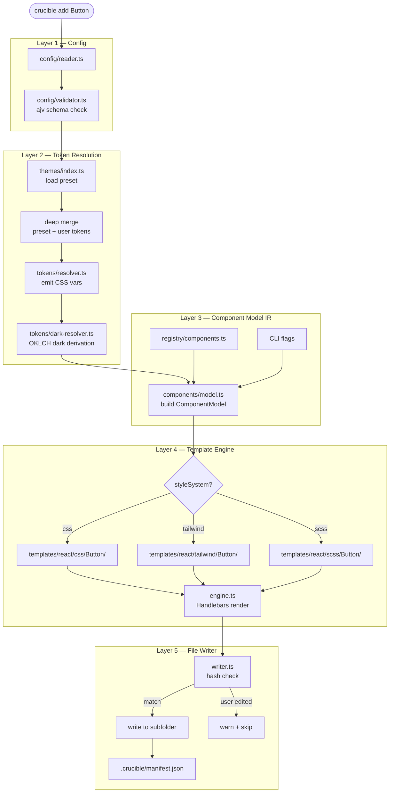

### 2.2 Layer Responsibilities

| Layer           | Allowed Inputs                 | Must NOT Know                 |
| --------------- | ------------------------------ | ----------------------------- |
| Config reader   | Raw JSON file                  | Tokens, components, templates |
| Token resolver  | Config + preset                | Component names, templates    |
| Component model | Config + tokens + CLI flags    | Template syntax, file paths   |
| Template engine | ComponentModel only            | Raw config, file system       |
| Writer          | Rendered strings + output path | Config, tokens, components    |

### 2.3 Data Flow

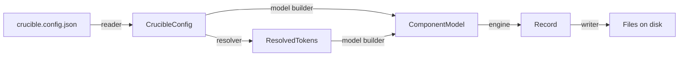

---

## 3. Config Layer

### 3.1 Config Schema

```typescript
interface CrucibleConfig {
  version?: string;
  framework?: 'react' | 'vue' | 'angular';
  theme?: 'minimal' | 'soft' | 'custom';
  styleSystem?: 'css' | 'tailwind' | 'scss';
  darkMode?: boolean | { strategy: 'auto' | 'manual' };
  tokens?: {
    color?: Partial<ColorTokens>;
    radius?: Partial<RadiusTokens>;
    spacing?: Partial<SpacingTokens>;
    typography?: Partial<TypographyTokens>;
  };
  features?: {
    hover?: boolean;
    focusRing?: boolean;
    motionSafe?: boolean;
    compoundComponents?: boolean;
  };
  a11y?: A11yConfig;
  flags?: {
    outputDir?: string;
    stories?: boolean;
  };
}
```

### 3.2 Default Values

| Key                           | Default     | Reason                                      |
| ----------------------------- | ----------- | ------------------------------------------- |
| `styleSystem`                 | `"css"`     | Backward compatible, no Tailwind assumption |
| `theme`                       | `"minimal"` | Neutral starting point                      |
| `darkMode`                    | `false`     | Opt-in, not imposed                         |
| `features.hover`              | `true`      | Better default UX                           |
| `features.focusRing`          | `true`      | Accessibility non-negotiable                |
| `features.compoundComponents` | `true`      | React/Vue only, Angular excluded            |
| `flags.stories`               | `false`     | Opt-in story generation                     |

### 3.3 Config Processing Flow

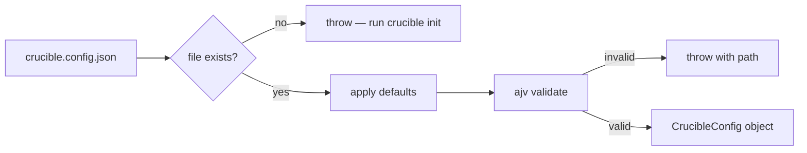

---

## 4. Token Resolution Layer

### 4.1 Colorjs.io Integration

Tokens are resolved using `colorjs.io` for perceptually uniform color manipulation:

```typescript
import Color from 'colorjs.io';

// Parse user color
const color = new Color('#7C3AED');

// Shift for dark mode (perceptually uniform)
const dark = color.shift(-0.15, 'oklch');
```

### 4.2 OKLCH vs HSL

| Approach    | Result                                    |
| ----------- | ----------------------------------------- |
| HSL shift   | Blue drifts toward cyan at high lightness |
| OKLCH shift | Color hue preserved, consistent L change  |

### 4.3 ResolvedTokens Output

```typescript
interface ResolvedTokens {
  cssVars: Record<string, string>; // --color-primary: #7C3AED
  darkCssVars: Record<string, string>; // dark mode variants
  js: Record<string, string>; // colorPrimary: '#7C3AED'
}
```

---

## 5. Theme Preset System

### 5.1 Available Themes

| Theme     | Description                                   |
| --------- | --------------------------------------------- |
| `minimal` | Neutral, low-saturation, minimal shadows      |
| `soft`    | Rounded corners, subtle shadows, pastel tints |
| `custom`  | User-defined via `tokens` override            |

### 5.2 Deep Merge Behavior

When `theme: "soft"` with partial override:

```json
{
  "theme": "soft",
  "tokens": { "color": { "primary": "#FF6B6B" } }
}
```

User gets soft radius + soft typography + soft background, but **only** the primary color changes.

---

## 6. Dark Mode Architecture

### 6.1 Output Format

```css
:root {
  --color-primary: #7c3aed;
}

@media (prefers-color-scheme: dark) {
  :root {
    --color-primary: #9f7aea;
  }
}
```

### 6.2 Auto vs Manual

| Strategy | Behavior                                |
| -------- | --------------------------------------- |
| `auto`   | Uses `prefers-color-scheme` media query |
| `manual` | User controls via `.dark` class         |

---

## 7. Component Model — The IR Layer

### 7.1 Why an IR Layer?

Without `ComponentModel`, templates receive `CrucibleConfig` directly:

```handlebars
{{! BAD: Logic in template }}
{{#if angular}}...{{/if}}
{{#if darkMode}}...{{/if}}

{{! GOOD: Template receives pre-resolved data }}
{{#if hasFocusTrap}}...{{/if}}
{{tokens.darkCssVars}}
```

The IR forces all branching into TypeScript where it can be tested, typed, and reasoned about.

### 7.2 ComponentModel Full Shape

```typescript
interface ComponentModel {
  name: string;
  framework: Framework; // react | vue | angular
  theme: string;
  engineVersion: string;
  isReact: boolean;
  isAngular: boolean;
  isVue: boolean;
  styleSystem: StyleSystem; // css | tailwind | scss
  variants: string[];
  sizes: string[];
  states: string[];
  tokens: ResolvedTokens;
  tailwindVariants?: Record<string, string>;
  a11y: {
    focusRing: boolean;
    focusRingColor: string;
    focusRingWidth: string;
    focusRingOffset: string;
    reduceMotion: boolean;
    role?: string;
    focusTrap?: boolean; // Modal only
    keyboardNav?: boolean; // Select only
    passwordToggle?: boolean; // Input only
  };
  features: {
    hover: boolean;
    compoundComponents?: boolean;
  };
  generateStories: boolean;
  prefix: string;
  hasVariant: boolean;
  hasSize: boolean;
  hasLoading: boolean;
  hasDisabled: boolean;
  hasRequired: boolean;
  hasError: boolean;
  hasHint: boolean;
  hasLabel: boolean;
  hasTitle: boolean;
  hasIsOpen: boolean;
  hasClassName: boolean;
  hasId: boolean;
  hasOutputClose: boolean;
  hasClassesGetter: boolean;
  hasPlaceholder: boolean;
}
```

### 7.3 ComponentMeta — Single Source of Truth

All component metadata lives in `COMPONENT_DEFAULTS` (`src/registry/manifests/defaults.ts`):

```typescript
interface ComponentMeta {
  variants: string[]; // Visual variants
  sizes: string[]; // Size options
  states: string[]; // Behavioral states
  props: string[]; // Props (derives has* flags)
  prefix: string; // CSS class prefix
  noClassName?: boolean; // Card, Modal don't accept className
  behaviours?: ('closeable' | 'focusTrap' | 'scrollLock')[];
  a11y?: {
    role?: string;
    focusTrap?: boolean;
    keyboardNav?: boolean;
    passwordToggle?: boolean;
  };
}
```

### 7.4 Derivation Rules

`model.ts` derives all flags from `COMPONENT_DEFAULTS`:

| Flag             | Derivation                                   |
| ---------------- | -------------------------------------------- |
| `hasRequired`    | `defaults.props.includes('required')`        |
| `hasLabel`       | `defaults.props.includes('label')`           |
| `hasOutputClose` | `defaults.behaviours?.includes('closeable')` |
| `hasClassName`   | `!defaults.noClassName`                      |
| `prefix`         | `defaults.prefix`                            |
| `focusTrap`      | `defaults.behaviours?.includes('focusTrap')` |

### 7.5 Adding a New Component

Adding Textarea requires **only** this change to `COMPONENT_DEFAULTS`:

```typescript
[ComponentName.Textarea]: {
  variants: ['default', 'error'],
  sizes: ['sm', 'md', 'lg'],
  states: ['disabled', 'error'],
  props: ['label', 'hint', 'placeholder', 'rows', 'maxLength'],
  prefix: 'textarea',
  a11y: { role: 'textbox' },
},
```

**No changes needed to:** `model.ts`, `engine.ts`, `registry/components.ts`

---

## 8. Registry System

### 8.1 Registry Architecture

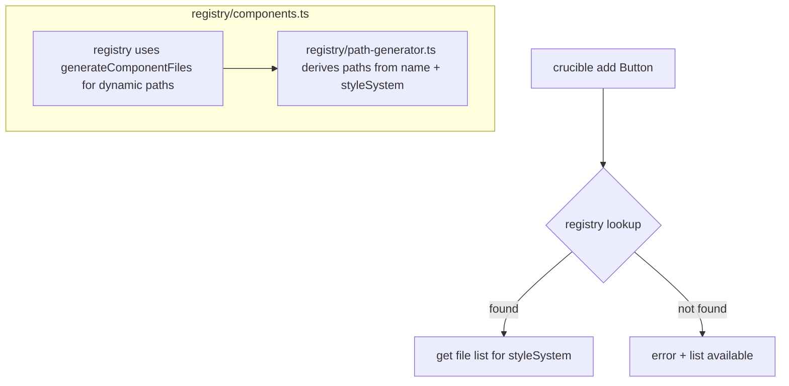

### 8.2 Component Dependencies

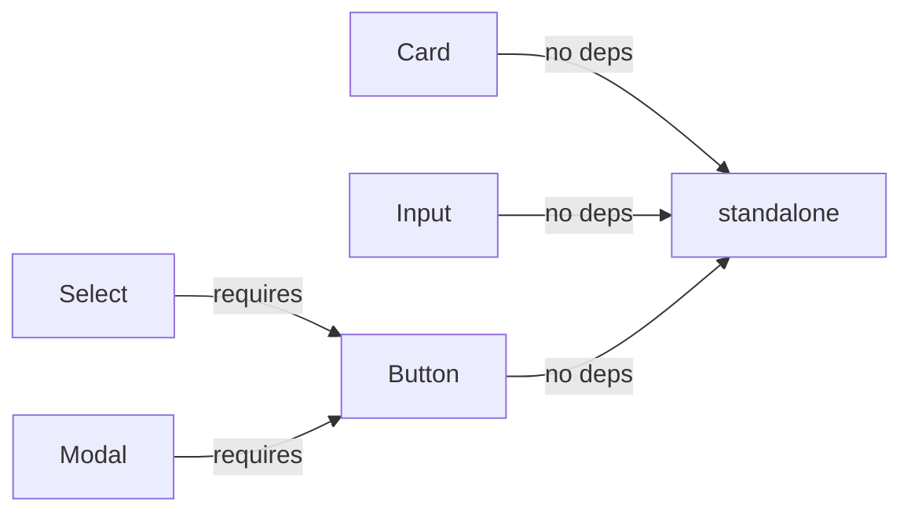

### 8.3 Dynamic Path Generation

```typescript
export function generateComponentFiles(name: string): ComponentDef {
  return {
    frameworks: [...ALL_FRAMEWORKS],
    styleSystems: [...ALL_STYLE_SYSTEMS],
    files: {
      css: [`${name}/${name}.tsx`, `${name}/${name}.module.css`],
      tailwind: [`${name}/${name}.tsx`],
      scss: [`${name}/${name}.tsx`, `${name}/${name}.module.scss`],
    },
    dependencies: getComponentDependencies(name),
  };
}
```

---

## 9. Style System — Three Modes

### 9.1 Selection Flow

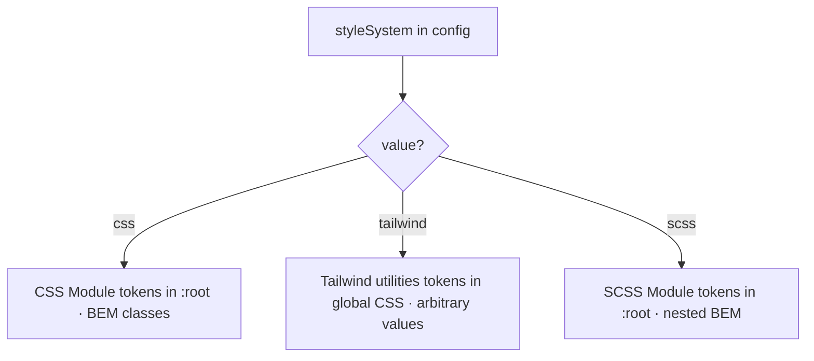

### 9.2 Token Bridge

In every mode, tokens resolve to CSS custom properties:

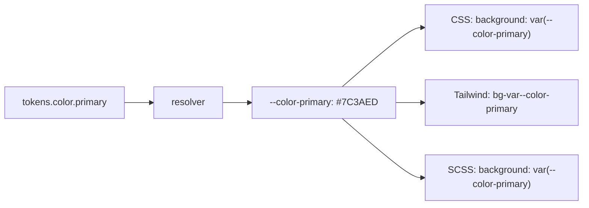

### 9.3 What Stays the Same

| Identical           | Differs                           |
| ------------------- | --------------------------------- |
| Component props API | CSS file emitted (css/scss only)  |
| ARIA attributes     | Class approach (BEM vs utilities) |
| TypeScript types    | Template folder selected          |
| Token values        |                                   |
| Dark mode vars      |                                   |

### 9.4 SCSS Support

SCSS uses `.module.scss` files with nested BEM structure. Templates reuse framework `.tsx.hbs` files
(DRY fallback), with only the stylesheet being SCSS-specific.

---

## 10. Template Engine

### 10.1 Template Structure

```
templates/
├── react/
│   ├── css/
│   │   └── Button/
│   │       ├── Button.tsx.hbs
│   │       └── Button.module.css.hbs
│   ├── tailwind/
│   └── scss/
├── vue/
├── angular/
└── shared/
    ├── focus-ring.hbs
    ├── dark-mode.hbs
    └── variant-types.hbs
```

### 10.2 Registered Helpers

| Helper        | Signature    | Purpose                |
| ------------- | ------------ | ---------------------- |
| `eq`          | `(a, b)`     | Strict equality        |
| `includes`    | `(arr, val)` | Array membership       |
| `capitalize`  | `(str)`      | First char uppercase   |
| `kebab`       | `(str)`      | camelCase → kebab-case |
| `toLowerCase` | `(str)`      | String to lowercase    |

### 10.3 Logic Enforcement Rules

Templates must contain **only**:

- `{{field}}` — interpolation
- `{{#if boolean}}...{{/if}}` — boolean conditionals
- `{{#each array}}...{{/each}}` — iteration
- `{{> partial}}` — partial references

**Forbidden:**

- Comparisons: `{{#if variant === 'primary'}}`
- Ternary: `{{condition ? a : b}}`
- Else-if chains: `{{else if condition}}`
- ComponentName references: `{{ComponentName.Button}}`
- Config references: `{{crucible.config.theme}}`

### 10.4 Template Audit Script

Run with: `npm run audit:templates`

```typescript
// src/__tests__/templates/audit.ts
export const PROHIBITED_PATTERNS: RegExp[] = [
  /\{\{[^}]*if[^}]*(===|!==|<|>|<=|>=)/, // Comparisons
  /\{\{[^}]*\}\?[^:]*:/, // Ternary
  /\{\{[^}]*else[^}]*if/, // Else-if
  /ComponentName/, // Enum refs
  /crucible\.config\./, // Config refs
];
```

### 10.5 Template Style Conventions

#### Class Naming (BEM)

All components use **BEM (Block Element Modifier)** naming:

| Component | Block       | Elements                                       | Modifiers                   |
| --------- | ----------- | ---------------------------------------------- | --------------------------- |
| Button    | `.btn`      | —                                              | `.btn--primary`, `.btn--sm` |
| Card      | `.card`     | `.header`, `.footer`, `.title`, `.content`     | `.card--hoverable`          |
| Modal     | `.modal`    | `.header`, `.footer`, `.body`, `.close-button` | `.modal--sm`                |
| Input     | `.input`    | `.label`, `.hint`, `.error`                    | `.input--error`             |
| Select    | `.combobox` | `.label`, `.option`, `.listbox`                | `.combobox--open`           |

**Angular Note:** Angular uses component-prefixed classes (`.card-header`, `.card-footer`) for view
encapsulation.

#### CSS Variable Usage

Always use CSS custom properties for component values:

```css
/* CORRECT */
.card {
  padding: var(--card-header-padding);
  border-radius: var(--card-border-radius);
}

/* WRONG — hardcoded values */
.card {
  padding: 24px;
  border-radius: 8px;
}
```

**Required token variables per component:**

| Component | Required Variables                                                         |
| --------- | -------------------------------------------------------------------------- |
| Card      | `--card-header-padding`, `--card-content-padding`, `--card-footer-padding` |
| Modal     | `--modal-padding`, `--modal-overlay-bg`, `--modal-border-radius`           |
| Button    | `--btn-border-radius`, `--btn-font-weight`, `--btn-transition`             |
| Input     | `--input-height`, `--input-border-radius`, `--input-transition`            |
| Select    | `--select-height`, `--select-border-radius`                                |

#### Border Width Standard

| Style System | Value                                   |
| ------------ | --------------------------------------- |
| CSS          | `1px`                                   |
| SCSS         | `1.5px`                                 |
| Tailwind     | `border-[1.5px]` (use bracket notation) |

#### Tailwind Approach: CSS-in-Tailwind

Crucible uses a **CSS-in-Tailwind** approach:

```html
<!-- Reference CSS variables via arbitrary value syntax -->
class="bg-[var(--color-surface)] rounded-[var(--radius-lg)]"
```

No Tailwind config changes required — the CSS variable system provides all design tokens.

#### Compound Component Classes

When adding compound sub-components, ALWAYS define corresponding CSS classes:

```tsx
// Card.tsx — references styles.header
export const CardHeader = ({ children, className }) => (
  <div className={[styles.header, className].filter(Boolean).join(' ')}>{children}</div>
);
```

**Required:** Add the CSS class definition:

```css
/* Card.module.css.hbs */
.header {
  padding: var(--card-header-padding);
}
```

#### Z-Index Tokens

Use token-based z-index values to prevent conflicts:

| Component | Token        | Value  |
| --------- | ------------ | ------ |
| Modal     | `--z-modal`  | `1000` |
| Select    | `--z-select` | `900`  |

---

## 11. File Writer & Hash System

### 11.1 Write Flow

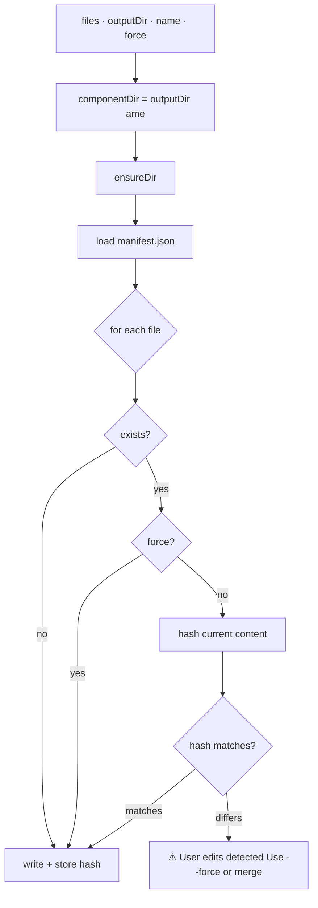

### 11.2 Hash System — Three Cases

| Scenario                       | Behavior                        |
| ------------------------------ | ------------------------------- |
| **First generation**           | Write file, store content hash  |
| **Re-generation, unchanged**   | Hash matches, safe to overwrite |
| **Re-generation, user edited** | Hash differs, warn + skip       |

### 11.3 User Edit Protection Message

```
⚠  User edits detected in Button/Button.tsx. Your changes are preserved.
   Use --force to overwrite, or manually merge your changes.
```

### 11.4 Manifest File Format

```json
{
  "engineVersion": "1.0.0",
  "configHash": "sha256...",
  "generatedAt": "2026-03-23T12:00:00Z",
  "files": {
    "Button/Button.tsx": {
      "contentHash": "a3f2c8e1b994",
      "generatedAt": "2026-03-23T12:00:00Z"
    }
  }
}
```

---

## 12. CLI Layer

### 12.1 Command Reference

| Command                    | Description                          |
| -------------------------- | ------------------------------------ |
| `crucible init`            | Scaffold `crucible.config.json`      |
| `crucible add <component>` | Generate component                   |
| `crucible add`             | Interactive multi-select             |
| `crucible doctor`          | Validate setup                       |
| `crucible list`            | Show available components            |
| `crucible eject`           | Copy preset tokens to config         |
| `crucible tokens`          | Regenerate `tokens.css`              |
| `crucible tokens --force`  | Force overwrite `tokens.css`         |
| `crucible pg:gen`          | Generate all 3 playground frameworks |
| `crucible pg:open`         | Open Storybook                       |
| `crucible pg:dev`          | Start Vite dev server                |

### 12.2 CLI Flags

| Flag               | Description                   | Default |
| ------------------ | ----------------------------- | ------- |
| `--framework <fw>` | Target framework              | `react` |
| `--dev`            | Output to playground          | `false` |
| `--force`          | Overwrite user edits          | `false` |
| `--stories`        | Generate Storybook story      | `false` |
| `--no-stories`     | Skip story generation         | —       |
| `--dry-run`        | Simulate without writing      | `false` |
| `--cwd <path>`     | Working directory             | `.`     |
| `--verbose`        | Enable detailed logging       | `false` |
| `--quiet`          | Disable logging except errors | `false` |

### 12.3 generateStories Resolution

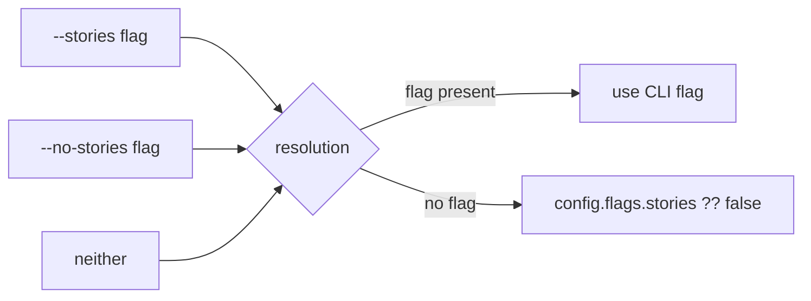

### 12.4 Output Directory Resolution

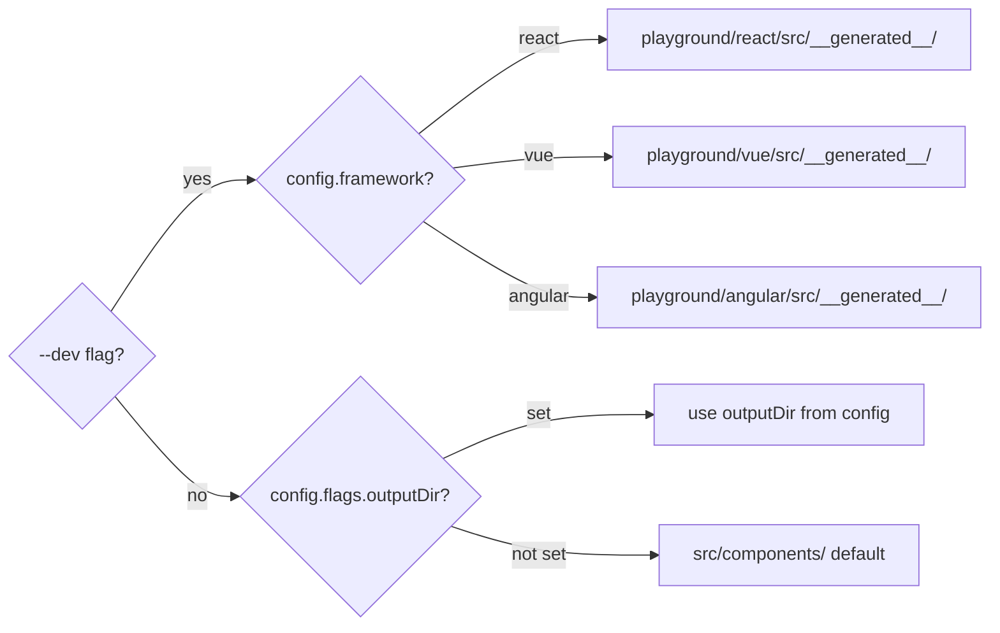

---

## 13. Compound Component Architecture

### 13.1 Pattern by Framework

| Framework | Pattern           | Example                           |
| --------- | ----------------- | --------------------------------- |
| React     | Static properties | `Button.Primary = Button`         |
| Vue       | Named slots       | `<Button#primary>`                |
| Angular   | `ng-content`      | `<ng-content select="[primary]">` |

### 13.2 Compound File Output

```
Button/
├── Button.tsx              # Compound container
├── ButtonPrimitive.tsx     # Single button
├── Button.module.css
└── Button.stories.tsx
```

---

## 14. Multi-Framework Architecture

### 14.1 Framework Folder Structure

```
templates/
├── react/
│   └── {component}/
│       ├── {Component}.tsx.hbs
│       └── {Component}.module.css.hbs
├── vue/
│   └── {component}/
│       └── {Component}.vue.hbs
└── angular/
    └── {component}/
        ├── {component}.component.ts.hbs
        ├── {component}.component.html.hbs
        └── {component}.component.css.hbs
```

### 14.2 Key Principle

Adding a new framework is adding a template folder — **not modifying the engine**.

---

## 15. Testing Architecture

### 15.1 Testing Pyramid

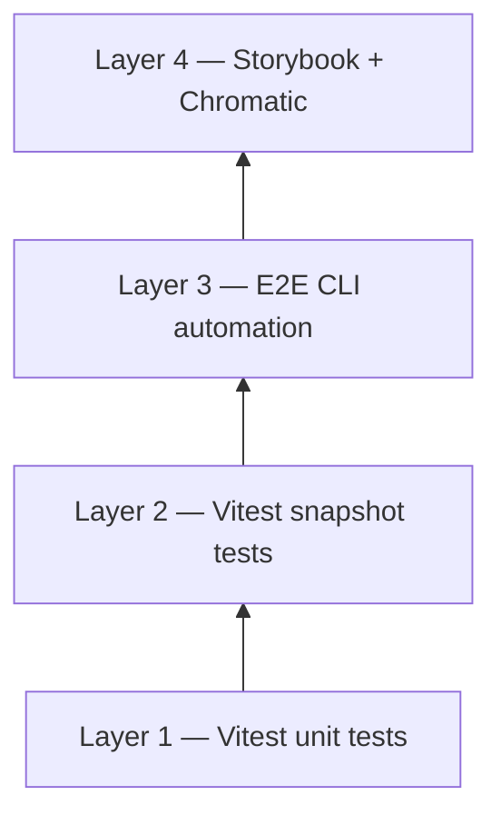

### 15.2 Layer Coverage

| Layer           | Catches                                               |
| --------------- | ----------------------------------------------------- |
| Vitest unit     | Wrong CSS var · token not resolving · dark derivation |
| Vitest snapshot | Template output changed · dark block missing          |
| E2E script      | Init flow · dependency resolution · tsc errors        |
| Storybook       | Missing ARIA · focus ring visible · contrast failure  |
| Chromatic       | Token drift · hover state broke · dark rendering      |

### 15.3 Test Suite

**Current: 128 tests across 19 test files**

| Test File               | Coverage                                    |
| ----------------------- | ------------------------------------------- |
| `resolver.test.ts`      | Preset loading, user overrides, dark mode   |
| `dark-resolver.test.ts` | OKLCH normalization, auto derivation        |
| `model.test.ts`         | StyleSystem, a11y fields, compound flag     |
| `config.test.ts`        | Schema validation, enum acceptance          |
| `registry.test.ts`      | Path generation, framework/style combos     |
| `doctor.test.ts`        | Circular ref detection                      |
| `writer.test.ts`        | Hash system, dry-run, force, path traversal |
| `snapshots/*.test.ts`   | Full pipeline output per component          |
| `a11y/*.test.ts`        | Accessibility verification                  |

### 15.4 E2E Test Phases

1. Scaffold test environment
2. Run `crucible init -y`
3. Tailwind auto-setup
4. Multi-component generation
5. Dependency resolution
6. TypeScript compilation verification

---

## 16. Playground & Dev Environment

### 16.1 Playground Structure

```
playground/
├── react/        # Vite + React + Storybook
├── vue/          # Vite + Vue + Storybook
└── angular/      # Angular CLI + Storybook
```

### 16.2 Dev Loop

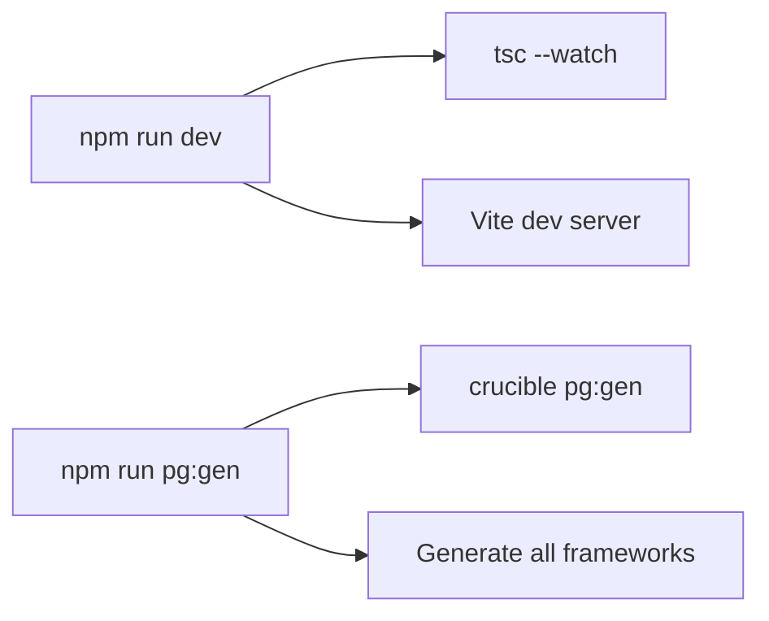

---

## 17. Data Shapes — Type Reference

### 17.1 Core Enums (`src/core/enums.ts`)

```typescript
enum Framework {
  React = 'react',
  Vue = 'vue',
  Angular = 'angular',
}

enum StyleSystem {
  CSS = 'css',
  Tailwind = 'tailwind',
  SCSS = 'scss',
}

enum ThemePreset {
  Minimal = 'minimal',
  Soft = 'soft',
  Custom = 'custom',
}

enum DarkModeStrategy {
  Auto = 'auto',
  Manual = 'manual',
}

enum ComponentName {
  Button = 'Button',
  Input = 'Input',
  Card = 'Card',
  Modal = 'Modal',
  Select = 'Select',
}
```

### 17.2 ComponentDef (Registry Entry)

```typescript
interface ComponentDef {
  frameworks: string[];
  styleSystems: string[];
  files: {
    css: string[];
    tailwind: string[];
    scss: string[];
  };
  dependencies?: string[];
}
```

---

## 18. Key Architectural Decisions

### Why TypeScript for v1.0?

Frontend developers are the target users. `npx crucible` works on any machine with Node.

### Why an IR layer?

Without it, templates need `{{#if angular}}`. The IR forces branching into TypeScript where it's
testable and typed.

### Why Handlebars?

No `require`, no function calls. Template authors **cannot** add business logic — the syntax won't
allow it.

### Why OKLCH for dark mode?

HSL lightness shifts change perceived hue. OKLCH is perceptually uniform — dark mode looks
deliberate, not broken.

### Why hash-based protection?

User edits are sacred. The hash system detects when files have changed since generation.

### Why parallel template folders?

One template with `{{#if styleSystem === 'tailwind'}}` blocks becomes half-Tailwind by the fifth
component. Parallel folders keep each clean.

### Why component subfolders?

At 5+ components, flat output is 15+ files with no grouping. Subfolders mean delete one folder to
remove a component.

### Why colorjs.io?

Color space conversions are a solved problem. Writing equivalent quality takes days and introduces
hidden bugs.

---

## 19. Stack

| Technology        | Purpose            |
| ----------------- | ------------------ |
| TypeScript        | Engine language    |
| Node.js           | Runtime            |
| Handlebars        | Template engine    |
| Vitest            | Testing            |
| colorjs.io        | Color manipulation |
| @inquirer/prompts | Interactive CLI    |
| chokidar          | File watching      |
| prettier          | Code formatting    |
