# ⚗ Crucible — System Architecture

**Version:** 1.0.4 | **Date:** March 2026

---

## 1. System Overview

Crucible is a **code generation engine** that generates style system/spec-based components for
React, Vue, and Angular. Unlike component libraries that ship as npm packages with runtime
dependencies, Crucible produces **pure source code files** that you own, edit, and maintain directly
in your project.

### What Makes Crucible Different

| Aspect        | Component Library      | Crucible                |
| ------------- | ---------------------- | ----------------------- |
| Output        | Compiled package       | Source files you own    |
| API           | Limited to package API | Edit any generated line |
| Updates       | npm update             | Regenerate or merge     |
| Bundle        | Part of your bundle    | Zero runtime footprint  |
| Customization | CSS overrides only     | Full code access        |

### Five-Layer Pipeline

```
┌─────────────┐    ┌─────────────┐    ┌─────────────┐    ┌─────────────┐    ┌─────────────┐
│   Config    │───▶│   Tokens    │───▶│    Model    │───▶│  Templates  │───▶│   Writer    │
│   Layer     │    │   Layer     │    │    (IR)     │    │   Engine    │    │             │
└─────────────┘    └─────────────┘    └─────────────┘    └─────────────┘    └─────────────┘
     │                 │                 │                 │                   │
  crucible.         Theme +            Component          Handlebars          File output
  config.json      user tokens       spec + flags        rendering          + hash tracking
```

### Key Properties

- **No runtime dependency** — Crucible has zero presence in your app after generation
- **Full ownership** — Edit any generated file; re-generation is opt-in via `--force`
- **Hash-based protection** — Detects when you've edited files before overwriting via
  `.crucible/manifest.json`
- **Component subfolders** — `Button/Button.tsx` keeps related files organized
- **Stories opt-in** — Not generated by default; enable via `--stories` or config
- **Compound components default** — Modern composition pattern enabled by default
- **Three style systems:** CSS Modules, SCSS Modules, Tailwind CSS v4
- **Three frameworks:** React, Vue 3, Angular
- **Two theme presets:** Minimal (neutral) and Soft (rounded, pastel tints)
- **Automatic dark mode** — OKLCH-based perceptually uniform color derivation
- **Dependency resolution** — Auto-scaffolds Button for Select/Dialog
- **Prettier integration** — All generated code is auto-formatted

### The Five Layers

```
Config → Tokens → Model (IR) → Templates → Writer
```

---

## 2. Core Pipeline

### 2.1 End-to-End Flow

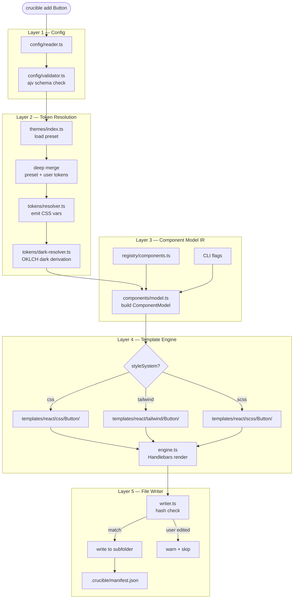
```mermaid
flowchart TD
    A([crucible add Button]) --> B
    subgraph CONFIG ["Layer 1 — Config"]
        B[config/reader.ts] --> C[config/validator.ts<br/>ajv schema check]
    end
    subgraph TOKENS ["Layer 2 — Token Resolution"]
        C --> D[themes/index.ts<br/>load preset]
        D --> E[deep merge<br/>preset + user tokens]
        E --> F[tokens/resolver.ts<br/>emit CSS vars]
        F --> G[tokens/dark-resolver.ts<br/>OKLCH dark derivation]
    end
    subgraph MODEL ["Layer 3 — Component Model IR"]
        G --> H[components/model.ts<br/>build ComponentModel]
        I[registry/components.ts] --> H
        J[CLI flags] --> H
    end
    subgraph TEMPLATE ["Layer 4 — Template Engine"]
        H --> K{styleSystem?}
        K -->|css| L[templates/react/css/Button/]
        K -->|tailwind| M[templates/react/tailwind/Button/]
        K -->|scss| N[templates/react/scss/Button/]
        L & M & N --> P[engine.ts<br/>Handlebars render]
    end
    subgraph WRITER ["Layer 5 — File Writer"]
        P --> Q[writer.ts<br/>hash check]
        Q -->|match| R[write to subfolder]
        Q -->|user edited| S[warn + skip]
        R --> T[.crucible/manifest.json]
    end
```

### 2.2 Layer Responsibilities

| Layer           | Allowed Inputs                 | Must NOT Know                 |
| --------------- | ------------------------------ | ----------------------------- |
| Config reader   | Raw JSON file                  | Tokens, components, templates |
| Token resolver  | Config + preset                | Component names, templates    |
| Component model | Config + tokens + CLI flags    | Template syntax, file paths   |
| Template engine | ComponentModel only            | Raw config, file system       |
| Writer          | Rendered strings + output path | Config, tokens, components    |

**Note on `--dev` flag:** When using `--dev`, output is written to `<cwd>/src/__generated__`. This
lands in the playground folders only when the CLI is invoked from those directories (e.g.,
`playground/vue/`). The `--dev` flag is cwd-relative, not globally playground-routed.

### 2.3 Data Flow

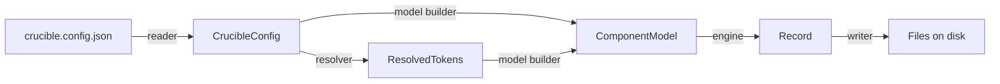
```mermaid
graph LR
    A[crucible.config.json] -->|reader| B[CrucibleConfig]
    B -->|resolver| C[ResolvedTokens]
    B & C -->|model builder| D[ComponentModel]
    D -->|engine| E[Record<string, string>]
    E -->|writer| F[Files on disk]
```

---

## 3. Config Layer

### 3.1 Config Schema

```typescript
interface CrucibleConfig {
  version?: string;
  framework?: 'react' | 'vue' | 'angular';
  theme?: 'minimal' | 'soft' | 'custom';
  styleSystem?: 'css' | 'tailwind' | 'scss';
  darkMode?: boolean | { strategy: 'auto' | 'manual' };
  tokens?: {
    color?: Partial<ColorTokens>;
    radius?: Partial<RadiusTokens>;
    spacing?: Partial<SpacingTokens>;
    typography?: Partial<TypographyTokens>;
  };
  features?: {
    hover?: boolean;
    focusRing?: boolean;
    motionSafe?: boolean;
    compoundComponents?: boolean;
  };
  a11y?: A11yConfig;
  flags?: {
    outputDir?: string;
    stories?: boolean;
  };
}
```

### 3.2 Default Values

| Key                           | Default     | Reason                                            |
| ----------------------------- | ----------- | ------------------------------------------------- |
| `styleSystem`                 | `"css"`     | Backward compatible, no Tailwind assumption       |
| `theme`                       | `"minimal"` | Neutral starting point                            |
| `darkMode`                    | `false`     | Opt-in, not imposed                               |
| `features.hover`              | `true`      | Better default UX                                 |
| `features.focusRing`          | `true`      | Accessibility non-negotiable                      |
| `features.compoundComponents` | `true`      | React/Vue only - Angular uses ng-content natively |
| `flags.stories`               | `false`     | Opt-in story generation                           |

### 3.3 Config Processing Flow

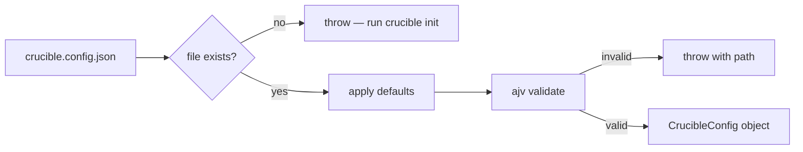
```mermaid
flowchart LR
    A[crucible.config.json] --> B{file exists?}
    B -->|no| C[throw — run crucible init]
    B -->|yes| D[apply defaults]
    D --> E[ajv validate]
    E -->|invalid| F[throw with path]
    E -->|valid| G[CrucibleConfig object]
```

---

## 4. Token Resolution Layer

### 4.1 Colorjs.io Integration

Tokens are resolved using `colorjs.io` for perceptually uniform color manipulation:

```typescript
import Color from 'colorjs.io';

// Parse user color
const color = new Color('#7C3AED');

// Shift for dark mode (perceptually uniform)
const dark = color.shift(-0.15, 'oklch');
```

### 4.2 OKLCH vs HSL

| Approach    | Result                                    |
| ----------- | ----------------------------------------- |
| HSL shift   | Blue drifts toward cyan at high lightness |
| OKLCH shift | Color hue preserved, consistent L change  |

### 4.3 ResolvedTokens Output

```typescript
interface ResolvedTokens {
  cssVars: Record<string, string>; // --color-primary: #7C3AED
  darkCssVars: Record<string, string>; // dark mode variants
  js: Record<string, string>; // colorPrimary: '#7C3AED'
  componentTokens: Record<string, Record<string, string>>; // component-scoped tokens
}
```

The `componentTokens` field contains component-specific design tokens (e.g.,
`--card-header-padding`, `--btn-height-md`) that are resolved from `src/tokens/component-deriver.ts`
and can be overridden through `config.tokens.components`.

### 4.4 Component Token System

Component tokens provide per-component design values derived from global seed tokens:

| Component | Token Variables                                                                                                              |
| --------- | ---------------------------------------------------------------------------------------------------------------------------- |
| Card      | `--card-header-padding`, `--card-content-padding`, `--card-footer-padding`, `--card-border-radius`                           |
| Dialog    | `--Dialog-padding`, `--Dialog-overlay-bg`, `--Dialog-border-radius`, `--Dialog-shadow`, `--z-Dialog`                          |
| Button    | `--btn-border-radius`, `--btn-font-weight`, `--btn-transition`                                                               |
| Input     | `--input-height`, `--input-border-radius`, `--input-border-color`, `--input-transition`                                      |
| Select    | `--select-height`, `--select-border-radius`, `--select-border-color`, `--z-select`                                           |
| Popover   | `--popover-background`, `--popover-border`, `--popover-radius`, `--popover-shadow`, `--popover-padding`, `--popover-z-index` |
| Table     | `--table-row-height`, `--table-header-height`, `--table-border-radius`, `--table-cell-padding`, `--table-row-hover-bg`       |

Users can override component tokens via `config.tokens.components`:

```json
{
  "tokens": {
    "components": {
      "card": {
        "headerPadding": "20px"
      }
    }
  }
}
```

### 4.4 Semantic Color Tokens (Standard Pattern)

Crucible generates semantic foreground color tokens for proper contrast pairing:

```css
:root {
  --color-primary: #6c63ff;
  --color-primary-foreground: #ffffff;
  --color-secondary: #f3f2ff;
  --color-secondary-foreground: #1a1a2e;
  --color-destructive: #e24b4a;
  --color-destructive-foreground: #ffffff;
  --color-accent-foreground: #1a1a2e;
  --foreground: #1a1a2e;
}
```

These tokens ensure proper text/background contrast for accessibility compliance.

---

## 5. Theme Preset System

### 5.1 Available Themes

| Theme     | Description                                                     |
| --------- | --------------------------------------------------------------- |
| `minimal` | Neutral, low-saturation, minimal shadows                        |
| `soft`    | Rounded corners, subtle shadows, pastel tints                   |
| `custom`  | User-defined via `tokens` override (set after `crucible eject`) |

When running `crucible eject`, the active preset tokens are copied into `crucible.config.json` and
`theme` is automatically set to `"custom"`, giving you full manual control over all token values.

### 5.2 Deep Merge Behavior

When `theme: "soft"` with partial override:

```json
{
  "theme": "soft",
  "tokens": { "color": { "primary": "#FF6B6B" } }
}
```

User gets soft radius + soft typography + soft background, but **only** the primary color changes.

---

## 6. Dark Mode Architecture

### 6.1 Output Format

```css
:root {
  --color-primary: #7c3aed;
}

@media (prefers-color-scheme: dark) {
  :root {
    --color-primary: #9f7aea;
  }
}
```

**Token Stylesheet Injection:** The CLI injects a `<link>` tag pointing to
`__generated__/tokens.css` (relative path) into the project's `index.html`. The target path depends
on the framework:

- React/Vue: `index.html` at project root
- Angular: `src/index.html` in the src folder

If an existing tokens.css link has an incorrect path, it will be automatically updated.

### 6.2 Auto vs Manual Strategy

Crucible supports two dark mode strategies:

| Strategy | Config Value                                         | CSS Output                            | Control Method                             |
| -------- | ---------------------------------------------------- | ------------------------------------- | ------------------------------------------ |
| `auto`   | `darkMode: true` or `darkMode: { strategy: "auto" }` | `@media (prefers-color-scheme: dark)` | System preference (OS/ browser setting)    |
| `manual` | `darkMode: { strategy: "manual" }`                   | `.dark { ... }`                       | JavaScript toggle on `<html class="dark">` |

**Manual Mode Usage:**

```html
<!-- Enable dark mode -->
<html class="dark">
  <!-- Disable dark mode -->
  <html></html>
</html>
```

```javascript
// Toggle via JavaScript
document.documentElement.classList.toggle('dark');
```

---

## 7. Component Model — The IR Layer

### 7.1 Why an IR Layer?

Without `ComponentModel`, templates receive `CrucibleConfig` directly:

```handlebars
{{! BAD: Logic in template }}
{{#if angular}}...{{/if}}
{{#if darkMode}}...{{/if}}

{{! GOOD: Template receives pre-resolved data }}
{{#if hasFocusTrap}}...{{/if}}
{{tokens.darkCssVars}}
```

The IR forces all branching into TypeScript where it can be tested, typed, and reasoned about.

### 7.2 ComponentModel Full Shape

```typescript
interface ComponentModel {
  // Identity
  name: string;
  framework: 'react' | 'vue' | 'angular';
  theme: string;
  engineVersion: string;

  // Framework flags (derived for template convenience)
  isReact: boolean;
  isAngular: boolean;
  isVue: boolean;

  // Style configuration
  styleSystem: 'css' | 'tailwind' | 'scss';
  variants: string[];
  sizes: string[];
  states: string[];

  // Token data
  tokens: ResolvedTokens;
  tailwindVariants?: Record<string, string>; // Tailwind CSS utilities

  // Accessibility
  a11y: {
    focusRing: boolean;
    focusRingColor: string;
    focusRingWidth: string;
    focusRingOffset: string;
    reduceMotion: boolean;
    role?: string; // dialog, combobox, article, input
    focusTrap?: boolean; // Dialog only
    keyboardNav?: boolean; // Select only
  };

  // Features
  features: {
    hover: boolean;
    compoundComponents?: boolean; // Angular uses ng-content natively - no flag needed
  };
  generateStories: boolean;
  prefix: string;

  // Derived flags (from ComponentMeta)
  hasVariant: boolean;
  hasSize: boolean;
  hasLoading: boolean;
  hasDisabled: boolean;
  hasRequired: boolean;
  hasError: boolean;
  hasHint: boolean;
  hasLabel: boolean;
  hasTitle: boolean;
  hasIsOpen: boolean;
  hasClassName: boolean;
  hasId: boolean;
  hasOutputClose: boolean;
  hasClassesGetter: boolean;
  hasPlaceholder: boolean;
  hasOnClick: boolean;
  hasHref: boolean;
}
```

### 7.3 ComponentMeta — Single Source of Truth

All component metadata lives in `COMPONENT_DEFAULTS` (`src/registry/manifests/defaults.ts`):

```typescript
interface ComponentMeta {
  variants: string[]; // Visual variants
  sizes: string[]; // Size options
  states: string[]; // Behavioral states
  props: string[]; // Props (derives has* flags)
  prefix: string; // CSS class prefix
  noClassName?: boolean; // Card, Dialog don't accept className
  behaviours?: ('closeable' | 'focusTrap' | 'scrollLock')[];
  a11y?: {
    role?: string;
    focusTrap?: boolean;
    keyboardNav?: boolean;
    passwordToggle?: boolean;
  };
}
```

### 7.4 Derivation Rules

`model.ts` derives all flags from `COMPONENT_DEFAULTS`:

| Flag             | Derivation                                   |
| ---------------- | -------------------------------------------- |
| `hasRequired`    | `defaults.props.includes('required')`        |
| `hasLabel`       | `defaults.props.includes('label')`           |
| `hasOutputClose` | `defaults.behaviours?.includes('closeable')` |
| `hasClassName`   | `!defaults.noClassName`                      |
| `prefix`         | `defaults.prefix`                            |
| `focusTrap`      | `defaults.behaviours?.includes('focusTrap')` |

### 7.5 Adding a New Component

Adding Textarea requires **only** this change to `COMPONENT_DEFAULTS`:

```typescript
[ComponentName.Textarea]: {
  variants: ['default', 'error'],
  sizes: ['sm', 'md', 'lg'],
  states: ['disabled', 'error'],
  props: ['label', 'hint', 'placeholder', 'rows', 'maxLength'],
  prefix: 'textarea',
  a11y: { role: 'textbox' },
},
```

**No changes needed to:** `model.ts`, `engine.ts`, `registry/components.ts`

---

## 8. Registry System

### 8.1 Registry Architecture

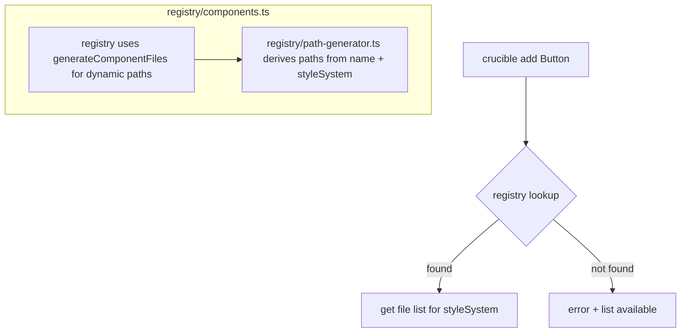
```mermaid
graph TD
    subgraph REG ["registry/components.ts"]
        A[registry uses generateComponentFiles for dynamic paths]
        A --> B[registry/path-generator.ts derives paths from name + styleSystem]
    end
    D[crucible add Button] --> E{registry lookup}
    E -->|found| F[get file list for styleSystem]
    E -->|not found| G[error + list available]
```

### 8.2 Component Dependencies

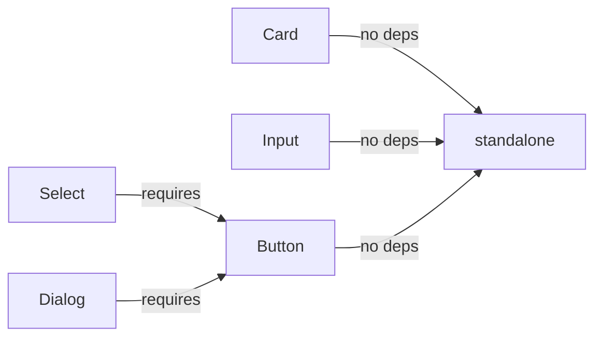
```mermaid
graph LR
    Select -->|requires| Button
    Dialog -->|requires| Button
    Card -->|no deps| NONE[standalone]
    Input -->|no deps| NONE
    Button -->|no deps| NONE
```

### 8.3 Dynamic Path Generation

```typescript
export function generateComponentFiles(name: string): ComponentDef {
  return {
    frameworks: [...ALL_FRAMEWORKS],
    styleSystems: [...ALL_STYLE_SYSTEMS],
    files: {
      css: [`${name}/${name}.tsx`, `${name}/${name}.module.css`],
      tailwind: [`${name}/${name}.tsx`],
      scss: [`${name}/${name}.tsx`, `${name}/${name}.module.scss`],
    },
    dependencies: getComponentDependencies(name),
  };
}
```

**Output per style system:**

| styleSystem | Files Generated                                   |
| ----------- | ------------------------------------------------- |
| `css`       | `Button.tsx` · `Button.module.css` · `README.md`  |
| `tailwind`  | `Button.tsx` · `README.md`                        |
| `scss`      | `Button.tsx` · `Button.module.scss` · `README.md` |

\*Story files are generated only when `generateStories: true` (opt-in via config or `--stories`
flag).

---

## 9. Style System — Three Modes

### 9.1 Selection Flow

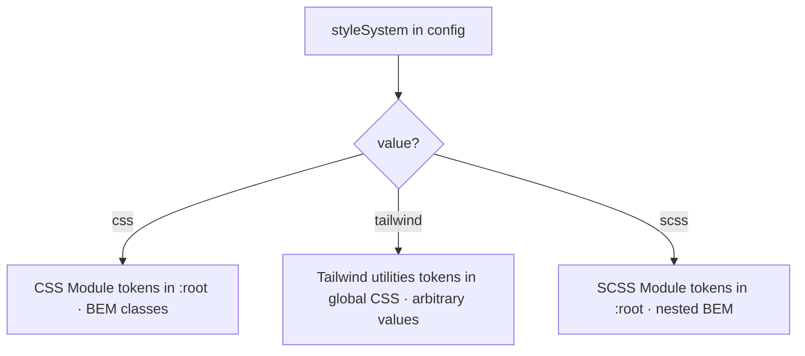
```mermaid
graph TD
    A[styleSystem in config] --> B{value?}
    B -->|css| C[CSS Module tokens in :root · BEM classes]
    B -->|tailwind| D[Tailwind utilities tokens in global CSS · arbitrary values]
    B -->|scss| E[SCSS Module tokens in :root · nested BEM]
```

### 9.2 Token Bridge

In every mode, tokens resolve to CSS custom properties:

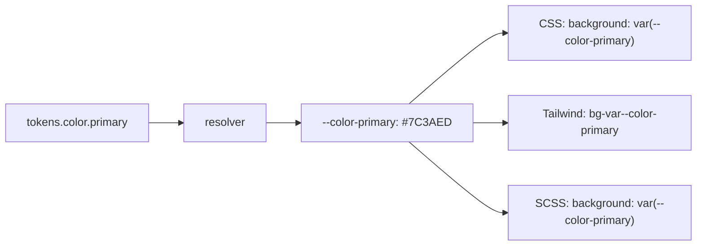
```mermaid
graph LR
    A["tokens.color.primary"] --> B[resolver]
    B --> C["--color-primary: #7C3AED"]
    C --> D1["CSS: background: var(--color-primary)"]
    C --> D2["Tailwind: bg-var--color-primary"]
    C --> D3["SCSS: background: var(--color-primary)"]
```

### 9.3 What Stays the Same

| Identical           | Differs                           |
| ------------------- | --------------------------------- |
| Component props API | CSS file emitted (css/scss only)  |
| ARIA attributes     | Class approach (BEM vs utilities) |
| TypeScript types    | Template folder selected          |
| Token values        |                                   |
| Dark mode vars      |                                   |

### 9.4 Error Variant Support

All frameworks support `variant === 'error'` for styling components. This applies when either:

- The `error` prop/message is provided
- The `variant` prop is set to `'error'`

**Pattern used:**

```typescript
// Pattern: (error || variant === 'error') && styles['error-class']
className={cn(
  baseStyles,
  (error || variant === 'error') && styles.error
)}
```

Supported on: Input, Select (React, Vue, Angular)

### 9.5 Vue Story Guidelines

Vue stories use explicit prop binding (`:variant`, `:size`, etc.) instead of `v-bind="args"` to
ensure slots render correctly in Storybook.

**Correct:**

```typescript
template: `<Card :title="args.title" :variant="args.variant" :size="args.size">Content</Card>`;
```

**Avoid:**

```typescript
template: `<Card v-bind="args">Content</Card>`; // Slots may not render properly in Storybook
```

### 9.6 SCSS Support

SCSS uses `.module.scss` files with nested BEM structure. Templates reuse framework `.tsx.hbs` files
(DRY fallback), with only the stylesheet being SCSS-specific.

### 9.7 Form System — Stateful Component Patterns

`Form` is the first component that ships its own **runtime state**, so it introduces patterns the
stateless components (Button, Input, Card…) don't need. The same dependency-free validation engine is
realized idiomatically per framework, with **no npm peer dependencies**.

- **Validation engine.** A small store owns `values` / `errors` / `touched` / `isSubmitting` and a
  rules map (`required`, `pattern`, `min`/`max`, `minLength`/`maxLength`, custom `validate`) evaluated
  by a shared pure `evaluateRule`. Modes: `onSubmit` / `onBlur` / `onChange` / `onTouched` / `all`.
- **Compound + schema-driven duality** (gated by `features.compoundComponents`, see §7.4 — Angular is
  always monolithic). Compound exposes `Root / Field / Item / Label / Control / Description / Message /
  Submit`; monolithic renders the same internals from a `fields` config array. Both share one engine.
- **RHF-adapter seam.** `Form.Root` (React) / `<Form>` (Vue) accept an external react-hook-form
  `control`; `adaptExternalControl` maps it onto the **same store surface**. Internal vs external are
  mutually exclusive — one engine is ever active, so there is no double validation and still no peer dep.
- **Per-framework realization:**
  - **React** — the store is an external store (refs + per-field subscriptions) read via
    `useSyncExternalStore`. `Control` subscribes to **its own field's value and error only**, so typing
    in one field re-renders that field, not the whole form. Compound parts are `Object.assign(FormRoot, …)`.
  - **Vue** — the engine is a `reactive()` object exposed as a `useForm` composable; Form/Field context
    flows via `provide` / `inject`. Compound sub-components are **named exports from the SFC**
    (`export const FormField = defineComponent(…)`), imported alongside the default `Form`.
  - **Angular** — validation lives in the component class (`@Input() fields`, `@Output() formSubmit` /
    `formError`); `@if`/`@for`/`@switch` render fields; `ng-content` provides `[form-header]`/`[form-footer]`
    projection (v18+ fallback content).
- **Vue scoped-style gotcha.** Because the compound sub-components are **separate component instances**,
  Vue's `<style scoped>` does not reach their DOM. The Vue Form CSS/SCSS template therefore uses a
  **non-scoped `<style>` with every rule qualified by the `.form` ancestor** (all parts render inside
  `<form class="form">`). Tailwind is unaffected — utility classes are inline on each element.
- Tokens: `--form-*` (group/item gap, label, control height, error/description colors, radius) — see §4.4.

### 9.8 Tabs — Roving tabindex + manual/automatic activation

`Tabs` implements the **WAI-ARIA tabs pattern** with no peer dependencies. The state surface is small
(one `value` string), but the keyboard contract is the source of complexity.

- **Roving tabindex.** Exactly one trigger has `tabIndex=0` (the active one); all others are `-1`.
  This keeps the tablist as a single Tab-stop. Implemented by reading `value` in each `Trigger` and
  setting `tabIndex={isActive ? 0 : -1}`.
- **Keyboard nav lives on `List`.** Arrow keys (orientation-aware: Left/Right horizontal, Up/Down
  vertical), Home, End move focus through **enabled** triggers only, wrapping around. The list owns the
  handler so triggers don't need per-element key wiring.
- **Manual vs automatic activation.** `activationMode='manual'` (default) moves focus only — selection
  requires click or Enter/Space. `'automatic'` selects-on-focus (shadcn default). Manual is safer for
  panels that fetch data on activation.
- **Always-mounted content with `hidden`.** `Content` renders even when inactive, with the `hidden`
  attribute, so panel state (form inputs, scroll position) survives tab switches. Users who need DOM
  removal pass `forceMount={false}` (React/Vue) — the default of `hidden` matches Radix and shadcn.
- **Compound + schema-driven duality.** Compound exposes `Root / List / Trigger / Content`; monolithic
  (`compoundComponents:false`) renders the same internals from an `items` config array. Angular is
  always monolithic per §7.4.
- **Per-framework realization:**
  - **React** — `useTabs` returns `{value, setValue, registerTrigger, moveFocus, focusEdge}` from a
    `useRef<Map>` of trigger nodes. Sub-components consume via `useTabsContext()`. `Object.assign(TabsRoot, …)`
    publishes the 4-part API.
  - **Vue** — `reactive()` state + `provide`/`inject` of a `TabsApi` object. Compound sub-components are
    named exports from the SFC (`export const TabsList/TabsTrigger/TabsContent = defineComponent(…)`).
    `<style>` is non-scoped and qualified by `.tabs-root` for the same reason §9.7 documents for Form.
  - **Angular** — schema-driven with `@Input() items` + `@Output() valueChange`; `@ViewChildren('triggerEl')`
    gives the keyboard handler direct DOM access to focus enabled triggers by index.
- Tokens: `--tabs-*` (list gap, trigger height per size, padding/radius, color/active color, hover bg,
  active indicator, content padding) — see §4.4.

### 9.9 Tooltip — Focus-trap-free floating label

`Tooltip` is a lightweight variant of Popover (§ floating components): same `@floating-ui` positioning
stack (`offset`/`flip`/`shift`/`arrow`) but a smaller behaviour surface tuned for the ARIA tooltip role.

- **`role="tooltip"` + `aria-describedby`.** Unlike Popover's `role="dialog"`, the content is a
  describing label. React wires this through `useRole(context, { role: 'tooltip' })`; Vue/Angular set
  `role="tooltip"` on content and `aria-describedby` on the trigger while open.
- **Hover + focus, not just pointer.** Default trigger is `hover`, but keyboard focus on the trigger
  always reveals the tooltip (`useFocus` in React; `focusin`/`focusout` in Vue/Angular) so the label is
  reachable without a mouse. `click` is also supported. Escape dismisses.
- **No focus trap, no Close.** Tooltips never steal or trap focus, so the Popover `FloatingFocusManager`,
  `modal`, focus-restore, and `Close` sub-component are all dropped. Content is `pointer-events: none`.
- **Compound + schema-driven duality.** Compound exposes `Root / Trigger / Portal / Content / Arrow`
  (React/Vue); Angular is always monolithic per §7.4.
- Tokens: `--tooltip-*` (background, border, text, shadow, radius, padding, z-index) — see §4.4. Default
  placement is `top`; `z-index` (60) sits above Popover (50) so a tooltip on a popover trigger wins.

---

## 10. Template Engine

### 10.1 Template Structure

```
templates/
├── react/
│   ├── css/
│   │   └── Button/
│   │       ├── Button.tsx.hbs
│   │       └── Button.module.css.hbs
│   ├── tailwind/
│   └── scss/
├── vue/
├── angular/
└── shared/
    ├── focus-ring.hbs
    ├── dark-mode.hbs
    └── variant-types.hbs
```

### 10.2 Registered Helpers

| Helper        | Signature    | Purpose                                            |
| ------------- | ------------ | -------------------------------------------------- |
| `eq`          | `(a, b)`     | Strict equality                                    |
| `includes`    | `(arr, val)` | Array membership                                   |
| `capitalize`  | `(str)`      | First char uppercase                               |
| `kebab`       | `(str)`      | camelCase → kebab-case                             |
| `toLowerCase` | `(str)`      | String to lowercase                                |
| `hbs`         | `(str)`      | Escape literal `{{str}}` for Vue/Angular templates |

### 10.3 Logic Enforcement Rules

Templates must contain **only**:

- `{{field}}` — interpolation
- `{{#if boolean}}...{{/if}}` — boolean conditionals
- `{{#each array}}...{{/each}}` — iteration
- `{{> partial}}` — partial references

**Forbidden:**

- Comparisons: `{{#if variant === 'primary'}}`
- Ternary: `{{condition ? a : b}}`
- Else-if chains: `{{else if condition}}`
- ComponentName references: `{{ComponentName.Button}}`
- Config references: `{{crucible.config.theme}}`

### 10.4 Template Audit Script

Run with: `npm run audit:templates`

```typescript
// src/__tests__/templates/audit.ts
export const PROHIBITED_PATTERNS: RegExp[] = [
  /\{\{[^}]*if[^}]*(===|!==|<|>|<=|>=)/, // Comparisons
  /\{\{[^}]*\}\?[^:]*:/, // Ternary
  /\{\{[^}]*else[^}]*if/, // Else-if
  /ComponentName/, // Enum refs
  /crucible\.config\./, // Config refs
];
```

### 10.5 Angular 17+ Control Flow

All Angular templates use the modern Angular 17+ control flow syntax (`@if`, `@for`) instead of the
legacy `*ngIf`, `*ngFor`, `*ngSwitch` directives.

**Audit Rules** (enforced by `npm run audit:templates`):

- Prohibited: `/\*ngIf/`, `/\*ngFor/`, `/\*ngSwitch/`

**Correct usage:**

```html
@if (title) {
<h3 class="card-title">{{ title }}</h3>
} @for (item of items; track item.id) {
<option [value]="item.value">{{ item.label }}</option>
}
```

### 10.6 Template Style Conventions

#### Class Naming (BEM)

All components use **BEM (Block Element Modifier)** naming:

| Component | Block            | Elements                                                              | Modifiers                                                  |
| --------- | ---------------- | --------------------------------------------------------------------- | ---------------------------------------------------------- |
| Button    | `.btn`           | —                                                                     | `.btn--primary`, `.btn--sm`                                |
| Card      | `.card`          | `.header`, `.footer`, `.title`, `.content`                            | `.card--hoverable`                                         |
| Dialog    | `.Dialog`        | `.header`, `.footer`, `.body`, `.close-button`                        | `.Dialog--sm`                                              |
| Input     | `.input`         | `.label`, `.hint`, `.error`                                           | `.input--error`                                            |
| Select    | `.combobox`      | `.label`, `.option`, `.listbox`                                       | `.combobox--open`                                          |
| Popover   | `.popover`       | `.popover-trigger`, `.popover-content`, `.popover-arrow`              | `.variant-minimal`, `.size-lg`, `.arrow-top`               |
| Table     | `.tableWrapper`  | `.table`, `.thead`, `.tbody`, `.headerCell`, `.cell`, `.pagination`   | `.tableWrapperBordered`, `.rowStriped`, `.rowSelected`     |

**Angular Note:** Angular uses component-prefixed classes (`.card-header`, `.card-footer`) for view
encapsulation.

#### CSS Variable Usage

Always use CSS custom properties for component values:

```css
/* CORRECT */
.card {
  padding: var(--card-header-padding);
  border-radius: var(--card-border-radius);
}

/* WRONG — hardcoded values */
.card {
  padding: 24px;
  border-radius: 8px;
}
```

**Required token variables per component:**

| Component | Required Variables                                                         |
| --------- | -------------------------------------------------------------------------- |
| Card      | `--card-header-padding`, `--card-content-padding`, `--card-footer-padding` |
| Dialog    | `--Dialog-padding`, `--Dialog-overlay-bg`, `--Dialog-border-radius`        |
| Button    | `--btn-border-radius`, `--btn-font-weight`, `--btn-transition`             |
| Input     | `--input-height`, `--input-border-radius`, `--input-transition`            |
| Select    | `--select-height`, `--select-border-radius`                                |

#### Border Width Standard

| Style System | Value                                   |
| ------------ | --------------------------------------- |
| CSS          | `1px`                                   |
| SCSS         | `1.5px`                                 |
| Tailwind     | `border-[1.5px]` (use bracket notation) |

#### Tailwind Approach: CSS-in-Tailwind

Crucible uses a **CSS-in-Tailwind** approach:

```html
<!-- Reference CSS variables via arbitrary value syntax -->
class="bg-[var(--color-surface)] rounded-[var(--radius-lg)]"
```

No Tailwind config changes required — the CSS variable system provides all design tokens.

#### Compound Component Classes

When adding compound sub-components, ALWAYS define corresponding CSS classes:

```tsx
// Card.tsx — references styles.header
export const CardHeader = ({ children, className }) => (
  <div className={[styles.header, className].filter(Boolean).join(' ')}>{children}</div>
);
```

**Required:** Add the CSS class definition:

```css
/* Card.module.css.hbs */
.header {
  padding: var(--card-header-padding);
}
```

#### Z-Index Tokens

Use token-based z-index values to prevent conflicts:

| Component | Token                | Value  |
| --------- | -------------------- | ------ |
| Dialog    | `--z-Dialog`         | `1000` |
| Select    | `--z-select`         | `900`  |
| Popover   | `--popover-z-index`  | `50`   |

---

## 11. File Writer & Hash System

### 11.1 Write Flow

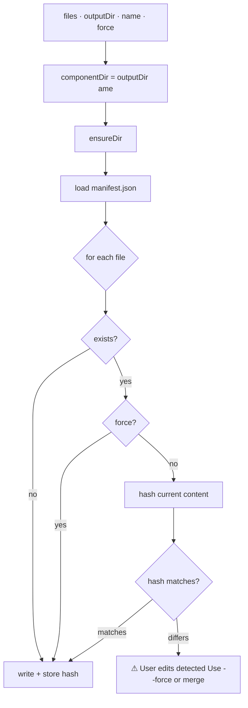
```mermaid
flowchart TD
    A[files · outputDir · name · force] --> B[componentDir = outputDir ame]
    B --> C[ensureDir]
    C --> D[load manifest.json]
    D --> E{for each file}
    E --> F{exists?}
    F -->|no| G[write + store hash]
    F -->|yes| H{force?}
    H -->|yes| G
    H -->|no| I[hash current content]
    I --> J{hash matches?}
    J -->|matches| G
    J -->|differs| K["⚠ User edits detected Use --force or merge"]
```

### 11.2 Hash System — Three Cases

| Scenario                       | Behavior                        |
| ------------------------------ | ------------------------------- |
| **First generation**           | Write file, store content hash  |
| **Re-generation, unchanged**   | Hash matches, safe to overwrite |
| **Re-generation, user edited** | Hash differs, warn + skip       |

### 11.3 User Edit Protection Message

```
⚠  User edits detected in Button/Button.tsx. Your changes are preserved.
   Use --force to overwrite, or manually merge your changes.
```

### 11.4 Manifest File Format

The hash system uses `.crucible/manifest.json` as the storage format:

```json
{
  "engineVersion": "1.0.0",
  "configHash": "sha256...",
  "generatedAt": "2026-03-23T12:00:00Z",
  "files": {
    "Button/Button.tsx": {
      "contentHash": "a3f2c8e1b994",
      "generatedAt": "2026-03-23T12:00:00Z"
    }
  }
}
```

The writer contains legacy migration logic for older `.crucible-hashes.json` files, but
`.crucible/manifest.json` is the current active storage format.

### 11.5 Component README Generation

Each generated component folder includes an auto-generated `README.md` that documents:

- Variants, sizes, and states
- Props and their types
- Usage examples
- Accessibility notes

The README reflects the user's specific token values from `crucible.config.json`, not generic
defaults.

---

## 12. CLI Layer

### 12.1 Command Reference

| Command                    | Shorthand | Description                          |
| -------------------------- | --------- | ------------------------------------ |
| `crucible init`            | `i`       | Scaffold `crucible.config.json`      |
| `crucible add <component>` | `a`       | Generate component                   |
| `crucible add --all`       | `a -a`    | Add all components                   |
| `crucible doctor`          | `d`       | Validate setup                       |
| `crucible list`            | `l`       | Show available components            |
| `crucible eject`           | `e`       | Copy preset tokens to config         |
| `crucible tokens`          | `t`       | Regenerate `tokens.css`              |
| `crucible tokens --force`  | `t -f`    | Force overwrite `tokens.css`         |
| `crucible pg:gen`          | `pg`      | Generate all 3 playground frameworks |
| `crucible pg:gen --force`  | `pg -f`   | Clean + regenerate playground        |
| `crucible pg:open`         | `po`      | Open Storybook                       |
| `crucible pg:dev`          | `pd`      | Start Vite dev server                |
| `crucible clean`           | `c`       | Remove generated files               |
| `crucible clean --all`     | `c -a`    | Remove + config file                 |
| `crucible pg:clean`        | `pcl`     | Clean all playground folders         |
| `crucible config`          | `cfg`     | Show current config                  |

### 12.2 CLI Flags

#### `add` Command Flags

| Flag               | Shorthand | Description                          | Default                |
| ------------------ | --------- | ------------------------------------ | ---------------------- |
| `--framework <fw>` | —         | Target framework (react/vue/angular) | `react`                |
| `--style <system>` | `-s`      | Override style (css/tailwind/scss)   | Config value           |
| `--theme <name>`   | `-t`      | Override theme (minimal/soft)        | Config value           |
| `--dev`            | —         | Output to playground/**generated**   | `false`                |
| `--force`          | `-f`      | Overwrite user edits                 | `false`                |
| `--stories`        | —         | Generate Storybook story             | Config value           |
| `--no-stories`     | —         | Skip story generation                | Config value           |
| `--all`            | `-a`      | Add all components                   | `false`                |
| `--dry-run`        | —         | Simulate without writing             | `false`                |
| `--cwd <path>`     | —         | Working directory                    | `.`                    |
| `--yes`            | `-y`      | Skip all interactive prompts         | `false`                |
| `--verbose`        | —         | Enable detailed logging              | `false`                |
| `--quiet`          | —         | Disable logging except errors        | `false`                |
| `--config <path>`  | —         | Path to config file                  | `crucible.config.json` |

#### Other Command Flags

| Command  | Flag             | Description                   |
| -------- | ---------------- | ----------------------------- |
| `tokens` | `--force` / `-f` | Overwrite existing tokens.css |
| `tokens` | `--dry-run`      | Preview without writing       |
| `init`   | `--yes` / `-y`   | Use defaults without prompts  |
| `clean`  | `--all` / `-a`   | Also remove config file       |
| `config` | `--json`         | Output raw JSON               |

### 12.3 generateStories Resolution

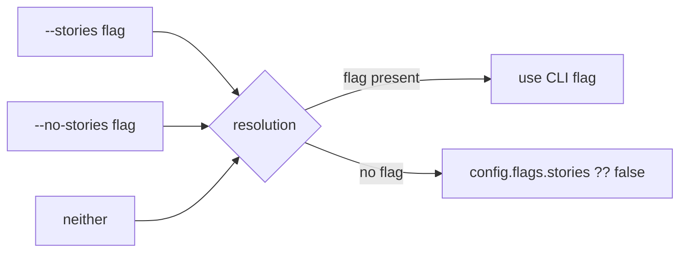
```mermaid
flowchart LR
    A[--stories flag] --> D{resolution}
    B[--no-stories flag] --> D
    C[neither] --> D
    D -->|flag present| E[use CLI flag]
    D -->|no flag| F[config.flags.stories ?? false]
```

### 12.4 Output Directory Resolution

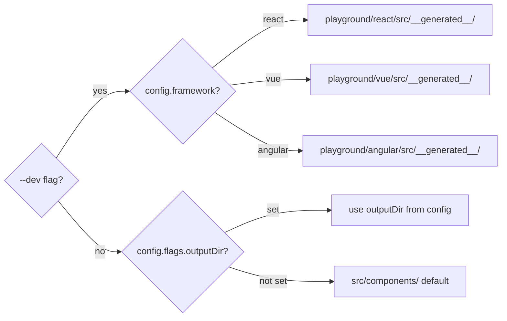
```mermaid
flowchart LR
    A{--dev flag?} -->|yes| B{config.framework?}
    A -->|no| C{config.flags.outputDir?}
    B -->|react| BR[playground/react/src/__generated__/]
    B -->|vue| BV[playground/vue/src/__generated__/]
    B -->|angular| BA[playground/angular/src/__generated__/]
    C -->|set| D[use outputDir from config]
    C -->|not set| E[src/components/ default]
```

---

## 13. Compound Component Architecture

### 13.1 Pattern by Framework

| Framework | Pattern           | Example                           |
| --------- | ----------------- | --------------------------------- |
| React     | Static properties | `Button.Primary = Button`         |
| Vue       | Named slots       | `<Button#primary>`                |
| Angular   | `ng-content`      | `<ng-content select="[primary]">` |

### 13.2 Angular Content Projection

Angular uses `ng-content` for content projection, which **natively supports both monolithic and
compound patterns** without requiring a feature flag:

#### Monolithic (simple props):

```html
<app-card title="Hello">Content here</app-card>
```

#### Compound (content projection):

```html
<app-card>
  <h3 card-title>Custom Title</h3>
  <p card-description>Description here</p>
  <div card-action>Action button</div>
</app-card>
```

#### Available Slots by Component:

**Card:**

- `card-title` - Title content (inside header)
- `card-description` - Description content (inside header)
- `card-action` - Action buttons (inside header)
- `card-content` - Main content area
- `card-footer` - Footer content

**Dialog:**

- `dialog-title` - Title content (inside header)
- `dialog-description` - Description content (inside header)
- `dialog-close` - Close button (inside header)
- `dialog-body` - Main body content
- `dialog-footer` - Footer actions
- `dialog-content` - Full content wrapper
- `dialog-overlay` - Overlay customization

**Input:**

- `input-label` - Label content
- `input-field` - Input field wrapper
- `input-prefix` - Prefix content
- `input-suffix` - Suffix content
- `input-hint` - Hint message
- `input-error` - Error message

**Select:**

- `select-label` - Label content
- `select-trigger` - Trigger element
- `select-value` - Selected value display
- `select-icon` - Dropdown icon
- `select-content` - Dropdown content
- `select-item` - Item element
- `select-item-text` - Item text
- `select-error` - Error message
- `select-prefix` / `select-suffix` - Prefix/suffix

**Button:**

- `btn-spinner` - Loading spinner
- `btn-icon` - Icon content
- `btn-label` - Label content

#### Slot Naming Convention:

- All slots use component-specific prefix: `{component}-{slotname}`
- Slots customize **inner content**, not replace container elements
- Default content shown when slot is not provided

### 13.3 Compound File Output

```
Button/
├── Button.tsx              # Compound container
├── ButtonPrimitive.tsx     # Single button
├── Button.module.css
└── Button.stories.tsx
```

---

## 14. Multi-Framework Architecture

### 14.1 Framework Folder Structure

```
templates/
├── react/
│   └── {component}/
│       ├── {Component}.tsx.hbs
│       └── {Component}.module.css.hbs
├── vue/
│   └── {component}/
│       └── {Component}.vue.hbs
└── angular/
    └── {component}/
        ├── {component}.component.ts.hbs
        ├── {component}.component.html.hbs
        └── {component}.component.css.hbs
```

### 14.2 Key Principle

Adding a new framework is adding a template folder — **not modifying the engine**.

---

## 15. Testing Architecture

### 15.1 Testing Pyramid

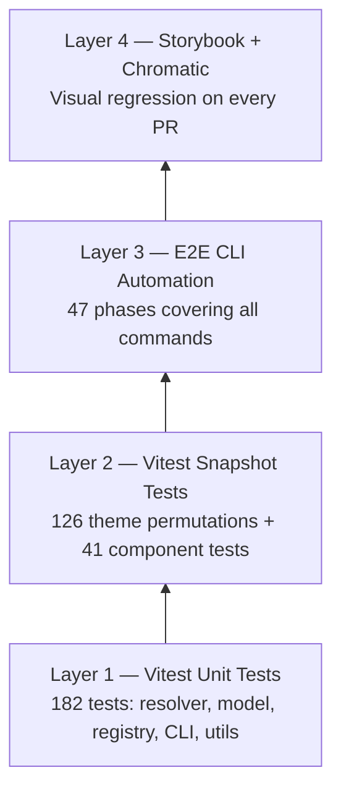
```mermaid
graph BT
    L1["Layer 1 — Vitest Unit Tests<br/>182 tests: resolver, model, registry, CLI, utils"]
    L2["Layer 2 — Vitest Snapshot Tests<br/>126 theme permutations + 41 component tests"]
    L3["Layer 3 — E2E CLI Automation<br/>47 phases covering all commands"]
    L4["Layer 4 — Storybook + Chromatic<br/>Visual regression on every PR"]
    L1 --> L2 --> L3 --> L4
```

### 15.2 Layer Coverage

| Layer           | Catches                                               |
| --------------- | ----------------------------------------------------- |
| Vitest unit     | Wrong CSS var · token not resolving · dark derivation |
| Vitest snapshot | Template output changed · dark block missing          |
| E2E script      | Init flow · dependency resolution · tsc errors        |
| Storybook       | Missing ARIA · focus ring visible · contrast failure  |
| Chromatic       | Token drift · hover state broke · dark rendering      |

### 15.3 Test Suite

**Current: 368 tests across 33 test files + 47 E2E phases**

| Test File               | Coverage                                    |
| ----------------------- | ------------------------------------------- |
| `resolver.test.ts`      | Preset loading, user overrides, dark mode   |
| `dark-resolver.test.ts` | OKLCH normalization, auto derivation        |
| `model.test.ts`         | StyleSystem, a11y fields, compound flag     |
| `config.test.ts`        | Schema validation, enum acceptance          |
| `registry.test.ts`      | Path generation, framework/style combos     |
| `doctor.test.ts`        | Circular ref detection                      |
| `writer.test.ts`        | Hash system, dry-run, force, path traversal |
| `snapshots/*.test.ts`   | Full pipeline output per component          |
| `a11y/*.test.ts`        | Accessibility verification (axe)            |

### 15.4 Test Coverage Phases

| Category               | Tests   | Coverage                                          |
| ---------------------- | ------- | ------------------------------------------------- |
| Core engine            | 65      | resolver, model, registry, config, dark mode      |
| Utility logic          | 75      | table paginator, sorter, virtualizer              |
| Template audit         | 6       | logic-free template enforcement                   |
| Accessibility (axe)    | 19      | per-component a11y + dark mode + interaction       |
| Component snapshots    | 161     | full pipeline output + theme permutations          |
| CLI / writer / doctor  | 42      | command flows, hash protection, setup validation  |
| **Total**              | **368** | **across 33 files**                                |

E2E: **47 phases** ✅

### 15.5 E2E Test Phases

| Phase | Coverage                                              |
| ----- | ----------------------------------------------------- |
| 1-3   | React × CSS, SCSS, Tailwind                            |
| 4-6   | Angular × CSS, SCSS, Tailwind                          |
| 7-9   | Vue × CSS, SCSS, Tailwind                              |
| 10-12 | Write protection (dry-run, force, hash)               |
| 13-15 | Multi-component generation, theme presets, output dir |
| 16-18 | CLI commands (init, eject, list)                      |
| 19    | Error handling                                        |
| 20-27 | Table × all frameworks and style systems              |
| 28-31 | Popover × React/Vue/Angular                           |
| 32-35 | Toast × React/Vue/Angular                             |
| 36-39 | Form × React/Vue/Angular                              |
| 40-43 | Tabs × React/Vue/Angular                              |
| 44-47 | Tooltip × React/Vue/Angular                           |

**Total: 47 E2E phases** ✅

---

## 16. Playground & Dev Environment

### 16.1 Playground Structure

```
playground/
├── react/        # Vite + React + Storybook
├── vue/          # Vite + Vue + Storybook
└── angular/      # Angular CLI + Storybook
```

### 16.2 Dev Loop

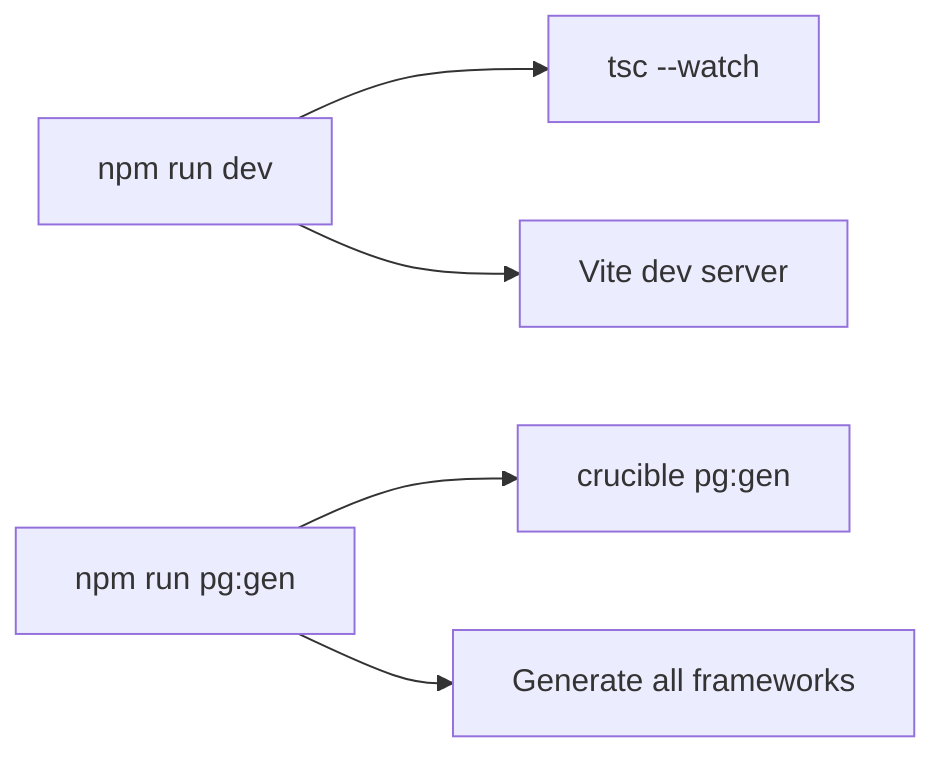
```mermaid
graph LR
    DEV[npm run dev] --> A[tsc --watch]
    DEV --> B[Vite dev server]
    PG[npm run pg:gen] --> C[crucible pg:gen]
    PG --> D[Generate all frameworks]
```

---

## 17. Data Shapes — Type Reference

### 17.1 Core Enums (`src/core/enums.ts`)

```typescript
enum Framework {
  React = 'react',
  Vue = 'vue',
  Angular = 'angular',
}

enum StyleSystem {
  CSS = 'css',
  Tailwind = 'tailwind',
  SCSS = 'scss',
}

enum ThemePreset {
  Minimal = 'minimal',
  Soft = 'soft',
  Custom = 'custom',
}

enum DarkModeStrategy {
  Auto = 'auto',
  Manual = 'manual',
}

enum ComponentName {
  Button = 'Button',
  Input = 'Input',
  Card = 'Card',
  Dialog = 'Dialog',
  Select = 'Select',
  Popover = 'Popover',
  Table = 'Table',
}
```

### 17.2 ComponentDef (Registry Entry)

```typescript
interface ComponentDef {
  frameworks: string[];
  styleSystems: string[];
  files: {
    css: string[];
    tailwind: string[];
    scss: string[];
  };
  dependencies?: string[];
}
```

---

## 18. Key Architectural Decisions

### Why TypeScript for v1.0?

Frontend developers are the target users. `npx crucible` works on any machine with Node.

### Why an IR layer?

Without it, templates need `{{#if angular}}`. The IR forces branching into TypeScript where it's
testable and typed.

### Why Handlebars?

No `require`, no function calls. Template authors **cannot** add business logic — the syntax won't
allow it.

### Why OKLCH for dark mode?

HSL lightness shifts change perceived hue. OKLCH is perceptually uniform — dark mode looks
deliberate, not broken.

### Why hash-based protection?

User edits are sacred. The hash system detects when files have changed since generation.

### Why parallel template folders?

One template with `{{#if styleSystem === 'tailwind'}}` blocks becomes half-Tailwind by the fifth
component. Parallel folders keep each clean.

### Why component subfolders?

At 5+ components, flat output is 15+ files with no grouping. Subfolders mean delete one folder to
remove a component.

### Why colorjs.io?

Color space conversions are a solved problem. Writing equivalent quality takes days and introduces
hidden bugs.

---

## 19. Stack

| Technology        | Purpose            |
| ----------------- | ------------------ |
| TypeScript        | Engine language    |
| Node.js           | Runtime            |
| Handlebars        | Template engine    |
| Vitest            | Testing            |
| colorjs.io        | Color manipulation |
| @inquirer/prompts | Interactive CLI    |
| chokidar          | File watching      |
| prettier          | Code formatting    |
| ansis             | Terminal styling   |
