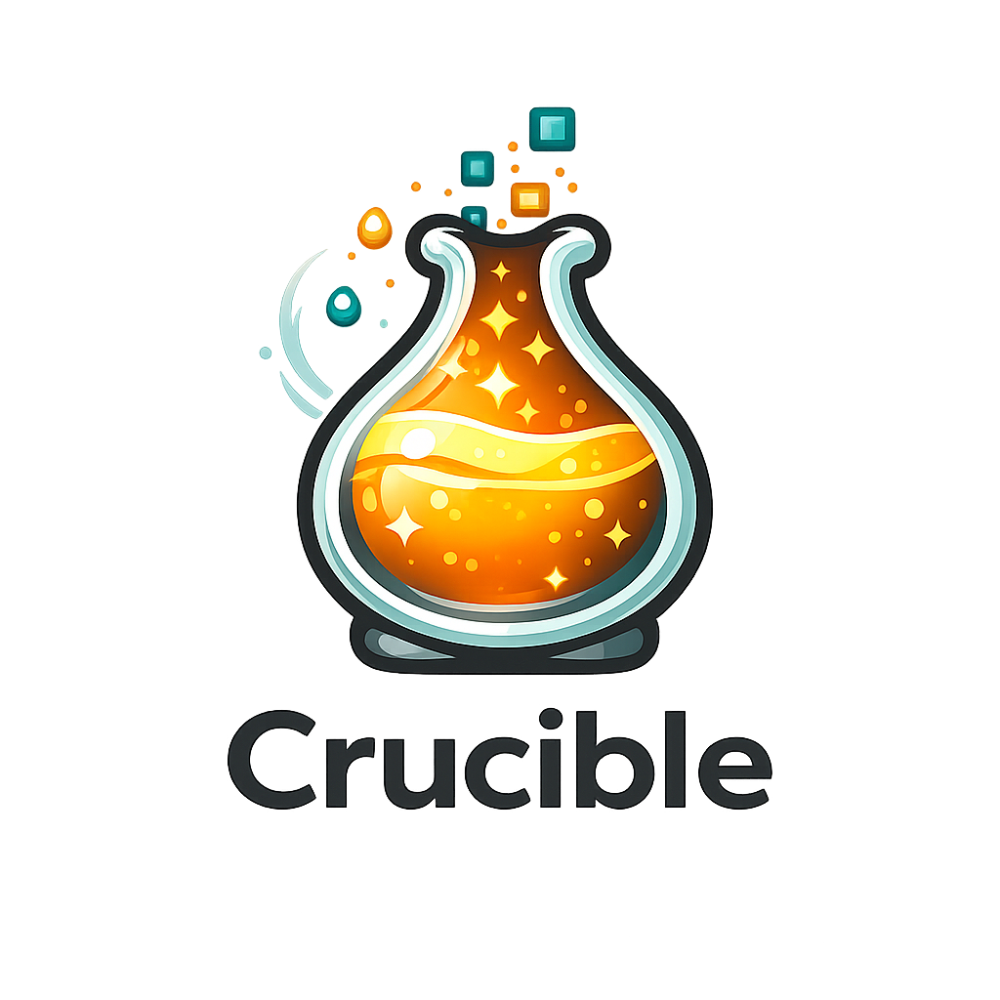
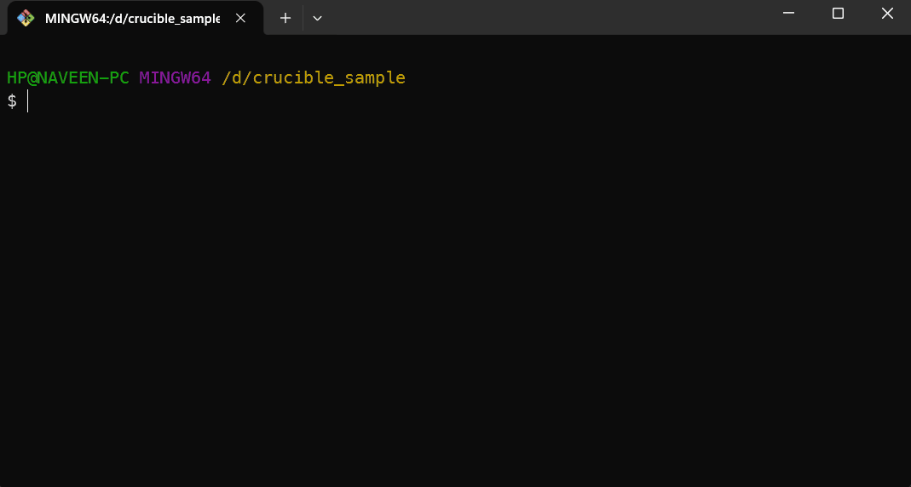
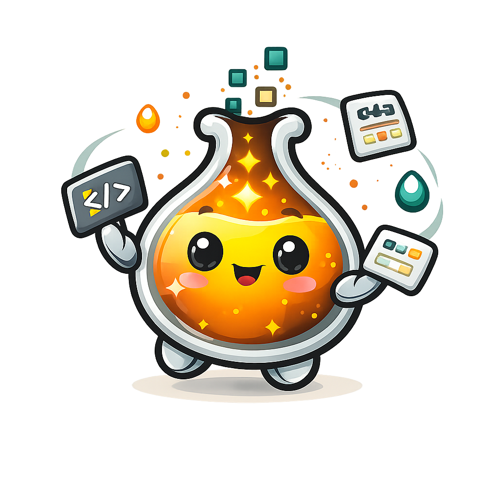

# ⚗️ Crucible — Code Generation Engine

<p align="center"></p>

> **Generated once. Yours forever.**
>
> A code generation engine that scaffolds production-ready, style system/spec-based components into
> your project. No wrappers, no black-box libraries. You own every file generated.

<p align="center">
  
</p>

**Crucible is not a component library** — it's a code generation engine. It produces source files
that live in your project, not a package that sits in node_modules.

[](https://www.npmjs.com/package/@cruciblelab/crucible)
[](LICENSE)
[](https://www.typescriptlang.org/)

---

## Why Crucible?

| Aspect        | Component Library      | Crucible                |
| ------------- | ---------------------- | ----------------------- |
| Output        | Compiled package       | Source files you own    |
| API           | Limited to package API | Edit any generated line |
| Updates       | npm update             | Regenerate or merge     |
| Bundle        | Part of your bundle    | Zero runtime footprint  |
| Customization | CSS overrides only     | Full code access        |

**Crucible generates pure source code** that lives in your project. Once generated, Crucible has
**zero runtime footprint**. You read, edit, and extend every line.

```bash
# Generate a Button component
npx crucible add Button

# Output: Button/Button.tsx, Button/Button.module.css, Button/README.md
# That's it. No runtime dependencies. Pure code you own.
```

---

## Features

| Feature                   | Description                                             |
| ------------------------- | ------------------------------------------------------- |
| **Multi-Framework**       | React, Vue 3, and Angular with full feature parity      |
| **Style Systems**         | CSS Modules, SCSS Modules, or Tailwind CSS v4           |
| **Theme Presets**         | Built-in `minimal` and `soft` with deep merge           |
| **Dark Mode**             | Automatic OKLCH-based perceptually uniform derivation   |
| **Accessibility**         | WCAG 2.1 AA-compliant with ARIA, focus rings            |
| **Component Patterns**    | Professional patterns with variants, sizes, states      |
| **Compound Components**   | React static props, Vue named slots, Angular projection |
| **User Ownership**        | Hash-based protection for user edits                    |
| **Dependency Resolution** | Auto-scaffolds Button for Select/Dialog                 |
| **Interactive CLI**       | Guided setup with @inquirer/prompts                     |
| **Prettier Integration**  | Auto-format all generated code                          |
| **Test Coverage**         | 230 unit tests + 19 E2E phases                          |

<p align="center"></p>

---

## Quick Start

### 1. Initialize

```bash
npx crucible init
```

Creates a `crucible.config.json` with your theme, tokens, and style system preferences.

### 2. Add Components

```bash
npx crucible add Button                    # Single component
npx crucible add Button Input Card         # Multiple components
npx crucible add -a                        # Add all components
npx crucible add Button -s tailwind        # Override style
npx crucible add Button -t soft            # Override theme
```

### 3. Customize

Update `crucible.config.json` and regenerate, or edit generated files directly — they're yours.

---

## Available Components

| Component | Variants                                                       | Sizes                | States                | Description                           |
| --------- | -------------------------------------------------------------- | -------------------- | --------------------- | ------------------------------------- |
| `Button`  | default, primary, secondary, outline, ghost, link, destructive | xs, sm, md, lg, icon | disabled, loading     | Compound components, loading spinner  |
| `Input`   | default, error                                                 | sm, md, lg           | disabled, error       | Password toggle, validation states    |
| `Card`    | default, hoverable, clickable                                  | sm, md, lg           | —                     | Container with title, onClick, href   |
| `Dialog`  | default, confirm                                               | sm, md, lg           | open, closed          | Focus trap, scroll lock, closeable    |
| `Select`  | default, error                                                 | sm, md, lg           | disabled, error, open | Keyboard navigation, combobox pattern |

---

## Documentation

- [Documentation](https://crucible-docs.naveenr.in) — Official docs site
- [ARCHITECTURE.md](./ARCHITECTURE.md) — System design and data flow
- [CONTRIBUTING.md](./CONTRIBUTING.md) — Contribution guidelines
- [ROADMAP.md](./ROADMAP.md) — Future plans

---

## CLI Reference

> **Note:** Commands marked `[dev only]` are for Crucible development. They show a warning when used
> in production installations.

### Generate Components

```bash
crucible add Button                    # Single component (alias: a)
crucible add Button Input Card         # Multiple components
crucible add -a                        # Add all components (alias: a -a)
crucible add Button --stories          # With Storybook story
crucible add Button --framework vue    # Vue framework
crucible add Button --dev             # Output to playground
crucible add Button -s tailwind        # Override style (css, tailwind, scss)
crucible add Button -t soft            # Override theme (minimal, soft)
crucible add Button --force            # Overwrite even if edited
crucible add Button --dry-run          # Preview without writing
crucible add Button --yes             # Skip all prompts (CI mode)
crucible add Button --verbose          # Detailed logging
```

### Setup & Configuration

```bash
crucible init              # Scaffold config file (alias: i)
crucible init --yes       # Use defaults (no prompts)
crucible doctor           # Validate setup (alias: d)
crucible list             # Show available components (alias: l)
crucible eject            # Copy preset to config (alias: e)
crucible config           # Show current config (alias: cfg)
crucible config --json    # Raw JSON output
```

### Tokens

```bash
crucible tokens            # Regenerate tokens.css (alias: t)
crucible tokens --force    # Force overwrite (alias: t -f)
crucible tokens --dry-run  # Preview without writing
```

### Playground (dev only)

```bash
crucible pg:gen           # Generate all 3 framework playgrounds (alias: pg) [dev only]
crucible pg:gen --force   # Clean + regenerate (alias: pg -f) [dev only]
crucible pg:open          # Open Storybook (alias: po) [dev only]
crucible pg:dev           # Start dev server (alias: pd) [dev only]
crucible pg:clean         # Clean all playgrounds (alias: pcl) [dev only]
```

### Cleanup

```bash
crucible clean            # Remove generated files (alias: c)
crucible clean --all      # Also remove config (alias: c -a)
```

---

## Architecture

```
┌─────────────┐    ┌─────────────┐    ┌─────────────┐    ┌─────────────┐    ┌─────────────┐
│   Config    │───▶│   Tokens    │───▶│    Model    │───▶│  Templates  │───▶│   Writer    │
│   Layer     │    │   Layer     │    │    (IR)     │    │   Engine    │    │             │
└─────────────┘    └─────────────┘    └─────────────┘    └─────────────┘    └─────────────┘
     │                 │                 │                 │                   │
  crucible.         Theme +            Component          Handlebars          File output
  config.json      user tokens       spec + flags        rendering          + hash tracking
```

1. **Config Layer** — User preferences in `crucible.config.json` with theme presets
2. **Token Resolver** — Maps tokens to CSS variables with OKLCH dark mode derivation
3. **Component Model (IR)** — Normalizes data for templates; single source of truth
4. **Template Engine** — Handlebars-driven generation with logic-free templates
5. **File Writer** — Writes files with hash protection and Prettier formatting

See [ARCHITECTURE.md](./ARCHITECTURE.md) for complete technical details.

---

## Contributing

Contributions are welcome! Please read [CONTRIBUTING.md](./CONTRIBUTING.md) before submitting PRs.

**Requirements:**

- All tests pass (`npm test`) — 230 tests across 24 files
- Templates pass audit (`npm run audit:templates`)
- No TypeScript errors (`npm run build`)

**Good first contributions:**

- Adding new components (Textarea, Badge, Checkbox)
- Improving documentation
- Writing missing tests for existing features
- Fixing small bugs in CLI commands

---

## License

[MIT License](./LICENSE) — © 2026 [Naveen R](https://github.com)

---

## Project Status

| Version | Status    | Description                                                                     |
| ------- | --------- | ------------------------------------------------------------------------------- |
| v1.0.3  | ✅ Stable | Manual dark mode strategy, Vue SCSS template fixes                              |
| v1.0.0  | ✅ Stable | First stable release — 3 frameworks, 3 style systems, 230 tests + 19 E2E phases |

### v1.0.3 Features

- **Manual dark mode strategy**: Add `.dark` class to `<html>` for manual dark mode toggle

### v1.0.0 Features

- **230 Unit Tests** across 24 test files
- **19 E2E Phases** covering all CLI commands
- **Multi-Framework**: React, Vue 3, Angular with full parity
- **Style Systems**: CSS Modules, SCSS Modules, Tailwind CSS v4
- **Theme Presets**: Minimal and Soft with deep merge
- **Dark Mode**: OKLCH-based automatic derivation
- **Compound Components**: Modern composition patterns
- **Interactive CLI**: Guided setup with shorthand commands
- **Hash Protection**: User edit detection
- **Template Audit**: Logic enforcement

See [ROADMAP.md](./ROADMAP.md) for future plans (v1.2 Migration Engine, v1.3 Studio, v2.0 Go
Binary).
