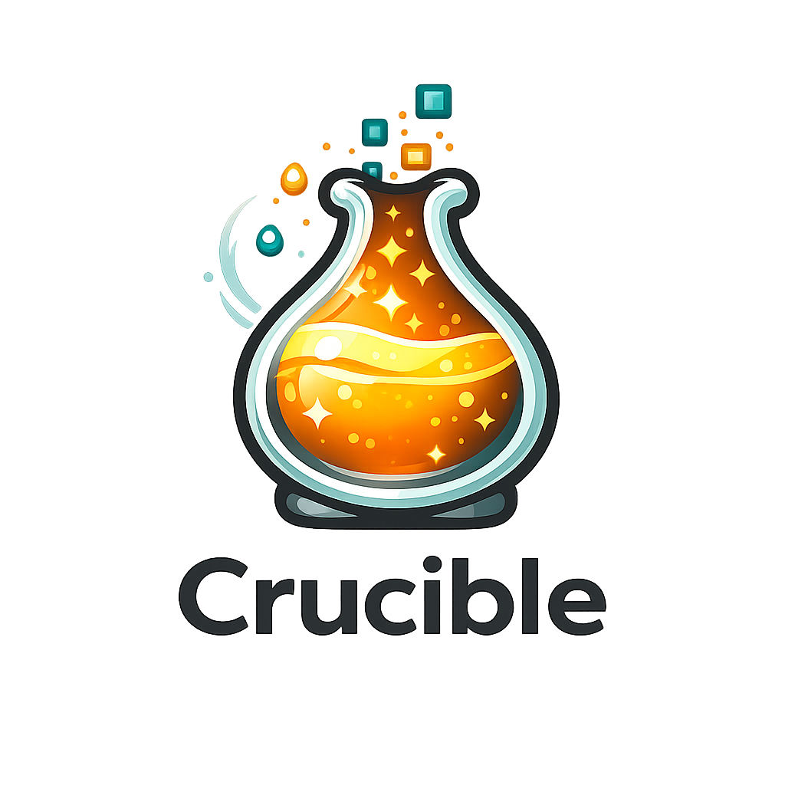
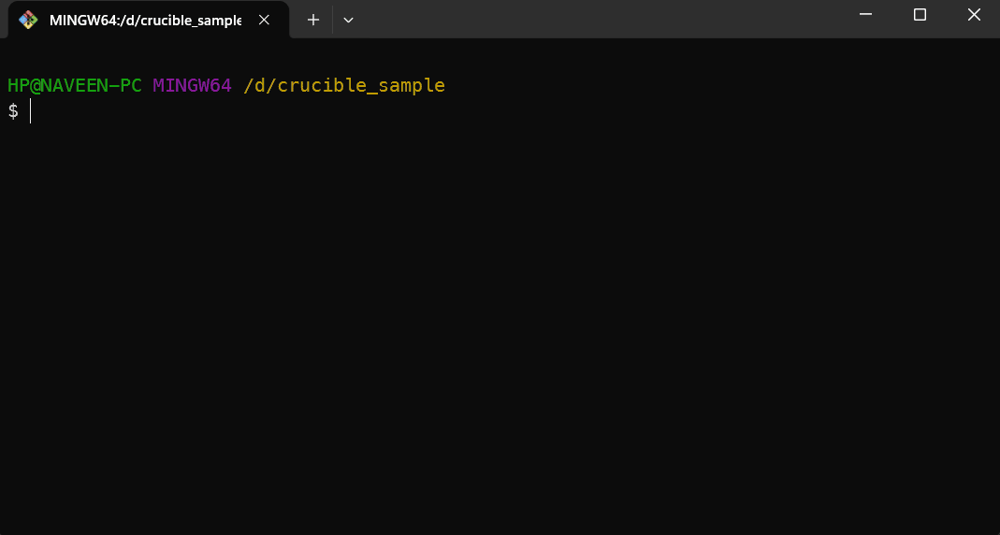
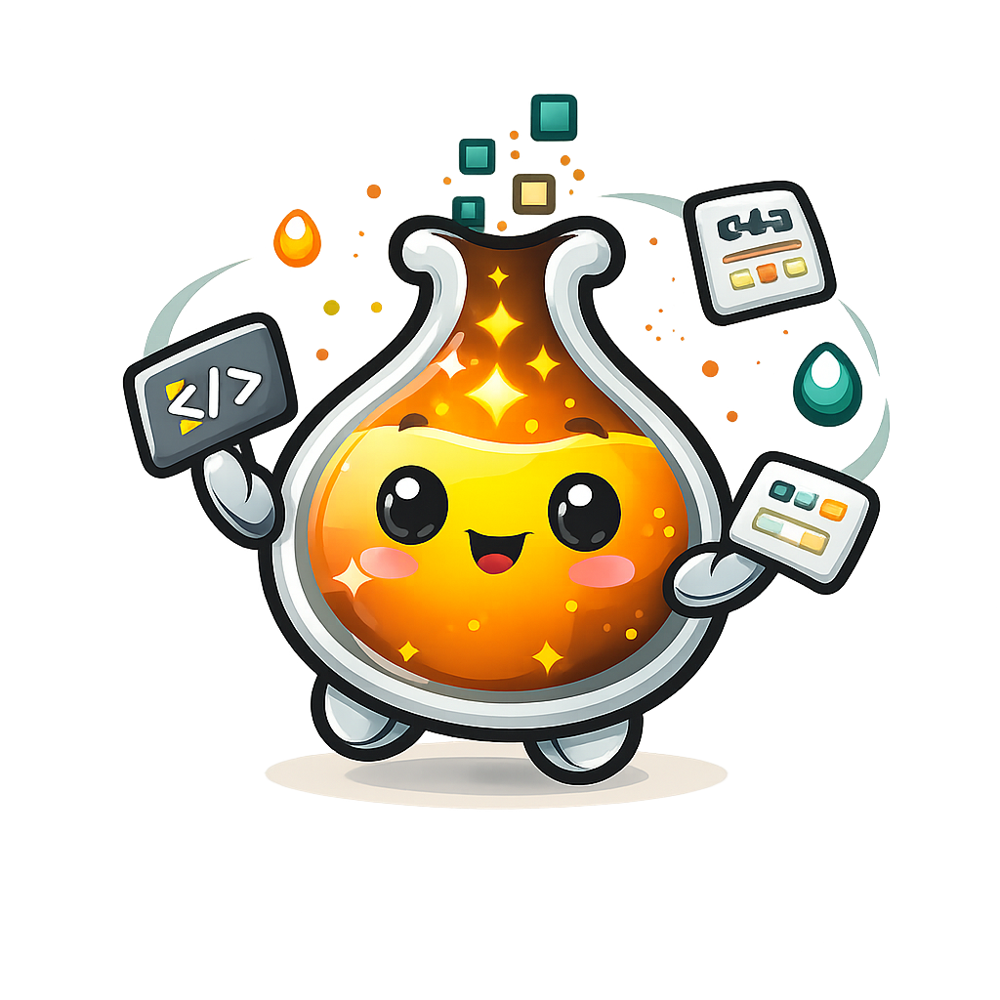

<div align="center">



# ⚗️ Crucible — Code Generation Engine

**Generated once. Yours forever.**

A code generation engine that scaffolds production-ready, style system/spec-based components into
your project. No wrappers, no black-box libraries. You own every file generated.

**Crucible is not a component library** — it's a code generation engine. It produces source files
that live in your project, not a package that sits in `node_modules`.

[](https://www.npmjs.com/package/@cruciblelab/crucible)
[](LICENSE)
[](https://nodejs.org)
[](https://www.typescriptlang.org/)
[](CONTRIBUTING.md)
[](https://github.com/Naveen2070/project_crucible/actions/workflows/test.yml)
[](CHANGELOG.md)
[](#why-crucible)
[](https://badge.socket.dev/npm/package/@cruciblelab/crucible/1.1.0)

[](https://github.com/Naveen2070/project_crucible/stargazers)
[](https://github.com/Naveen2070/project_crucible/network/members)
[](https://github.com/Naveen2070/project_crucible/issues)

<code>npm i -D @cruciblelab/crucible</code> &nbsp;·&nbsp;
<a href="https://crucible-docs.naveenr.in"><b>Docs</b></a> &nbsp;·&nbsp;
<a href="#quick-start"><b>Quick Start</b></a> &nbsp;·&nbsp;
<a href="https://github.com/Naveen2070/project_crucible/issues"><b>Report a Bug</b></a>

<br>



</div>

---

## Table of Contents

- [Why Crucible?](#why-crucible)
- [Features](#features)
- [Installation](#installation)
- [Quick Start](#quick-start)
- [Available Components](#available-components)
- [CLI Reference](#cli-reference)
- [Architecture](#architecture)
- [FAQ](#faq)
- [Documentation](#documentation)
- [Support & Community](#support--community)
- [Contributing](#contributing)
- [License](#license)
- [Project Status](#project-status)

---

## Why Crucible?

| Aspect        | Component Library      | Crucible                |
| ------------- | ---------------------- | ----------------------- |
| Output        | Compiled package       | Source files you own    |
| API           | Limited to package API | Edit any generated line |
| Updates       | npm update             | Regenerate or merge     |
| Bundle        | Part of your bundle    | Zero runtime footprint  |
| Customization | CSS overrides only     | Full code access        |

**Crucible generates pure source code** that lives in your project. Once generated, Crucible has
**zero runtime footprint**. You read, edit, and extend every line.

```bash
# Generate a Button component
npx crucible add Button

# Output: Button/Button.tsx, Button/Button.module.css, Button/README.md
# That's it. No runtime dependencies. Pure code you own.
```

---

## Features

| Feature                   | Description                                                  |
| ------------------------- | ------------------------------------------------------------ |
| **Multi-Framework**       | React, Vue 3.5+, and Angular with full feature parity        |
| **Style Systems**         | CSS Modules, SCSS Modules, or Tailwind CSS v4                |
| **Theme Presets**         | Built-in `minimal` and `soft` with deep merge                |
| **Dark Mode**             | Automatic OKLCH-based perceptually uniform derivation        |
| **Accessibility**         | WCAG 2.1 AA-compliant with ARIA, focus rings                 |
| **Component Patterns**    | Professional patterns with variants, sizes, states           |
| **Compound Components**   | React static props, Vue named slots, Angular projection      |
| **Plug-and-Play**         | Add your own components via local plugins, no engine changes |
| **User Ownership**        | Hash-based protection for user edits                         |
| **Dependency Resolution** | Auto-scaffolds Button for Select/Dialog                      |
| **Interactive CLI**       | Guided setup + `crucible ui` console (@inquirer/prompts)     |
| **Prettier Integration**  | Auto-format all generated code                               |
| **Test Coverage**         | 526 unit tests + 242 E2E phases                              |

<p align="center"></p>

---

## Installation

Crucible is published on npm as
**[`@cruciblelab/crucible`](https://www.npmjs.com/package/@cruciblelab/crucible)** and ships a
single CLI binary, `crucible`. There are two ways to run it.

### Option 1 — Run with `npx` (no install)

Best for a quick try or one-off generation. `npx` fetches and runs the latest published version on
demand; nothing is added to your project:

```bash
npx @cruciblelab/crucible@latest init
npx @cruciblelab/crucible@latest add Button
```

### Option 2 — Add to your project (recommended)

Install Crucible as a **project-local dev dependency** (not a global package). This pins the version
in your `package.json` / lockfile, so every contributor and CI run generates with the exact same
engine:

```bash
npm i -D @cruciblelab/crucible
# yarn add -D @cruciblelab/crucible
# pnpm add -D @cruciblelab/crucible
```

Then invoke the local binary with `npx crucible` — `npx` resolves it from `node_modules/.bin` (no
network round-trip, no global install):

```bash
npx crucible init
npx crucible add Button
```

> **Why not `-g` (global)?** A global install drifts from your project and isn't captured in your
> lockfile, so different machines can scaffold with different versions. A project-local dev
> dependency keeps generation reproducible. All examples below assume Option 2 and use
> `npx crucible …`; if you prefer the no-install route, swap `crucible` for
> `@cruciblelab/crucible@latest`.

---

## Quick Start

### 1. Initialize

```bash
npx crucible init
```

Creates a `crucible.config.json` with your theme, tokens, and style system preferences.

### 2. Add Components

```bash
npx crucible add Button                    # Single component
npx crucible add Button Input Card         # Multiple components
npx crucible add -a                        # Add all components
npx crucible add Button -s tailwind        # Override style
npx crucible add Button -t soft            # Override theme
```

### 3. Customize

Update `crucible.config.json` and regenerate, or edit generated files directly — they're yours.

<details>
<summary><b>See what <code>npx crucible add Button</code> generates</b></summary>

<br>

`Button/Button.tsx` (excerpt) — typed, accessible, zero-dependency source you own:

```tsx
export interface ButtonProps extends React.ButtonHTMLAttributes<HTMLButtonElement> {
  variant?: ButtonVariant; // default | primary | secondary | outline | ghost | link | destructive
  size?: ButtonSize; // xs | sm | md | lg | icon
  loading?: boolean;
  children: React.ReactNode;
}

export const ButtonRoot = React.forwardRef<HTMLButtonElement, ButtonProps>(
  (
    { variant = 'primary', size = 'md', loading = false, disabled, children, className, ...props },
    ref,
  ) => {
    /* className composition … */
    return (
      <button
        ref={ref}
        className={cls}
        disabled={disabled || loading}
        aria-disabled={disabled || loading}
        aria-busy={loading}
        {...props}
      >
        {children}
      </button>
    );
  },
);
```

Alongside it: `Button.module.css`, `Button.stories.tsx`, and a `Button/README.md` — all written into
your project, with **zero runtime dependency**. Switch frameworks/styles with `--framework vue` or
`-s tailwind` and the same component regenerates natively.

</details>

---

## Available Components

| Component      | Variants                                                            | Sizes                | States                      | Description                                                                                                                                                                                                                                                            |
| -------------- | ------------------------------------------------------------------- | -------------------- | --------------------------- | ---------------------------------------------------------------------------------------------------------------------------------------------------------------------------------------------------------------------------------------------------------------------- |
| `Button`       | default, primary, secondary, outline, ghost, link, destructive      | xs, sm, md, lg, icon | disabled, loading           | Compound components, loading spinner                                                                                                                                                                                                                                   |
| `Input`        | default, error                                                      | sm, md, lg           | disabled, error             | Password toggle, validation states                                                                                                                                                                                                                                     |
| `Card`         | default, hoverable, clickable                                       | sm, md, lg           | —                           | Container with title, onClick, href                                                                                                                                                                                                                                    |
| `Dialog`       | default, confirm                                                    | sm, md, lg           | open, closed                | Focus trap, scroll lock, closeable                                                                                                                                                                                                                                     |
| `Select`       | default, error                                                      | sm, md, lg           | disabled, error, open       | Keyboard navigation, combobox pattern                                                                                                                                                                                                                                  |
| `Popover`      | default, minimal                                                    | sm, md, lg           | open, closed, modal         | Floating-UI positioning, focus trap (modal), click/hover trigger, arrow                                                                                                                                                                                                |
| `Table`        | default, striped, bordered, compact                                 | sm, md, lg           | loading, empty              | Client/server pagination, sorting, single/multi selection, virtualization (5k+ rows), optional caption                                                                                                                                                                 |
| `Toast`        | default, success, error, warning, info, loading                     | sm, md, lg           | enter, visible, exit        | Sonner-style notifications: global `toast()` + `<Toaster>`, 6 positions, auto-dismiss, action button, rich colors, pause-on-hide                                                                                                                                       |
| `Form`         | default, inline                                                     | sm, md, lg           | disabled, error, submitting | Dependency-free validation engine, react-hook-form adapter, compound (Root/Field/Item/Label/Control/Description/Message/Submit) + schema-driven modes, aria wiring                                                                                                     |
| `Tabs`         | default, underline, pills                                           | sm, md, lg           | disabled                    | WAI-ARIA tabs pattern: compound (Root/List/Trigger/Content) + schema-driven, controlled/uncontrolled, manual/automatic activation, horizontal/vertical, roving tabindex; per-tab custom rendering (React ReactNode · Vue named slots · Angular `TabTemplateDirective`) |
| `Tooltip`      | default, minimal                                                    | sm, md, lg           | open, closed                | Floating-UI label, `role="tooltip"` + `aria-describedby`, hover/focus/click triggers, compound (Root/Trigger/Portal/Content/Arrow), no focus trap, Escape to dismiss                                                                                                   |
| `Label`        | —                                                                   | sm, md, lg           | disabled                    | Form label with required marker and `htmlFor` association                                                                                                                                                                                                              |
| `Separator`    | —                                                                   | —                    | —                           | Horizontal/vertical divider, `role="separator"`, optional centered label, decorative mode                                                                                                                                                                              |
| `Badge`        | default, primary, secondary, outline, success, warning, destructive | sm, md, lg           | —                           | Status/category label; Tailwind variant classes sourced from the manifest                                                                                                                                                                                              |
| `Skeleton`     | default, text, circle, rect                                         | —                    | —                           | Loading placeholder with pulse animation, `aria-busy`, custom width/height                                                                                                                                                                                             |
| `Avatar`       | circle, square                                                      | xs, sm, md, lg       | —                           | Image with initials fallback on load error, `role="img"`                                                                                                                                                                                                               |
| `Textarea`     | default, error                                                      | sm, md, lg           | disabled, error             | Multi-line field with label/hint/error wiring, `rows`, `maxLength`, aria-invalid                                                                                                                                                                                       |
| `Checkbox`     | default, error                                                      | sm, md, lg           | disabled, checked, error    | Native checkbox with indeterminate (ref/property-bound), label, error                                                                                                                                                                                                  |
| `Switch`       | —                                                                   | sm, md, lg           | disabled, checked           | `role="switch"` toggle (track + thumb), controlled/uncontrolled                                                                                                                                                                                                        |
| `Alert`        | default, info, success, warning, destructive                        | —                    | —                           | Inline `role="alert"` message with severity tint, icon, optional dismiss                                                                                                                                                                                               |
| `Progress`     | linear, circular                                                    | sm, md, lg           | indeterminate               | `role="progressbar"` bar or SVG ring; determinate value or continuous loader                                                                                                                                                                                           |
| `Breadcrumb`   | —                                                                   | sm, md, lg           | —                           | Items-driven nav trail, `aria-current="page"`, custom separator, `maxItems` collapse                                                                                                                                                                                   |
| `RadioGroup`   | —                                                                   | sm, md, lg           | disabled                    | WAI-ARIA radiogroup, roving tabindex, arrow-to-select; compound (Root/Item)                                                                                                                                                                                            |
| `Accordion`    | default, bordered, separated                                        | sm, md, lg           | disabled                    | Collapsible disclosure, single/multiple, `aria-expanded` + `role="region"`; compound (Root/Item/Trigger/Content)                                                                                                                                                       |
| `DropdownMenu` | default, minimal                                                    | sm, md, lg           | open, closed                | Floating-UI menu with roving items + typeahead, `role="menu"`; compound (Root/Trigger/Content/Item/Separator/Label)                                                                                                                                                    |

---

## CLI Reference

> **Note:** Commands marked `[dev only]` are for Crucible development. They show a warning when used
> in production installations.

### Interactive

```bash
crucible ui               # Interactive console (aliases: wizard, tui)
```

An opt-in, menu-driven terminal console: **browse/explore** components and their metadata, install
via a guided picker (framework → style → theme → components → stories), and run **diff / status /
update / remove** — all without leaving the prompt. Running bare `crucible` still prints help; the
console only launches when you ask for it. (`crucible init` also offers to scaffold components right
after creating the config.)

### Generate Components

```bash
crucible add Button                    # Single component (alias: a)
crucible add Button Input Card         # Multiple components
crucible add -a                        # Add all components (alias: a -a)
crucible add Button --stories          # With Storybook story
crucible add Button --framework vue    # Vue framework
crucible add Button --dev             # Output to playground
crucible add Button -s tailwind        # Override style (css, tailwind, scss)
crucible add Button -t soft            # Override theme (minimal, soft)
crucible add Button --force            # Overwrite even if edited
crucible add Button --dry-run          # Preview without writing
crucible add Button --yes             # Skip all prompts (CI mode)
crucible add Button --verbose          # Detailed logging
crucible add Button --strict           # Error on plugin collisions / incompatible plugins
```

### Setup & Configuration

```bash
crucible init              # Scaffold config file (alias: i); offers to add components after
crucible init --yes       # Use defaults (no prompts)
crucible doctor           # Validate setup (alias: d)
crucible doctor --json    # Machine-readable check result (exits non-zero on failure)
crucible list             # Show available components (alias: l)
crucible list --json      # Machine-readable component registry
crucible info Button      # Show a component's metadata (variants, props, deps, peer deps)
crucible info Button --json
crucible eject            # Copy preset to config (alias: e)
crucible config           # Show current config (alias: cfg)
crucible config --json    # Raw JSON output
```

> Most commands accept `--quiet` (errors only) and `--cwd <path>`; `info`, `list`, `doctor`,
> `status`, and `diff` support `--json` for scripting/CI.

### Manage Generated Components

```bash
crucible status            # Drift report: ok / modified / missing, plus config/engine staleness (alias: st)
crucible diff Button       # Preview what regeneration would change (defaults to all tracked)
crucible update            # Regenerate tracked components, preserving edits (alias: up)
crucible update Button --force   # Regenerate and overwrite local edits
crucible remove Button     # Delete a component and untrack it (alias: rm)
crucible remove Button --dry-run # Show what would be removed
```

`status` exits non-zero when tracked files are missing or the config/engine has drifted (handy in
CI). `update` and `remove` operate on the components recorded in `.crucible/manifest.json`.

### Tokens

```bash
crucible tokens            # Regenerate tokens.css (alias: t)
crucible tokens --force    # Force overwrite (alias: t -f)
crucible tokens --dry-run  # Preview without writing
```

### Playground (dev only)

```bash
crucible pg:gen           # Generate all 3 framework playgrounds (alias: pg) [dev only]
crucible pg:gen --force   # Clean + regenerate (alias: pg -f) [dev only]
crucible pg:open          # Open Storybook (alias: po) [dev only]
crucible pg:dev           # Start dev server (alias: pd) [dev only]
crucible pg:clean         # Clean all playgrounds (alias: pcl) [dev only]
```

### Cleanup

```bash
crucible clean            # Remove generated files (alias: c)
crucible clean --all      # Also remove config (alias: c -a)
```

---

## Architecture

```
┌─────────────┐    ┌─────────────┐    ┌─────────────┐    ┌─────────────┐    ┌─────────────┐
│   Config    │───▶│   Tokens    │───▶│    Model    │───▶│  Templates  │───▶│   Writer    │
│   Layer     │    │   Layer     │    │    (IR)     │    │   Engine    │    │             │
└─────────────┘    └─────────────┘    └─────────────┘    └─────────────┘    └─────────────┘
     │                 │                 │                 │                   │
   crucible.         Theme +            Component          Handlebars          File output
   config.json      user tokens       spec + flags        rendering          + hash tracking
```

1. **Config Layer** — User preferences in `crucible.config.json` with theme presets
2. **Token Resolver** — Maps tokens to CSS variables with OKLCH dark mode derivation
3. **Component Model (IR)** — Normalizes data for templates; single source of truth
4. **Template Engine** — Handlebars-driven generation with logic-free templates
5. **File Writer** — Writes files with hash protection and Prettier formatting

See [ARCHITECTURE.md](./ARCHITECTURE.md) for complete technical details.

---

## FAQ

<details>
<summary><b>Is this like shadcn/ui?</b></summary>

It shares the same philosophy — you own the generated source instead of importing a package — but
Crucible is **multi-framework and engine-driven**. The same component spec emits native **React, Vue
3, and Angular** code across **CSS Modules, SCSS Modules, or Tailwind v4**, from a manifest-based
generator rather than a copy-paste registry.

</details>

<details>
<summary><b>What happens to my components when I run <code>npm update</code>?</b></summary>

Nothing. Generated components are _your files_ — updating the Crucible dev dependency never touches
them. A content hash protects files you've edited, so a later regenerate won't silently overwrite
your changes; you regenerate only when you choose to.

</details>

<details>
<summary><b>Do I need Crucible at runtime?</b></summary>

No. Crucible is a **dev dependency** (or run via `npx`). It writes source code and then gets out of
the way — **zero runtime footprint** in your shipped bundle.

</details>

<details>
<summary><b>Which frameworks and style systems are supported?</b></summary>

| Framework | CSS Modules | SCSS Modules | Tailwind v4 |
| --------- | :---------: | :----------: | :---------: |
| React     |     ✅      |      ✅      |     ✅      |
| Vue 3.5+  |     ✅      |      ✅      |     ✅      |
| Angular   |     ✅      |      ✅      |     ✅      |

Generated Vue components use the native `useId()` composable (**Vue 3.5+**) for stable element IDs;
on older Vue the CLI emits a deprecated fallback and warns you to upgrade.

</details>

<details>
<summary><b>Can I add my own components?</b></summary>

Yes — Crucible is plug-and-play. Drop a component manifest and its templates into
`.crucible/plugins/` and they appear in `crucible list` and `crucible add` with no changes to the
engine. See the [Custom Components via Plugins](./docs/custom-components-via-plugins.md) how-to for
a complete walkthrough.

</details>

---

## Documentation

- [Documentation](https://crucible-docs.naveenr.in) — Official docs site
- [ARCHITECTURE.md](./ARCHITECTURE.md) — System design and data flow
- [Custom Components via Plugins](./docs/custom-components-via-plugins.md) — Add your own components
  (plug-and-play)
- [CONTRIBUTING.md](./CONTRIBUTING.md) — Contribution guidelines
- [CODE_OF_CONDUCT.md](./CODE_OF_CONDUCT.md) — Community expectations
- [SECURITY.md](./SECURITY.md) — Reporting vulnerabilities
- [ROADMAP.md](./ROADMAP.md) — Future plans
- [CHANGELOG.md](./CHANGELOG.md) — Release history

---

## Support & Community

- 💬 **Questions & ideas** — start a
  [GitHub Discussion](https://github.com/Naveen2070/project_crucible/discussions)
- 🐛 **Bugs & feature requests** — open an
  [issue](https://github.com/Naveen2070/project_crucible/issues/new/choose) (templates provided)
- 📖 **Docs** — [crucible-docs.naveenr.in](https://crucible-docs.naveenr.in)
- 🤝 **Conduct** — please review our [Code of Conduct](./CODE_OF_CONDUCT.md)
- 🔒 **Security** — report vulnerabilities privately per our [Security Policy](./SECURITY.md)

---

## Contributing

Contributions are welcome! Please read [CONTRIBUTING.md](./CONTRIBUTING.md) before submitting PRs.

**Requirements:**

- All tests pass (`npm test`) — 526 tests across 53 files
- Templates pass audit (`npm run audit:templates`)
- No TypeScript errors (`npm run build`)

**Good first contributions:**

- Adding new components (Tag, Pagination, Tooltip variants)
- Improving documentation
- Writing missing tests for existing features
- Fixing small bugs in CLI commands

---

## License

[MIT License](./LICENSE) — © 2026 [Naveen R](https://github.com)

---

## Project Status

| Version | Status    | Description                                                                                    |
| ------- | --------- | ---------------------------------------------------------------------------------------------- |
| v1.1.0  | ✅ Stable | Plugin-ready architecture + 14 new components (25 total) · 448 tests / 238 E2E / 453 templates |
| v1.0.4  | ✅ Stable | Replaced chalk with ansis, fs-extra with native node:fs, added test:bun script                 |
| v1.0.3  | ✅ Stable | Manual dark mode strategy, Vue SCSS template fixes                                             |
| v1.0.0  | ✅ Stable | First stable release — 3 frameworks, 3 style systems, 230 tests + 19 E2E phases                |

### v1.1.0 Highlights

- **Plug-and-play architecture**: Manifest-driven registry with local plugin auto-discovery
  (`.crucible/plugins/`) and semver engine-version gating
- **14 new components** (25 total): Label, Separator, Badge, Skeleton, Avatar, Textarea, Checkbox,
  Switch, Alert, Progress (linear + circular), Breadcrumb, RadioGroup, Accordion, DropdownMenu
- **App-Building Kit**: enough primitives to scaffold a minimal SaaS app, form, or marketing site
- **448 unit tests / 238 E2E phases / 453 templates**: full coverage for the expanded kit

See [ROADMAP.md](./ROADMAP.md) for future plans

---

## Contributors

Thanks to everyone who has contributed to Crucible!

<a href="https://github.com/Naveen2070/project_crucible/graphs/contributors">
  
</a>

## Star History

<a href="https://star-history.com/#Naveen2070/project_crucible&Date">
  
</a>
