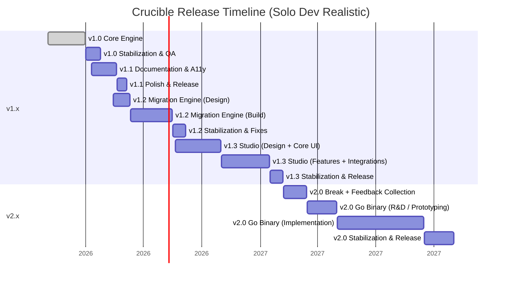
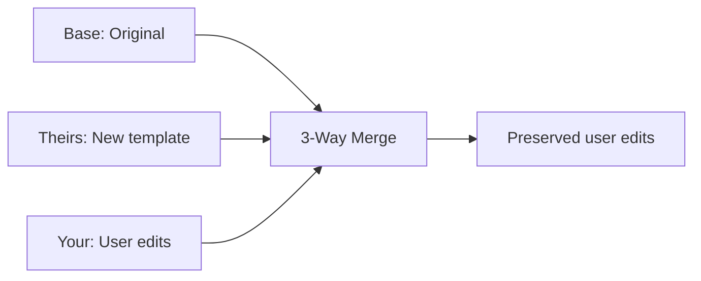
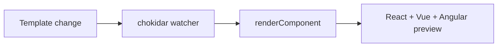
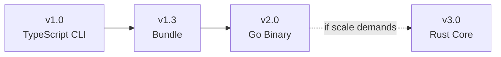

# Crucible Roadmap

**Current Version:** 1.0.0 | **Last Updated:** March 2026

---

## Philosophy

### The Three Core Risks

1. **The Code Generation Trap** — Users edit generated files. Without an upgrade path, Crucible is
   write-once.

2. **Logic Leaking into Templates** — Every `{{#if}}` chain is a maintenance burden. Multi-framework
   support requires clean templates.

3. **A11y Regressions** — Focus traps, ARIA live regions, combobox keyboard navigation. A single
   regression destroys the core value.

---

## v1.0 — Complete

| Feature                                    | Status |
| ------------------------------------------ | ------ |
| TypeScript CLI engine                      | ✅     |
| React, Vue, Angular frameworks             | ✅     |
| CSS, Tailwind, SCSS style systems          | ✅     |
| Theme presets (minimal, soft)              | ✅     |
| Dark mode (OKLCH derivation)               | ✅     |
| Hash-based user edit protection            | ✅     |
| Template logic enforcement                 | ✅     |
| Compound components                        | ✅     |
| Interactive CLI + Tailwind auto-setup      | ✅     |
| Component registry                         | ✅     |
| 128 tests across 19 test files             | ✅     |
| Professional component patterns            | ✅     |
| DialogDescription + aria support           | ✅     |
| Semantic color tokens                      | ✅     |
| CLI command shorthands (i, d, t, etc.)     | ✅     |
| CLI new flags (--style, --theme, --all)    | ✅     |
| CLI new commands (clean, pg:clean, config) | ✅     |

---

## Roadmap Timeline

---

## v1.1 — Documentation & A11y Testing ✅

### Phase 5: Template Enforcement ✅

- Template audit script implemented
- CI integration (prebuild hook)

### Phase 6: A11y Testing ✅

**Goals:**

- Programmatic accessibility verification for all components
- Theme permutation testing (30+ snapshots)
- Dark mode contrast validation

**Deliverables:**

- vitest-axe integration ✅
- Dialog focus trap tests ✅
- Select keyboard navigation tests ✅
- Theme permutation snapshots ✅
- DialogDescription with aria-describedby ✅
- Semantic color tokens (foreground variants) ✅

---

## v1.2 — Migration Engine

### The Problem

Without an upgrade path, Crucible is write-once. Users can't get template improvements after editing
generated files.

### Solution

### Deliverables

| Command            | Purpose                                |
| ------------------ | -------------------------------------- |
| `crucible upgrade` | Apply template improvements with merge |
| `crucible diff`    | Show what would change                 |
| `crucible audit`   | Scan for out-of-sync files             |

---

## v1.3 — Crucible Studio

### The Problem

Template authors need to see multi-framework output without running commands.

### Solution

### Deliverables

- In-memory rendering (no file writes)
- Live template watcher
- IR and token inspector

---

## v2 Binary Path

### Migration Path

_Rust only if project scale demands sub-ms generation performance._

### What Stays Forever

- Template files (`.hbs`) — language-agnostic
- `crucible.config.json` — JSON
- Community templates

---

## Future Components

| Component | Description       |
| --------- | ----------------- |
| Textarea  | Multi-line input  |
| Dropdown  | Combobox variant  |
| Badge     | Simple label      |
| Tabs      | ARIA tablist      |
| Tooltip   | Focus trap needed |

---

## Release Schedule

| Version | Focus                | Target        |
| ------- | -------------------- | ------------- |
| 1.0.0   | Core engine          | ✅ March 2026 |
| 1.1.0   | Documentation + A11y | ✅ March 2026 |
| 1.2.0   | Migration engine     | Q3 2026       |
| 1.3.0   | Studio               | Q4 2026       |
| 2.0.0   | Go binary            | 2027          |
