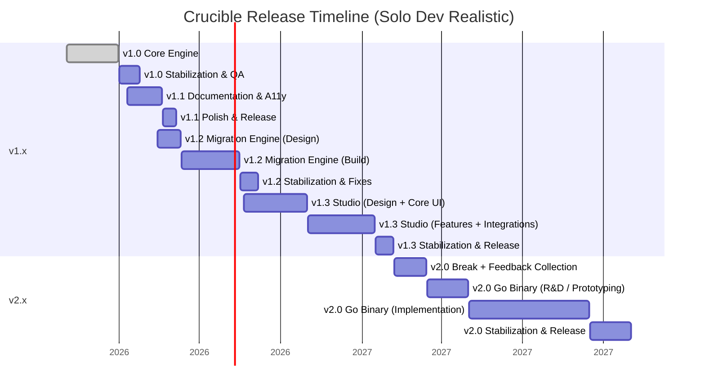
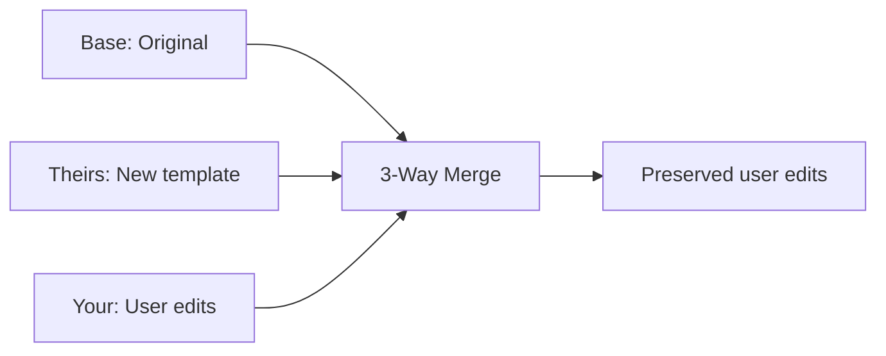
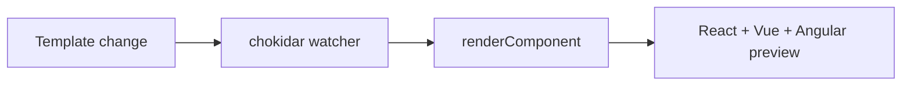
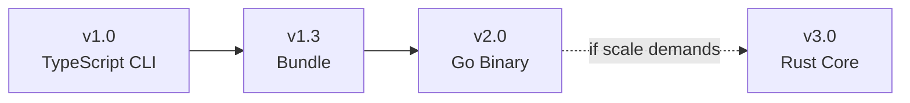

# Crucible Roadmap

> **Crucible — Code Generation Engine that generates style system/spec-based components**

**Current Version:** 1.0.0 | **Last Updated:** March 2026

---

## Philosophy

Crucible is a code generation engine, not a component library. The core philosophy:

### The Three Core Risks

1. **The Code Generation Trap** — Users edit generated files. Without an upgrade path, Crucible is
   write-once. This is the primary motivation for v1.2 (Migration Engine).

2. **Logic Leaking into Templates** — Every `{{#if}}` chain is a maintenance burden. Multi-framework
   support requires clean, logic-free templates enforced by the audit script.

3. **A11y Regressions** — Focus traps, ARIA live regions, combobox keyboard navigation. A single
   regression destroys the core value. Testing pyramid catches these before release.

---

## v1.0 — Complete ✅

| Feature                                           | Status |
| ------------------------------------------------- | ------ |
| TypeScript CLI engine (five-layer pipeline)       | ✅     |
| React, Vue 3, Angular frameworks                  | ✅     |
| CSS Modules, Tailwind CSS v4, SCSS style systems  | ✅     |
| Theme presets (minimal, soft) with deep merge     | ✅     |
| Dark mode (OKLCH perceptually uniform derivation) | ✅     |
| Hash-based user edit protection                   | ✅     |
| Template logic enforcement (audit script)         | ✅     |
| Compound components (all 3 frameworks)            | ✅     |
| Interactive CLI with @inquirer/prompts            | ✅     |
| Tailwind auto-setup                               | ✅     |
| Component registry with ComponentMeta             | ✅     |
| 230 unit tests across 24 test files               | ✅     |
| 19 E2E phases covering all commands               | ✅     |
| Professional component patterns                   | ✅     |
| DialogDescription + aria-describedby              | ✅     |
| Semantic color tokens (foreground variants)       | ✅     |
| CLI command shorthands (i, d, t, etc.)            | ✅     |
| CLI new flags (--style, --theme, --all)           | ✅     |
| CLI new commands (clean, pg:clean, config)        | ✅     |
| Prettier integration                              | ✅     |
| Dependency resolution (auto-scaffold Button)      | ✅     |
| Global tokens.css emission                        | ✅     |
| Playground system (3 frameworks)                  | ✅     |

---

## Roadmap Timeline

---

## v1.1 — Documentation & A11y Testing ✅

> Note: All v1.1 features were included in the v1.0.0 stable release. The phases below represent the
> development work that led to the stable release.

### Phase 5: Template Enforcement ✅

- Template audit script implemented ✅
- CI integration (prebuild hook) ✅

### Phase 6: A11y Testing ✅

**Goals:**

- Programmatic accessibility verification for all components ✅
- Theme permutation testing (90+ snapshots) ✅
- Dark mode contrast validation ✅

**Deliverables:**

- vitest-axe integration ✅
- Dialog focus trap tests ✅
- Select keyboard navigation tests ✅
- Theme permutation snapshots (90 tests) ✅
- DialogDescription with aria-describedby ✅
- Semantic color tokens (foreground variants) ✅

### All Test Phases Complete ✅

| Phase     | Tests   | Status          |
| --------- | ------- | --------------- |
| Phase 1   | 1       | ✅ Done         |
| Phase 2   | 11      | ✅ Done         |
| Phase 3   | 24      | ✅ Done         |
| Phase 4   | 108     | ✅ Done         |
| Phase 5   | 16      | ✅ Done         |
| Phase 6   | 11      | ✅ Done         |
| Phase 7   | 17      | ✅ Done         |
| Phase 8   | 3       | ✅ Done         |
| Phase 9   | 5       | ✅ Done         |
| Phase 10  | 3       | ✅ Done         |
| Phase 11  | 2       | ✅ Done         |
| **TOTAL** | **230** | ✅ **COMPLETE** |

E2E Tests: **19 phases** ✅

#### E2E Phase Coverage

| Phase | Coverage                                  |
| ----- | ----------------------------------------- |
| 1-3   | React: CSS, SCSS, Tailwind                |
| 4-6   | Angular: CSS, SCSS, Tailwind              |
| 7-9   | Vue: CSS, SCSS, Tailwind                  |
| 10-12 | Write protection (dry-run, force, hash)   |
| 13-15 | Configuration (batch, themes, output dir) |
| 16-18 | CLI commands (init, eject, list)          |
| 19    | Error handling                            |

---

## v1.2 — Migration Engine

### The Problem

Without an upgrade path, Crucible is write-once. Users can't get template improvements after editing
generated files.

### Solution

### Deliverables

| Command            | Purpose                                |
| ------------------ | -------------------------------------- |
| `crucible upgrade` | Apply template improvements with merge |
| `crucible diff`    | Show what would change                 |
| `crucible audit`   | Scan for out-of-sync files             |

---

## v1.3 — Crucible Studio

### The Problem

Template authors need to see multi-framework output without running commands.

### Solution

### Deliverables

- In-memory rendering (no file writes)
- Live template watcher
- IR and token inspector

---

## v2 Binary Path

### Migration Path

_Rust only if project scale demands sub-ms generation performance._

### What Stays Forever

- Template files (`.hbs`) — language-agnostic
- `crucible.config.json` — JSON
- Community templates

---

## Future Components

| Component | Description       |
| --------- | ----------------- |
| Textarea  | Multi-line input  |
| Dropdown  | Combobox variant  |
| Badge     | Simple label      |
| Tabs      | ARIA tablist      |
| Tooltip   | Focus trap needed |

---

## Release Schedule

| Version | Focus                | Target        |
| ------- | -------------------- | ------------- |
| 1.0.0   | Core engine          | ✅ March 2026 |
| 1.1.0   | Documentation + A11y | ✅ March 2026 |
| 1.2.0   | Migration engine     | Q3 2026       |
| 1.3.0   | Studio               | Q4 2026       |
| 2.0.0   | Go binary            | 2027          |
