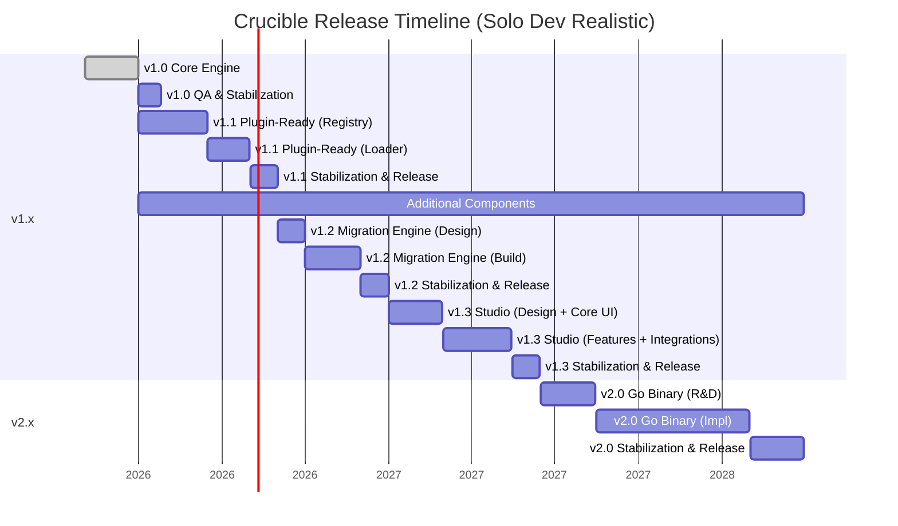
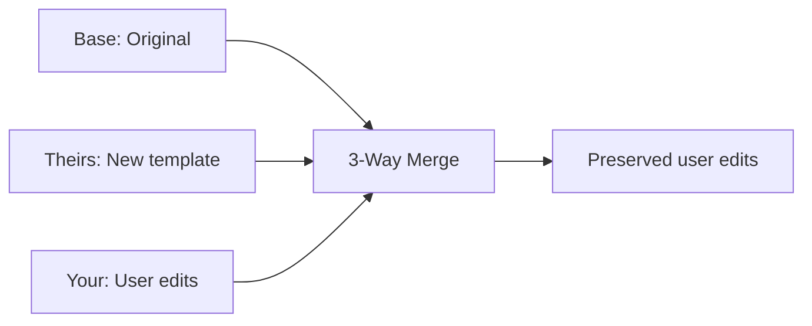
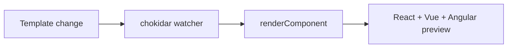
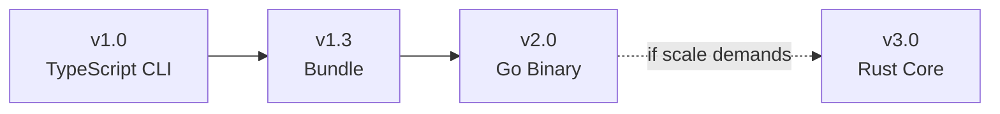

# Crucible Roadmap

> **Crucible — Code Generation Engine that generates style system/spec-based components**

**Current Version:** 1.0.0 | **Last Updated:** March 2026

---

## Philosophy

Crucible is a code generation engine, not a component library. The core philosophy:

### The Three Core Risks

1. **The Code Generation Trap** — Users edit generated files. Without an upgrade path, Crucible is
   write-once. This is the primary motivation for v1.2 (Migration Engine).

2. **Logic Leaking into Templates** — Every `{{#if}}` chain is a maintenance burden. Multi-framework
   support requires clean, logic-free templates enforced by the audit script.

3. **A11y Regressions** — Focus traps, ARIA live regions, combobox keyboard navigation. A single
   regression destroys the core value. Testing pyramid catches these before release.

---

## v1.0 — Complete ✅

| Feature                                           | Status |
| ------------------------------------------------- | ------ |
| TypeScript CLI engine (five-layer pipeline)       | ✅     |
| React, Vue 3, Angular frameworks                  | ✅     |
| CSS Modules, Tailwind CSS v4, SCSS style systems  | ✅     |
| Theme presets (minimal, soft) with deep merge     | ✅     |
| Dark mode (OKLCH perceptually uniform derivation) | ✅     |
| Hash-based user edit protection                   | ✅     |
| Template logic enforcement (audit script)         | ✅     |
| Compound components (all 3 frameworks)            | ✅     |
| Interactive CLI with @inquirer/prompts            | ✅     |
| Tailwind auto-setup                               | ✅     |
| Component registry with ComponentMeta             | ✅     |
| 230 unit tests across 24 test files               | ✅     |
| 19 E2E phases covering all commands               | ✅     |
| Professional component patterns                   | ✅     |
| DialogDescription + aria-describedby              | ✅     |
| Semantic color tokens (foreground variants)       | ✅     |
| CLI command shorthands (i, d, t, etc.)            | ✅     |
| CLI new flags (--style, --theme, --all)           | ✅     |
| CLI new commands (clean, pg:clean, config)        | ✅     |
| Prettier integration                              | ✅     |
| Dependency resolution (auto-scaffold Button)      | ✅     |
| Global tokens.css emission                        | ✅     |
| Playground system (3 frameworks)                  | ✅     |

---

## Additional Components

New components are added in parallel with version milestones. Each component requires:

- Template creation (React, Vue, Angular)
- Style system variants (CSS, Tailwind, SCSS)
- Snapshot tests
- Registry entry

| Component | Target Version | Status  |
| --------- | -------------- | ------- |
| Textarea  | v1.1           | Planned |
| Badge     | v1.1           | Planned |
| Tabs      | v1.1           | Planned |
| Tooltip   | v1.2           | Planned |
| Checkbox  | v1.2           | Planned |
| Radio     | v1.2           | Planned |
| Switch    | v1.3           | Planned |
| Alert     | v1.3           | Planned |
| Accordion | Future         | Planned |
| Avatar    | Future         | Planned |

Components are designed to work with existing token system and compound component patterns.

---

## v1.1 — Plugin-Ready Architecture

> **Target: Q2 2026**
>
> Make Crucible genuinely extensible by converting built-in components to manifest-driven loading,
> enabling local plugins, and preparing the writer for future upgrade tooling.

### Goals

- Load components from runtime manifests, not hardcoded source maps
- Enable local plugins via `.crucible/plugins/` discovery
- Multi-root template resolution (core + plugin templates)
- Declarative peer dependencies via manifests
- CLI registry-driven discovery (list/add work with plugins)
- Writer provenance for future upgrade/diff/audit commands

### Key Bottlenecks v1.1 Solves

| Bottleneck                       | Solution                             |
| -------------------------------- | ------------------------------------ |
| Hardcoded component registration | Runtime manifests + plugin loader    |
| Framework enum rigidity          | String IDs with validation           |
| Single template root             | Multi-root resolution                |
| Hardcoded peer dependencies      | Declarative manifest deps            |
| No upgrade path                  | Store provenance in manifest entries |

### Deliverables

| Feature              | Description                                                |
| -------------------- | ---------------------------------------------------------- |
| Manifest types       | `ComponentManifest`, `FrameworkManifest`, `PluginManifest` |
| Plugin loader        | `loadPlugins(cwd)` with validation + version checks        |
| Multi-root templates | Template resolution from core + plugin roots               |
| Declarative deps     | Per-component peerDependencies in manifests                |
| CLI plugin support   | `crucible list` and `crucible add` via runtime registry    |
| Writer provenance    | Store plugin/component/template source in manifest         |

---

## v1.2 — Migration Engine

### The Problem

Without an upgrade path, Crucible is write-once. Users can't get template improvements after editing
generated files.

### Solution

### Deliverables

| Command            | Purpose                                |
| ------------------ | -------------------------------------- |
| `crucible upgrade` | Apply template improvements with merge |
| `crucible diff`    | Show what would change                 |
| `crucible audit`   | Scan for out-of-sync files             |

---

## v1.3 — Crucible Studio

### The Problem

Template authors need to see multi-framework output without running commands.

### Solution

### Deliverables

- In-memory rendering (no file writes)
- Live template watcher
- IR and token inspector

---

## v2 Binary Path

### Migration Path

_Rust only if project scale demands sub-ms generation performance._

### What Stays Forever

- Template files (`.hbs`) — language-agnostic
- `crucible.config.json` — JSON
- Community templates

---

## Future Components (Long-term)

Additional components beyond the current roadmap timeline. Priority re-evaluated after v1.3.

| Component  | Description        |
| ---------- | ------------------ |
| Tag        | Removable tag      |
| Table      | Data table         |
| Pagination | Page navigation    |
| Breadcrumb | Navigation path    |
| Progress   | Progress indicator |

---

## Release Schedule

| Version | Focus                     | Target        |
| ------- | ------------------------- | ------------- |
| 1.0.0   | Core engine               | ✅ March 2026 |
| 1.1.0   | Plugin-ready architecture | ✅ Q3 2026    |
| 1.2.0   | Migration engine          | Q4 2026       |
| 1.3.0   | Studio                    | Q2 2027       |
| 2.0.0   | Go binary                 | 2028          |
