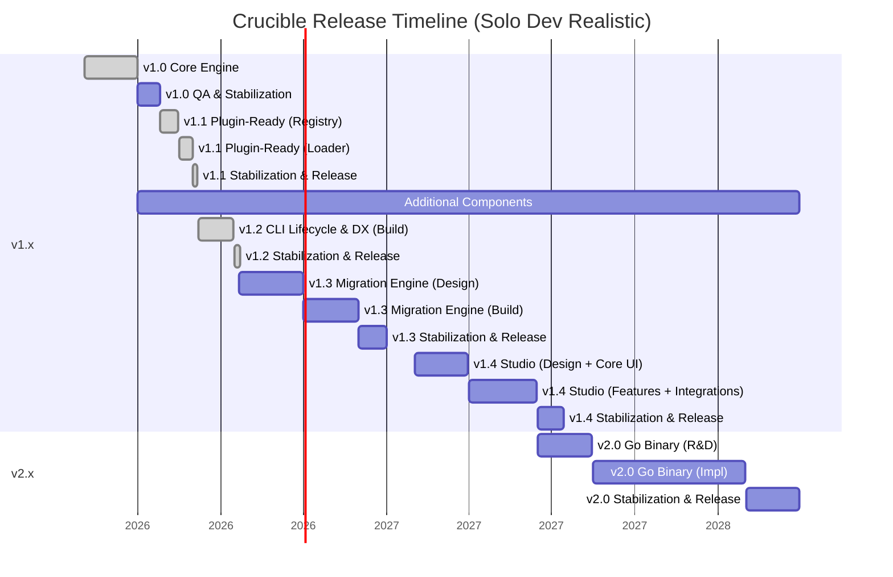
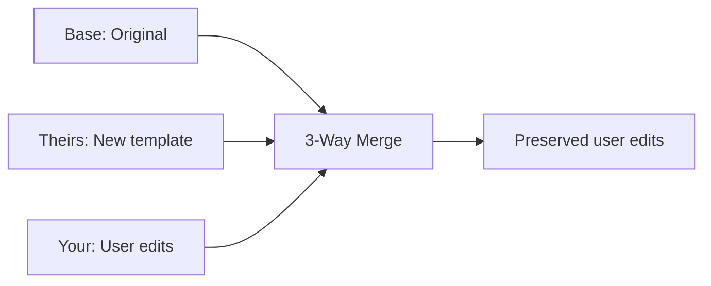
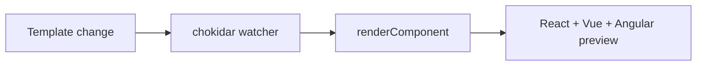
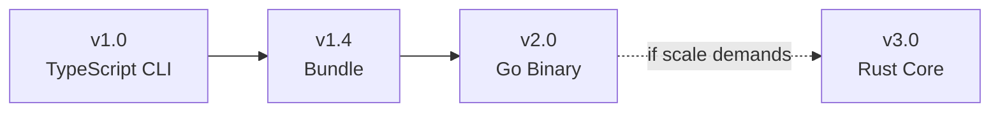

# Crucible Roadmap

> **Crucible — Code Generation Engine that generates style system/spec-based components**
>
> **shadcn for multi-framework teams + automation**

**Current Version:** 1.2.0 | **Last Updated:** 23-07-2026

---

## Philosophy

Crucible is a code generation engine, not a component library. The core philosophy:

### The Three Core Risks

1. **The Code Generation Trap** — Users edit generated files. Without an upgrade path, Crucible is
   write-once. This is the primary motivation for v1.3 (Migration Engine).

2. **Logic Leaking into Templates** — Every `{{#if}}` chain is a maintenance burden. Multi-framework
   support requires clean, logic-free templates enforced by the audit script.

3. **A11y Regressions** — Focus traps, ARIA live regions, combobox keyboard navigation. A single
   regression destroys the core value. Testing pyramid catches these before release.

---

## Addressing Common Concerns

### Migration & Updates

The v1.3 Migration Engine addresses the "write-once" problem with 3-way merge:

- `crucible upgrade` — Apply template improvements while preserving user edits
- `crucible diff` — Preview what would change
- `crucible audit` — Scan for out-of-sync files

### Ownership Trade-off

Full code ownership means you maintain what you edit. However:

- Base components are battle-tested and accessible (WCAG 2.1 AA)
- You choose what to customize vs. use as-is
- No breaking changes from upstream library updates

### Ecosystem & Adoption

- Real-world examples and templates (v1.5)
- Plugin system for community components (v1.1)
- Multi-framework consistency across your entire organization

---

## v1.0 — Complete ✅

| Feature                                           | Status |
| ------------------------------------------------- | ------ |
| TypeScript CLI engine (five-layer pipeline)       | ✅     |
| React, Vue 3, Angular frameworks                  | ✅     |
| CSS Modules, Tailwind CSS v4, SCSS style systems  | ✅     |
| Theme presets (minimal, soft) with deep merge     | ✅     |
| Dark mode (OKLCH perceptually uniform derivation) | ✅     |
| Hash-based user edit protection                   | ✅     |
| Template logic enforcement (audit script)         | ✅     |
| Compound components (all 3 frameworks)            | ✅     |
| Interactive CLI with @inquirer/prompts            | ✅     |
| Tailwind auto-setup                               | ✅     |
| Component registry with ComponentMeta             | ✅     |
| 448 unit tests across 48 test files               | ✅     |
| 238 E2E phases covering all commands              | ✅     |
| Professional component patterns                   | ✅     |
| DialogDescription + aria-describedby              | ✅     |
| Semantic color tokens (foreground variants)       | ✅     |
| CLI command shorthands (i, d, t, etc.)            | ✅     |
| CLI new flags (--style, --theme, --all)           | ✅     |
| CLI new commands (clean, pg:clean, config)        | ✅     |
| Prettier integration                              | ✅     |
| Dependency resolution (auto-scaffold Button)      | ✅     |
| Global tokens.css emission                        | ✅     |
| Playground system (3 frameworks)                  | ✅     |

---

## v1.1 — Complete ✅

> Shipped June 2026. Plugin-ready architecture + the 14-component app-building kit (**25
> components** total).

| Feature                                                           | Status |
| ----------------------------------------------------------------- | ------ |
| Plugin-ready, manifest-driven registry (no hardcoded source maps) | ✅     |
| Local plugins — `.crucible/plugins/*` auto-discovery              | ✅     |
| Engine-version compatibility checks (semver)                      | ✅     |
| Multi-root template resolution (core + plugin roots)              | ✅     |
| Declarative component + peer dependencies via manifests           | ✅     |
| Registry-driven CLI (`list` / `add` work with plugins)            | ✅     |
| App-building kit — 14 new components → **25 total**               | ✅     |
| Form controls — Textarea, Checkbox, Switch, RadioGroup, Label     | ✅     |
| Feedback — Alert, Progress (linear + circular), Skeleton          | ✅     |
| Navigation / overlay — Breadcrumb, Accordion, DropdownMenu        | ✅     |
| Presentational — Badge, Avatar, Separator                         | ✅     |
| WAI-ARIA patterns (radiogroup, menu, accordion, tabs, tooltip)    | ✅     |
| Floating-UI components (Popover, Tooltip, DropdownMenu)           | ✅     |
| 448 unit tests across 48 test files                               | ✅     |
| 238 E2E phases (every component × 3 frameworks × 3 styles)        | ✅     |
| 453 generated templates                                           | ✅     |

---

## Additional Components

New components are added in parallel with version milestones. Each component requires:

- Template creation (React, Vue, Angular)
- Style system variants (CSS, Tailwind, SCSS)
- Snapshot tests
- Registry entry

| Component        | Target Version | Status    |
| ---------------- | -------------- | --------- |
| **Table**        | v1.1           | ✅ Landed |
| **Popover**      | v1.1           | ✅ Landed |
| **Toast**        | v1.1           | ✅ Landed |
| **Form System**  | v1.1           | ✅ Landed |
| **Tabs**         | v1.1           | ✅ Landed |
| **Tooltip**      | v1.1           | ✅ Landed |
| **Textarea**     | v1.1           | ✅ Landed |
| **Checkbox**     | v1.1           | ✅ Landed |
| **Switch**       | v1.1           | ✅ Landed |
| **RadioGroup**   | v1.1           | ✅ Landed |
| **Label**        | v1.1           | ✅ Landed |
| **Separator**    | v1.1           | ✅ Landed |
| **Badge**        | v1.1           | ✅ Landed |
| **Skeleton**     | v1.1           | ✅ Landed |
| **Avatar**       | v1.1           | ✅ Landed |
| **Alert**        | v1.1           | ✅ Landed |
| **Progress**     | v1.1           | ✅ Landed |
| **Breadcrumb**   | v1.1           | ✅ Landed |
| **Accordion**    | v1.1           | ✅ Landed |
| **DropdownMenu** | v1.1           | ✅ Landed |

Components are designed to work with existing token system and compound component patterns.

### More coming soon 🚧

The kit keeps growing — planned next, each following the same multi-framework × style-system
pattern:

| Component                                                                | Description                        | Target  |
| ------------------------------------------------------------------------ | ---------------------------------- | ------- |
| Tag                                                                      | Removable/closable tag chip        | v1.3    |
| Pagination                                                               | Standalone page navigation control | v1.3    |
| Combobox                                                                 | Autocomplete / filterable Select   | v1.3    |
| Slider                                                                   | Range input with keyboard support  | v1.3    |
| Tabs Vertical presets · Toast promise helpers · more compound primitives | Incremental                        | rolling |

> Have a component you need? Local **plugins** (see v1.1 below) let you add your own today without
> waiting for a release — drop a manifest + templates into `.crucible/plugins/`.

```mermaid
gantt
    title Crucible Release Timeline (Solo Dev Realistic)
    dateFormat  YYYY-MM-DD
    axisFormat  %Y

    section v1.x

    v1.0 Core Engine           :done, 2026-02-01, 2026-03-31
    v1.0 QA & Stabilization    :2026-04-01, 2026-04-25

    v1.1 Plugin-Ready (Registry):done, 2026-04-26, 2026-05-15
    v1.1 Plugin-Ready (Loader)  :done, 2026-05-16, 2026-05-31
    v1.1 Stabilization & Release:done, 2026-06-01, 2026-06-06

    Additional Components       :2026-04-01, 2028-03-31

    v1.2 CLI Lifecycle & DX (Build) :done, 2026-06-07, 2026-07-15
    v1.2 Stabilization & Release    :done, 2026-07-16, 2026-07-23

    v1.3 Migration Engine (Design) :2026-07-22, 2026-09-30
    v1.3 Migration Engine (Build)  :2026-10-01, 2026-11-30
    v1.3 Stabilization & Release   :2026-12-01, 2026-12-31

    v1.4 Studio (Design + Core UI) :2027-02-01, 2027-03-31
    v1.4 Studio (Features + Integrations) :2027-04-01, 2027-06-15
    v1.4 Stabilization & Release   :2027-06-16, 2027-07-15

    section v2.x

    v2.0 Go Binary (R&D)       :2027-06-16, 2027-08-15
    v2.0 Go Binary (Impl)      :2027-08-16, 2028-01-31
    v2.0 Stabilization & Release:2028-02-01, 2028-03-31
```

---

## v1.1 — Plugin-Ready Architecture + App-Building Kit ✅ Shipped (June 2026)

> Released as **v1.1.0**. Two things landed together: the **plugin-ready architecture** (the engine
> is now fully manifest/registry-driven and plug-and-play) and a **14-component app-building kit**
> that brings the library to **25 components** — enough to scaffold a minimal SaaS app, web app,
> form, or marketing site.

### Plug-and-play — ready ✅

Crucible is genuinely extensible now. The registry is data-driven and discovers components at
runtime; **no engine code changes are needed to add a component** — just a manifest + templates.

- **Runtime manifests** — built-in components load from `src/registry/manifests/plugin.json`; no
  hardcoded source maps.
- **Local plugins** — `loadPlugins(cwd)` auto-discovers `.crucible/plugins/*/plugin.json`, so a
  project can drop in its own components/frameworks with zero core changes.
- **Engine-version compatibility** — each plugin declares `engineVersion`; incompatible plugins are
  skipped with a warning (semver `>=` check).
- **Multi-root templates** — each plugin carries its own template `root`, resolved alongside core.
- **Declarative dependencies** — per-component `dependencies` + `peerDependencies` live in
  manifests.
- **Registry-driven CLI** — `crucible list` / `crucible add` operate purely through the runtime
  registry, so plugin components are first-class.

### Deliverables

| Feature                                    | Description                                                | Status |
| ------------------------------------------ | ---------------------------------------------------------- | ------ |
| Manifest types                             | `ComponentManifest`, `FrameworkManifest`, `PluginManifest` | ✅     |
| Plugin loader                              | `loadPlugins(cwd)` with validation + version checks        | ✅     |
| Multi-root templates                       | Template resolution from core + plugin roots               | ✅     |
| Declarative deps                           | Per-component peer/component dependencies in manifests     | ✅     |
| CLI plugin support                         | `crucible list` and `crucible add` via runtime registry    | ✅     |
| App-building kit                           | 14 new components → 25 total (all 3 frameworks × 3 styles) | ✅     |
| 448 tests / 238 E2E phases / 453 templates | Full coverage for the expanded kit                         | ✅     |
| Writer provenance                          | `.crucible/manifest.json` storage (full provenance → v1.3) | 🚧     |

---

## v1.2 — CLI Lifecycle, Interactive Console & DX ✅ Complete

> Released as **v1.2.0** (23-07-2026). A developer-experience
> and lifecycle release built on the existing generation core: a guided terminal console, the
> commands to inspect, diff, update, and remove generated components, and a new **React Native**
> target.

| Feature                                                              | Status |
| -------------------------------------------------------------------- | ------ |
| `crucible ui` interactive console (aliases `wizard` / `tui`)         | ✅     |
| `crucible init` onboarding (offers guided scaffolding)               | ✅     |
| Lifecycle commands — `info`, `status`, `diff`, `update`, `remove`    | ✅     |
| `--json` output for `list` / `doctor` (+ `--quiet` on more commands) | ✅     |
| `--strict` plugin mode (collision / engineVersion → hard error)      | ✅     |
| Complete Vue SCSS coverage (25/25) + template-parity audit           | ✅     |
| Dependency upgrades (commander 15, vitest 4, Storybook 10.4, …)      | ✅     |
| Node floor raised to `>=22.12 <25` (drops Node 20/21)                | ✅     |
| Security hardening — CodeQL code-injection + path-injection fixes    | ✅     |
| Standalone playgrounds + esbuild 0.28.1 (dev advisory fixes)         | ✅     |
| Shell completion · update notifier · `info --deps-tree`              | ✅     |
| **React Native target — NativeWind *and* StyleSheet styling**        | ✅     |
| RN dependency preflight (react-native + Expo; nativewind/tailwind)   | ✅     |

---

## v1.3 — Migration Engine 🚧 In Progress

### The Problem

Without an upgrade path, Crucible is write-once. Users can't get template improvements after editing
generated files.

### Solution

```mermaid
graph LR
    A[Base: Original] --> D
    B[Theirs: New template] --> D
    C[Your: User edits] --> D
    D[3-Way Merge] --> E[Preserved user edits]
```

### Deliverables

| Command            | Purpose                                |
| ------------------ | -------------------------------------- |
| `crucible upgrade` | Apply template improvements with merge |
| `crucible diff`    | Show what would change                 |
| `crucible audit`   | Scan for out-of-sync files             |

---

## v1.4 — Crucible Studio

### The Problem

Template authors need to see multi-framework output without running commands.

### Solution

```mermaid
graph LR
    A[Template change] --> B[chokidar watcher]
    B --> C[renderComponent]
    C --> D[React + Vue + Angular preview]
```

### Deliverables

- In-memory rendering (no file writes)
- Live template watcher
- IR and token inspector

---

## v2 Binary Path

### Migration Path

```mermaid
flowchart LR
    A["v1.0<br/>TypeScript CLI"] --> B["v1.4<br/>Bundle"]
    B --> C["v2.0<br/>Go Binary"]
    C -.->|"if scale demands"| D["v3.0<br/>Rust Core"]
```

_Rust only if project scale demands sub-ms generation performance._

### What Stays Forever

- Template files (`.hbs`) — language-agnostic
- `crucible.config.json` — JSON
- Community templates

---

## Future Components (Long-term)

Additional components beyond the current roadmap timeline. Priority re-evaluated after v1.5.

| Component  | Description        |
| ---------- | ------------------ |
| Tag        | Removable tag      |
| Pagination | Page navigation    |

---

## Release Schedule

| Version | Focus                                                        | Target        |
| ------- | ------------------------------------------------------------ | ------------- |
| 1.0.0   | Core engine                                                  | ✅ March 2026 |
| 1.1.0   | Plugin-ready architecture + app-building kit (25 components) | ✅ June 2026  |
| 1.2.0   | CLI lifecycle, interactive console & DX                      | ✅ 23-07-2026  |
| 1.3.0   | Migration engine                                             | Q4 2026       |
| 1.4.0   | Studio                                                       | Q2 2027       |
| 1.5.0   | Ecosystem & examples                                         | Q3 2027       |
| 2.0.0   | Go binary                                                    | 2028          |
