# ⚗ Crucible — System Architecture

> **Design System Engine · v0.1 Architecture Reference**
>
> A complete technical map of every layer, decision, and data flow in the Crucible engine.

*Solo Project · Open Source · March 2026*

---

## Table of Contents

1. [System Overview](#1-system-overview)
2. [The Core Pipeline](#2-the-core-pipeline)
3. [Config Layer](#3-config-layer)
4. [Token Resolution Layer](#4-token-resolution-layer)
5. [Theme Preset System](#5-theme-preset-system)
6. [Dark Mode Architecture](#6-dark-mode-architecture)
7. [Component Model — The IR Layer](#7-component-model--the-ir-layer)
8. [Registry System](#8-registry-system)
9. [Style System — CSS vs Tailwind](#9-style-system--css-vs-tailwind)
10. [Template Engine](#10-template-engine)
11. [File Writer & Hash System](#11-file-writer--hash-system)
12. [CLI Layer](#12-cli-layer)
13. [Testing Architecture](#13-testing-architecture)
14. [Playground & Dev Environment](#14-playground--dev-environment)
15. [Data Shapes — Full Type Reference](#15-data-shapes--full-type-reference)
16. [Decision Log — Why Each Choice Was Made](#16-decision-log--why-each-choice-was-made)
17. [Future Architecture — v1 Binary Path](#17-future-architecture--v1-binary-path)

---

## 1. System Overview

Crucible is a **code generation engine**, not a component library. The distinction matters architecturally: it has no runtime presence in the user's application. Its entire job is to produce files that the user then owns.

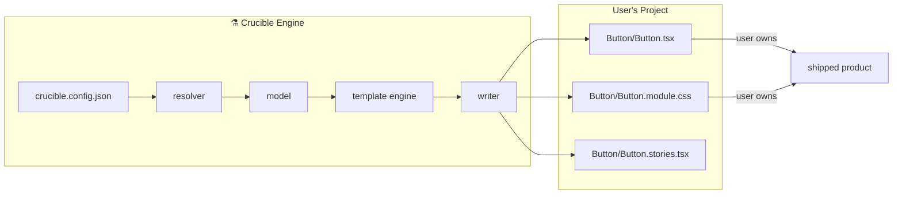

**Key properties:**
- No runtime dependency after generation
- User can edit every generated file freely
- Re-generation is opt-in via `--force`
- Hash system detects user edits before overwriting

---

## 2. The Core Pipeline

### 2.1 Full End-to-End Flow

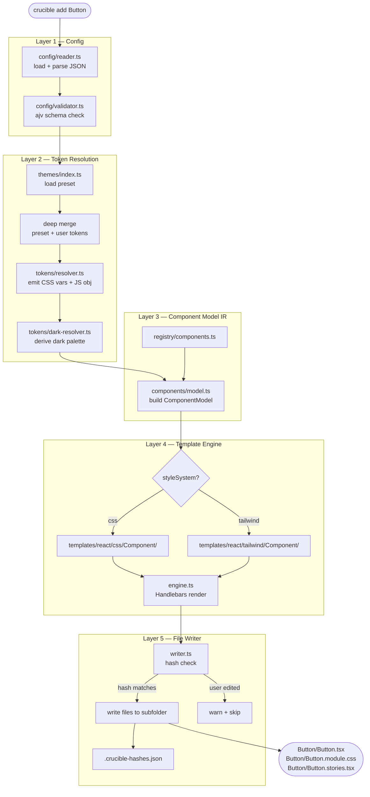

### 2.2 Layer Responsibilities

```mermaid
graph LR
    subgraph L1 ["Layer 1 — Config"]
        direction TB
        A1[read JSON from disk]
        A2[validate against schema]
        A3[apply defaults]
    end
    subgraph L2 ["Layer 2 — Tokens"]
        direction TB
        B1[load theme preset]
        B2[merge user overrides]
        B3[emit CSS custom props]
        B4[derive dark palette]
    end
    subgraph L3 ["Layer 3 — Model"]
        direction TB
        C1[normalize component shape]
        C2[resolve a11y requirements]
        C3[carry styleSystem through]
    end
    subgraph L4 ["Layer 4 — Templates"]
        direction TB
        D1[select template folder]
        D2[compile Handlebars]
        D3[render with model]
    end
    subgraph L5 ["Layer 5 — Writer"]
        direction TB
        E1[hash-check existing files]
        E2[write to disk]
        E3[update hash store]
    end
    L1 --> L2 --> L3 --> L4 --> L5
```

### 2.3 What Each Layer Is Allowed to Know

This is the key architectural constraint. Violations cause maintainability collapse.

| Layer | Allowed inputs | Must NOT know about |
|---|---|---|
| Config reader | Raw JSON file | Tokens, components, templates |
| Token resolver | Config + preset | Component names, templates |
| Component model | Config + resolved tokens | Template syntax, file paths |
| Template engine | ComponentModel only | Raw config, file system |
| Writer | Rendered strings + output path | Config, tokens, components |

Templates receive the `ComponentModel` — never raw config. If a template needs a value, the model must provide it. Logic in templates = architecture violation.

---

## 3. Config Layer

### 3.1 Config Processing Flow

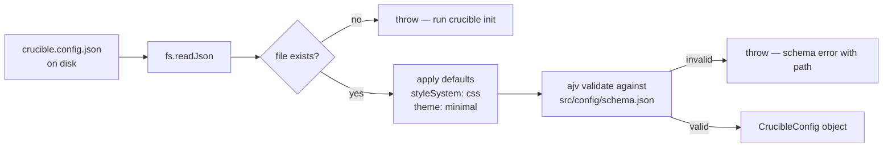

### 3.2 Config Schema — Complete Shape

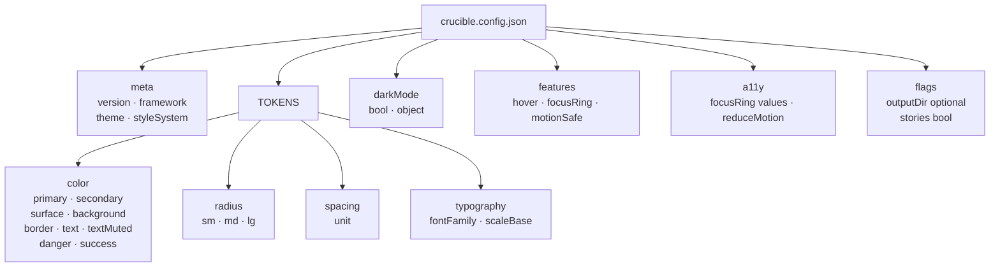

### 3.3 Default Values Applied by Reader

| Key | Default | Reason |
|---|---|---|
| `styleSystem` | `"css"` | Backward compatible, no Tailwind assumption |
| `theme` | `"minimal"` | Neutral starting point |
| `darkMode` | `false` | Opt-in, not imposed |
| `features.hover` | `true` | Better default UX |
| `features.focusRing` | `true` | Accessibility non-negotiable default |
| `a11y.reduceMotion` | `true` | Safe default for accessibility |
| `flags.stories` | `false` | Opt-in Storybook generation |

---

## 4. Token Resolution Layer

### 4.1 Resolution Pipeline

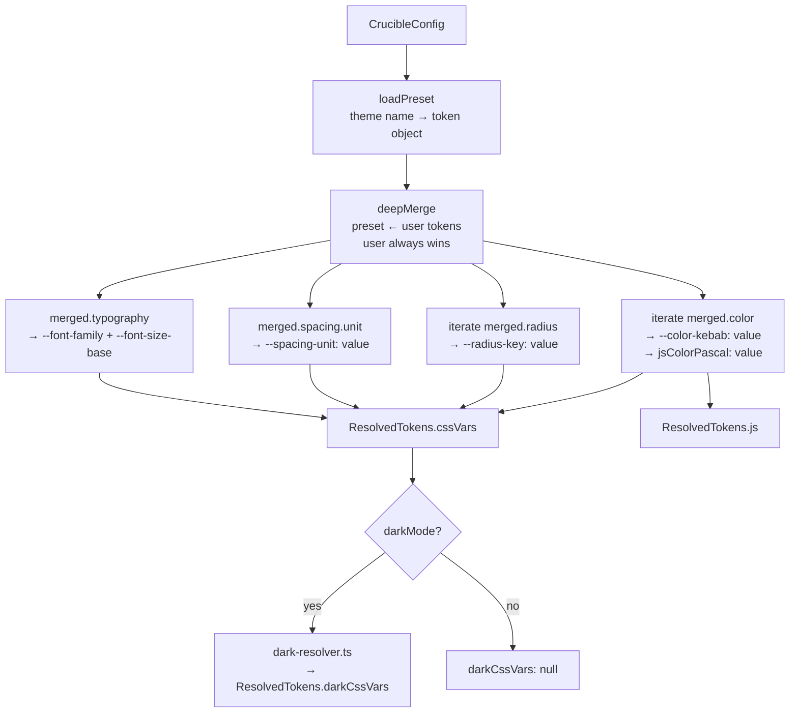

### 4.2 Key Transformation Rules

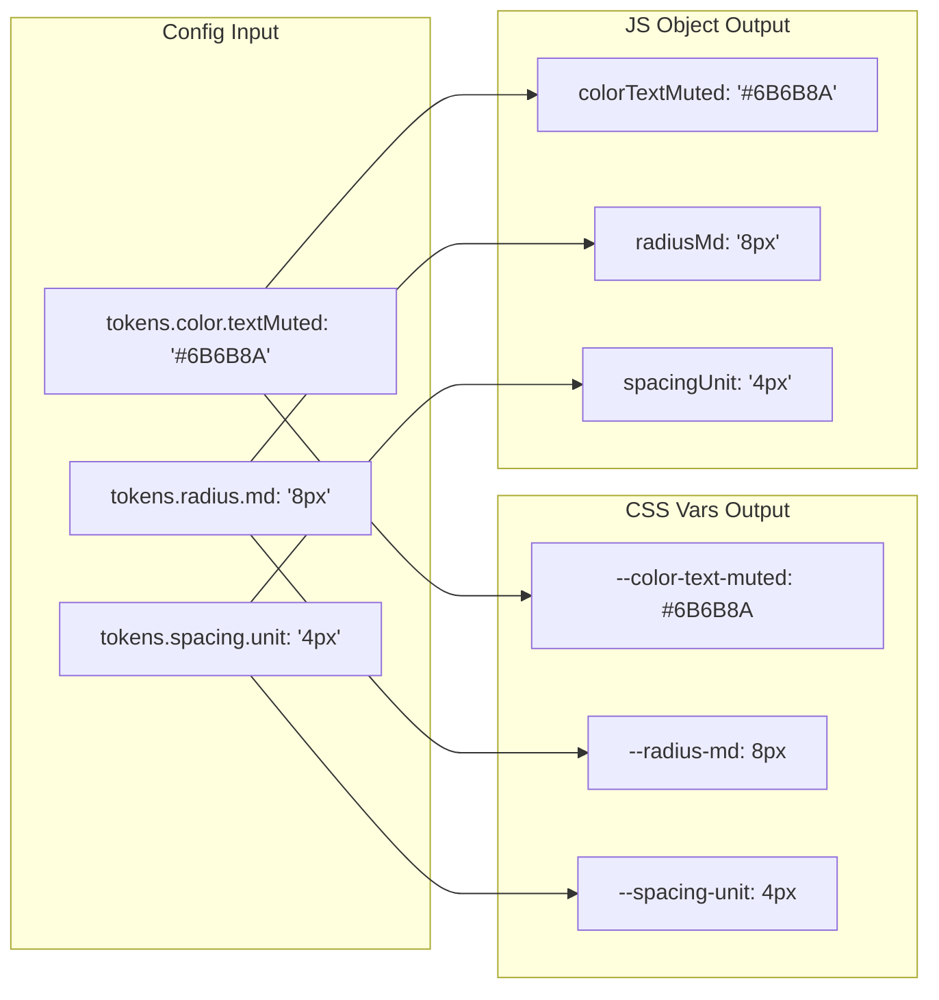

**Transformation functions:**
- `kebab()` — `textMuted` → `text-muted` (for CSS var names)
- `pascal()` — `textMuted` → `TextMuted` (for JS object keys, prefixed with type)

### 4.3 Deep Merge Strategy

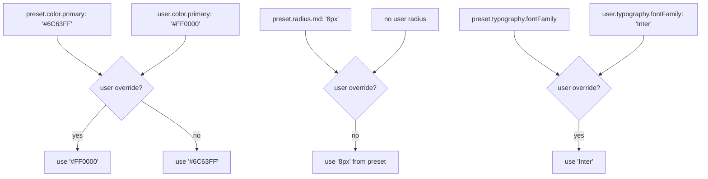

Merge is deep — `tokens.color.primary` overrides only `primary`, leaving other preset colors intact. Users only define what they want to change.

---

## 5. Theme Preset System

### 5.1 Preset Architecture

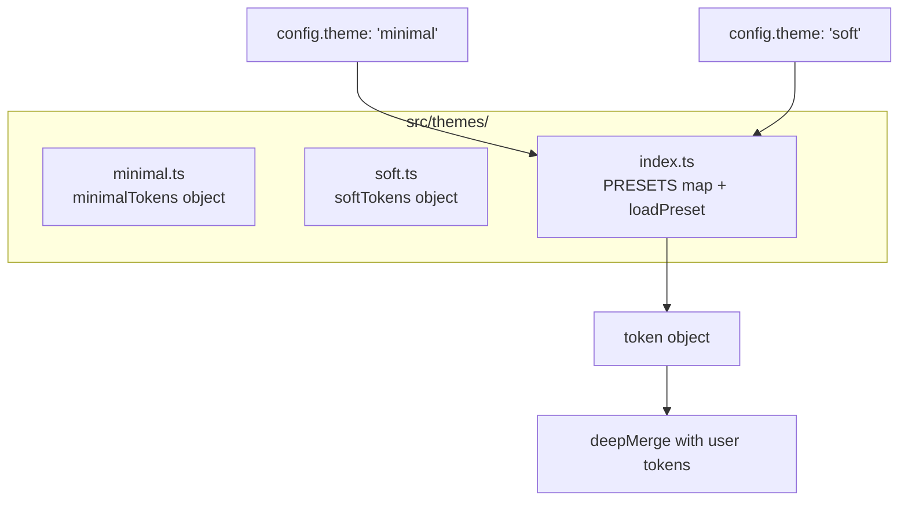

### 5.2 Minimal vs Soft — Key Differences

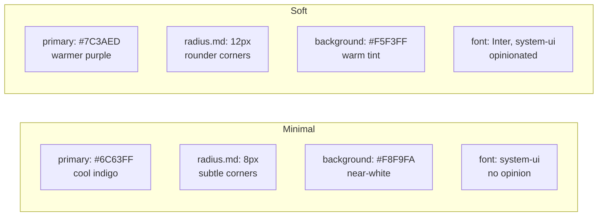

### 5.3 User Override Layering

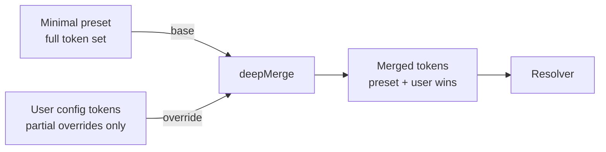

A user on `"theme": "soft"` who only sets `tokens.color.primary: "#FF6B6B"` gets the full soft palette with just the primary colour swapped. Everything else — radius, typography, background — stays soft.

---

## 6. Dark Mode Architecture

### 6.1 darkMode Config Forms

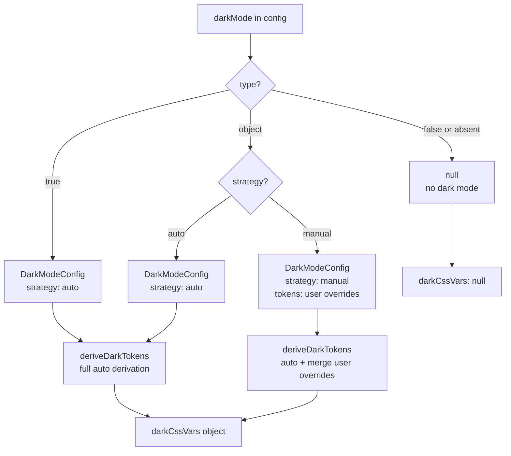

### 6.2 Colour Theory Derivation — OKLCH Space

Crucible derives dark tokens in OKLCH colour space, not HSL. OKLCH produces perceptually uniform shifts — the hue stays visually correct when you change lightness, which HSL does not guarantee.

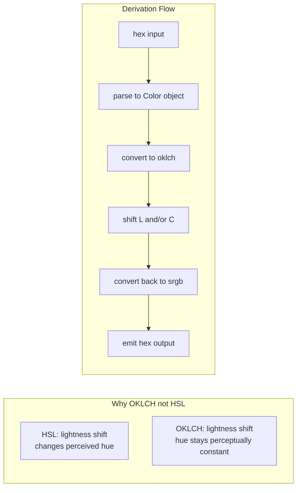

### 6.3 Transformation Table

| Token | Light value | Transformation | Dark result |
|---|---|---|---|
| `background` | `#F8F9FA` | Fixed per theme | `#0f0f1a` (minimal) |
| `surface` | `#FFFFFF` | Fixed per theme | `#1a1a2e` (minimal) |
| `primary` | `#6C63FF` | L +15%, C +5% | `#8B85FF` |
| `secondary` | `#F3F2FF` | L -40%, C -20% | darkened tint |
| `border` | `#E2E1F0` | primary at α 0.15 | `rgba(108,99,255,0.15)` |
| `text` | `#1A1A2E` | Fixed | `#f1f5f9` |
| `textMuted` | `#6B6B8A` | Fixed | `#94a3b8` |
| `danger` | `#E24B4A` | L +10% | lighter red |
| `success` | `#1D9E75` | L +10% | lighter green |

### 6.4 CSS Output Structure

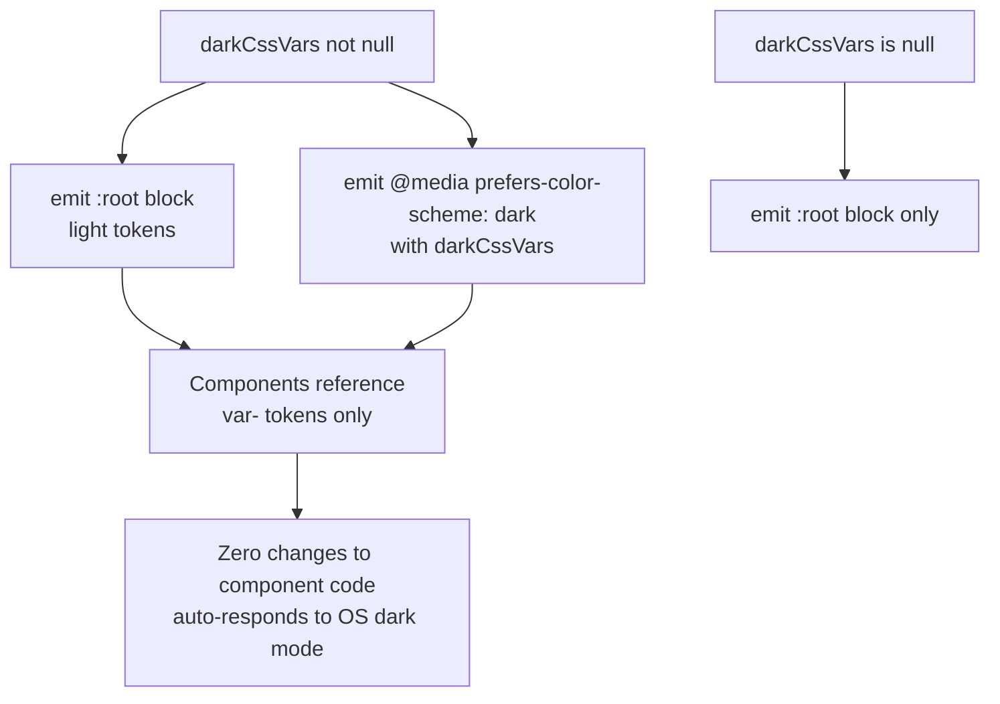

### 6.5 Manual Override Flow

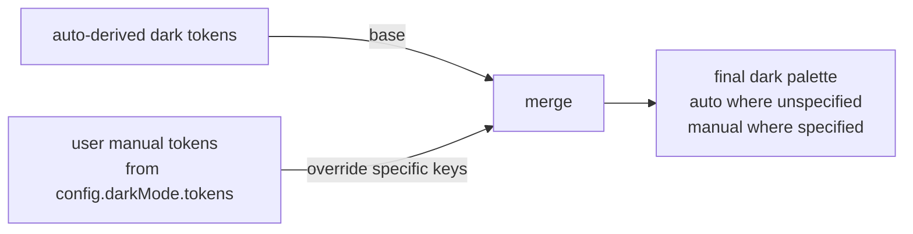

---

## 7. Component Model — The IR Layer

### 7.1 Why an IR Layer Exists

The IR (Intermediate Representation) sits between "what the user configured" and "what the template renders." Without it, templates become logic layers — `{{#if angular}}`, `{{#if hover}}`, `{{#if dark}}` — and collapse into unmaintainable Handlebars spaghetti.

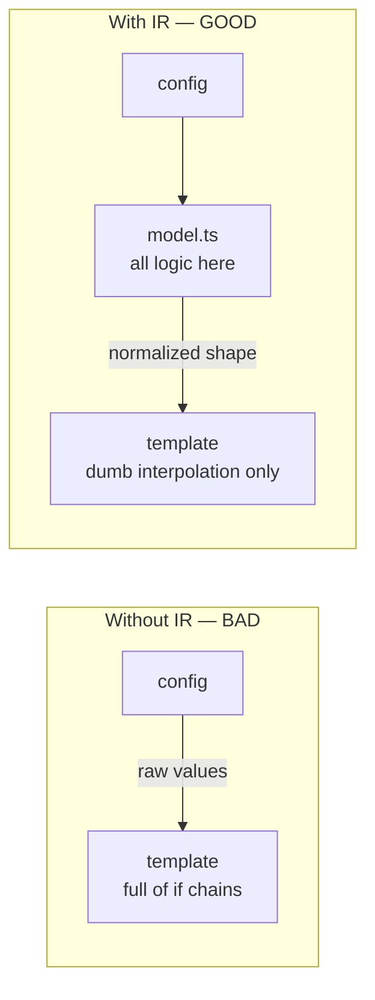

### 7.2 ComponentModel Shape

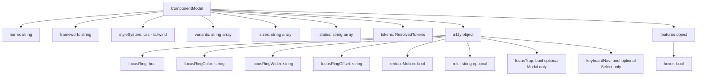

### 7.3 Component Defaults

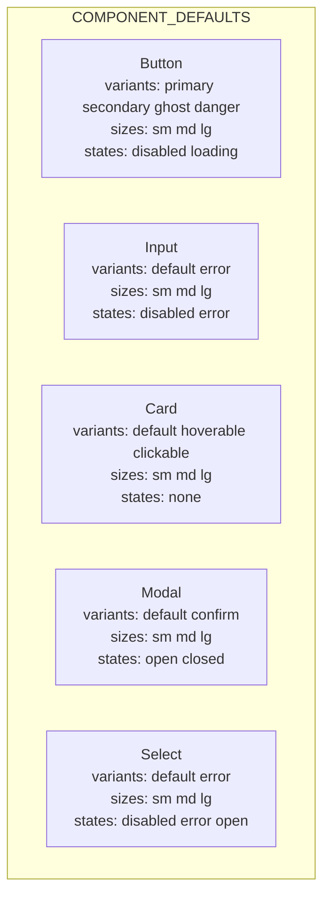

### 7.4 A11y Fields Per Component

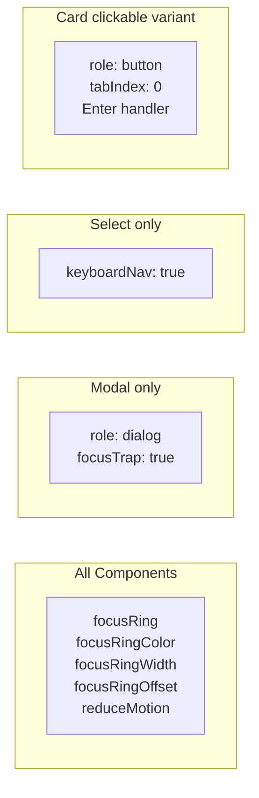

### 7.5 Model Build Flow

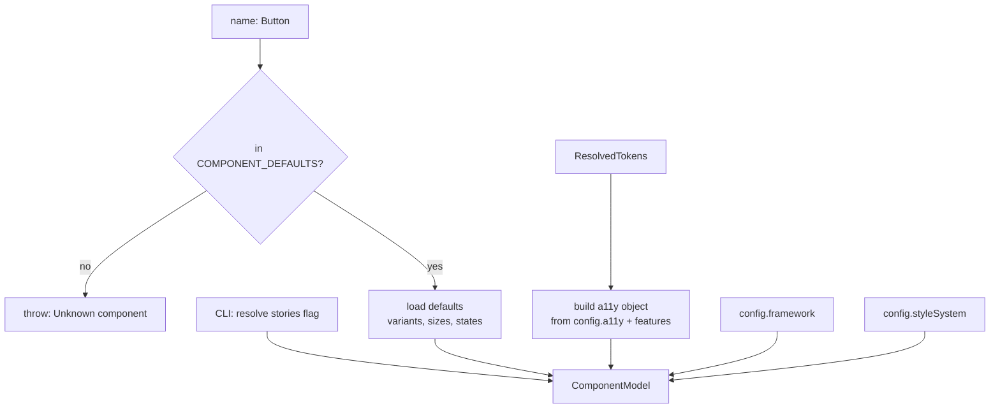

---

## 8. Registry System

### 8.1 Registry Architecture

```mermaid
graph TD
    subgraph REG ["registry/components.ts"]
        A[Button\nframeworks: react\nstyleSystems: css tailwind\nfiles.css: tsx + module.css + stories\nfiles.tailwind: tsx + stories]
        B[Input\nframeworks: react\nstyleSystems: css tailwind]
        C[Card · Modal · Select\nsame pattern]
    end
    D[CLI: crucible add Button] --> E{registry lookup}
    E -->|found| F[get file list for styleSystem]
    E -->|not found| G[error + list available]
    F --> H[model.ts]
```

### 8.2 What the Registry Unlocks

```mermaid
graph LR
    REG[registry] --> LIST[crucible list\nshows all components + frameworks]
    REG --> VALID[input validation\nbefore any processing starts]
    REG --> FILES[file list per styleSystem\nno CSS file in tailwind mode]
    REG --> PLUGIN[future: plugin-registered\ncommunity components]
```

### 8.3 File Output Per Style System

```mermaid
graph LR
    subgraph CSS ["styleSystem: css"]
        A[Button.tsx]
        B[Button.module.css]
        C[Button.stories.tsx]
    end
    subgraph TW ["styleSystem: tailwind"]
        D[Button.tsx]
        E[Button.stories.tsx]
        F[no CSS file]
    end
```

---

## 9. Style System — CSS vs Tailwind

### 9.1 The Architectural Choice

```mermaid
graph TD
    A[styleSystem in config] --> B{value?}
    B -->|css| C[templates/react/css/]
    B -->|tailwind| D[templates/react/tailwind/]
    C --> E[CSS module approach\ntokens in :root block\nclasses reference var---]
    D --> F[Tailwind utility approach\ntokens in project global CSS\nclasses use bg-var--- syntax]
```

### 9.2 Token Bridge — How Tailwind Uses Your Tokens

The key insight: in Tailwind mode, tokens still control the visual output. Tailwind's arbitrary value syntax `bg-[var(--color-primary)]` bridges Tailwind utilities with CSS custom properties. Your `crucible.config.json` tokens still drive everything.

```mermaid
graph LR
    A[tokens.color.primary: '#7C3AED'] --> B[resolver]
    B --> C[--color-primary: #7C3AED\nin :root CSS]
    C --> D[Tailwind: bg-var--color-primary]
    D --> E[renders as background: #7C3AED]
```

### 9.3 CSS Module vs Tailwind — Output Comparison

```mermaid
graph LR
    subgraph CSSIN ["CSS Mode Input"]
        A[.btn--primary {\n  background: var--color-primary\n  color: var--color-surface\n}]
    end
    subgraph TWIND ["Tailwind Mode Input"]
        B[primary: 'bg-var--color-primary\ntext-var--color-surface\nborder border-var--color-primary']
    end
    subgraph OUT ["Rendered output — identical"]
        C[background: #7C3AED\ncolor: #FDFCFF\nborder: 1px solid #7C3AED]
    end
    A --> OUT
    B --> OUT
```

### 9.4 What Does and Does NOT Change Between Modes

```mermaid
graph TD
    subgraph SAME ["Identical in both modes"]
        A[Component props API]
        B[ARIA attributes]
        C[TypeScript types]
        D[Stories structure]
        E[Token values]
    end
    subgraph DIFFERS ["Differs between modes"]
        F[CSS Module file — only in css mode]
        G[Class name approach — BEM vs utilities]
        H[Template folder — css/ vs tailwind/]
        I[Focus ring syntax — CSS vs Tailwind class]
    end
```

---

## 10. Template Engine

### 10.1 Template Architecture

```mermaid
graph TD
    subgraph FOLDERS ["Template Folders"]
        A[templates/react/css/Component/\nButton.tsx.hbs\nButton.module.css.hbs\nButton.stories.tsx.hbs]
        B[templates/react/tailwind/Component/\nButton.tsx.hbs\nButton.stories.tsx.hbs]
    end
    subgraph ENGINE ["engine.ts"]
        C[resolve tplDir\nfrom framework + styleSystem]
        D[build targets list\ncss: 3 files · tailwind: 2 files]
        E[for each target:\nread .hbs → Handlebars.compile → compiled model]
    end
    FOLDERS --> ENGINE
    F[ComponentModel] --> ENGINE
    ENGINE --> G[Record string string\nfilename → rendered content]
```

### 10.2 Handlebars Helpers Registered

```mermaid
graph LR
    subgraph HELPERS ["Registered helpers"]
        A[eq a b\na === b]
        B[includes arr val\narr?.includes val]
        C[capitalize str\nfirst char uppercase]
        D[kebab str\ncamelCase → kebab-case]
    end
```

### 10.3 Template Data Contract

```mermaid
graph LR
    subgraph ALLOWED ["Template receives"]
        A[ComponentModel\nfully resolved]
        B[model.name → component name]
        C[model.variants → array of strings]
        D[model.tokens.cssVars → map]
        E[model.tokens.darkCssVars → map or null]
        F[model.a11y → all a11y values resolved]
        G[model.features → hover etc]
    end
    subgraph FORBIDDEN ["Template must NOT receive"]
        H[raw CrucibleConfig]
        I[theme name]
        J[file paths]
        K[styleSystem string]
    end
```

Note: `styleSystem` drives *which template folder is chosen* — it does not appear inside the template itself. Once you're in the `tailwind/` folder, every template in there knows it's Tailwind.

### 10.4 dark CSS Vars Template Pattern

The CSS module template checks for `darkCssVars` before emitting the dark block:

```
{{#if tokens.darkCssVars}}
@media (prefers-color-scheme: dark) {
  :root {
{{#each tokens.darkCssVars}}    {{@key}}: {{this}};
{{/each}}  }
}
{{/if}}
```

If `darkMode: false` in config, `tokens.darkCssVars` is `null`, the block is omitted entirely. No dead code in the output.

---

## 11. File Writer & Hash System

### 11.1 Write Flow

```mermaid
flowchart TD
    A[files: Record string string\noutputDir: string\nopts.force: boolean] --> B[ensureDir outputDir]
    B --> C[load .crucible-hashes.json]
    C --> D{for each filename}
    D --> E{file exists on disk?}
    E -->|no| F[write file\nstore hash]
    E -->|yes| G{opts.force?}
    G -->|yes| F
    G -->|no| H[hash current file content]
    H --> I{stored hash matches\ncurrent hash?}
    I -->|matches = unchanged| F
    I -->|differs = user edited| J[warn + skip\ncannot overwrite]
    F --> K[update hashes map]
    K --> L[save .crucible-hashes.json]
```

### 11.2 The Hash System Explained

```mermaid
graph TD
    subgraph FIRST ["First generation"]
        A[generate Button.tsx] --> B[sha256 content → 12-char hash]
        B --> C[write Button.tsx to disk]
        C --> D[store hash in .crucible-hashes.json]
    end
    subgraph SECOND ["Second generation — user edited"]
        E[user edits Button.tsx] --> F[current file hash differs\nfrom stored hash]
        F --> G[warn: file modified\nuse --force to overwrite]
        G --> H[file preserved]
    end
    subgraph THIRD ["Second generation — file unchanged"]
        I[file on disk same\nas last generated] --> J[current hash matches stored]
        J --> K[safe to overwrite]
    end
```

### 11.3 Hash File Format

```json
{
  "Button/Button.tsx":         "a3f2c8e1b994",
  "Button/Button.module.css":  "d7e1a2b3c4f5",
  "Button/Button.stories.tsx": "f1e2d3c4b5a6"
}
```

One entry per generated file. 12-character SHA-256 prefix. Do not delete — losing this file means Crucible can no longer detect user edits.

---

## 12. CLI Layer

### 12.1 Command Architecture

```mermaid
graph TD
    subgraph CLI ["src/cli/index.ts"]
        A[crucible add Button]
        B[crucible list]
        C[crucible init]
        D[crucible eject]
    end
    subgraph ADD ["add command flow"]
        E[validate component in registry]
        F[readConfig]
        G[resolveTokens]
        H[buildComponentModel]
        I[renderComponent]
        J[writeFiles]
    end
    A --> E --> F --> G --> H --> I --> J
    B --> K[print registry entries]
```

### 12.2 Interactive Features & Dependency Resolution

The CLI supports advanced interactive features to streamline scaffolding:
- **Interactive Init:** `crucible init` prompts the user to select their preferred style system and component output directory, creating a tailored `crucible.config.json`.
- **Eject Command:** `crucible eject` allows users to pull the built-in theme tokens (from presets like `minimal` or `soft`) directly into their `crucible.config.json`. This provides full manual control over every token without having to look up preset values.
- **Multiselect Component Addition:** Running `crucible add` without arguments opens an interactive multiselect prompt to pick multiple components at once.
- **Dependency Resolution:** Complex components prompt for missing dependencies. For instance, `Select` and `Modal` both prompt the user to automatically scaffold `Button` if it's missing in the destination folder.

### 12.3 Tailwind Setup Integration

When `styleSystem: 'tailwind'` is selected, the CLI's `add` command triggers a setup check (`checkAndSetupTailwind`). It scans the project to verify Tailwind CSS is installed and correctly imported.
- If missing, it prompts the user to automatically install **Tailwind CSS v4** (and `@tailwindcss/vite` or `@tailwindcss/postcss` depending on the bundler).
- It injects `@import "tailwindcss";` into the user's global CSS file seamlessly.

### 12.4 CLI Flags

```mermaid
graph LR
    subgraph FLAGS ["crucible add flags"]
        A[--framework react\ndefault: react]
        B[--dev\noutput to playground/__generated__]
        C[--force\noverwrite user-edited files]
        D[--config path\ndefault: crucible.config.json]
        E[-y, --yes\nskip interactive prompts]
        F[--stories\nopt-in stories]
        G[--no-stories\nopt-out stories]
    end
```

### 12.5 Output Directory Resolution

```mermaid
flowchart LR
    A{--dev flag?} -->|yes| B[playground/react/src/__generated__/]
    A -->|no| C{config.flags.outputDir?}
    C -->|set| D[use outputDir from config]
    C -->|not set| E[src/components/ default]
```

### 12.6 CLI Output on Completion

```
✓  Button.tsx
✓  Button.module.css
✓  Button.stories.tsx

⚗  Button [css/minimal] → src/components
```

The completion line reports both `styleSystem` and `theme` so the user always knows which combination was used.

---

## 13. Testing Architecture

### 13.1 Testing Pyramid

```mermaid
graph BT
    subgraph L1 ["Layer 1 — Fast, pure logic"]
        A[Vitest unit tests\nresolver · model · dark-resolver\nno file system, no templates]
    end
    subgraph L2 ["Layer 2 — Integration, real output"]
        B[Vitest snapshot tests\nfull pipeline → rendered file content\nboth CSS and Tailwind mode]
    end
    subgraph L3 ["Layer 3 — Visual, rendered"]
        C[Storybook stories\nevery variant · every state\nwith real tokens applied\na11y panel on every story]
    end
    subgraph L4 ["Layer 4 — Regression, pixel-level"]
        D[Chromatic visual regression\npixel diff on every PR\nblocks merge if visuals change]
    end
    L1 --> L2 --> L3 --> L4
```

### 13.2 What Each Layer Catches

```mermaid
graph LR
    subgraph UNIT ["Vitest unit"]
        A[Wrong CSS var name]
        B[Token not resolving]
        C[Dark derivation wrong]
        D[Model a11y field missing]
    end
    subgraph SNAP ["Vitest snapshot"]
        E[Template output changed unexpectedly]
        F[Dark block missing from CSS]
        G[Tailwind mode still emitting CSS file]
    end
    subgraph SB ["Storybook a11y"]
        H[Missing ARIA role]
        I[Focus ring not visible]
        J[Color contrast failure]
        K[Broken keyboard interaction]
    end
    subgraph CHR ["Chromatic"]
        L[Token value drifted visually]
        M[Hover state broke]
        N[Dark mode rendering wrong]
        O[Cross-browser layout shift]
    end
```

### 13.3 Test File Map

```mermaid
graph TD
    subgraph TESTS ["src/__tests__/"]
        A[resolver.test.ts\ntoken resolution · preset loading\nuser overrides · dark mode flag]
        B[dark-resolver.test.ts\nnormalize · auto derivation\nmanual override · OKLCH shift]
        C[model.test.ts\ncomponent defaults · styleSystem\na11y fields · unknown component throw]
        D[snapshots/button.test.ts\ncss mode full output\ntailwind mode full output\ndark mode CSS block present]
    end
```

---

## 14. Playground & Dev Environment

### 14.1 Dev Loop Architecture

```mermaid
graph LR
    subgraph DEV ["npm run dev"]
        A[tsc --watch\nrecompiles src/ on save]
        B[Vite dev server\nwatches playground/react/]
    end
    subgraph GENERATE ["npm run generate:dev"]
        C[node dist/cli/index.js\nadd Button --dev]
    end
    subgraph OUTPUT ["playground/react/src/__generated__/"]
        D[Button.tsx]
        E[Button.module.css]
        F[Button.stories.tsx]
    end
    A -->|on change| G[dist/ updated]
    G --> C
    C --> D & E & F
    D & E & F -->|file change detected| B
    B -->|hot reload| H[browser\nlive preview]
```

### 14.2 Playground Structure

```mermaid
graph TD
    subgraph PLAY ["playground/react/"]
        A[package.json\nstandalone workspace]
        B[vite.config.ts]
        C[.storybook/\nmain.ts · preview.ts]
        D[src/\n__generated__/\n← crucible writes here]
    end
    subgraph DEPS ["playground deps only"]
        E[react react-dom]
        F[vite @vitejs/plugin-react]
        G[storybook addons]
        H[focus-trap-react]
    end
```

### 14.3 Storybook Watches Generated Files

```mermaid
graph LR
    A[stories: src/__generated__/**/*.stories.tsx] --> B[Storybook\nauto-discovers new stories]
    C[crucible add Input --dev] --> D[Input.stories.tsx\nappears in __generated__/]
    D --> B
    B --> E[Input stories\nvisible immediately]
```

This means you never manually register stories. Every component you generate via `--dev` automatically appears in Storybook.

### 14.4 NPM Workspaces Setup

```mermaid
graph TD
    ROOT[root package.json\nworkspaces: playground/react] --> PG[playground/react\npackage.json\nstandalone deps]
    ROOT -->|npm run playground| PG
    ROOT -->|npm run storybook| PG
    ROOT -->|npm run build| SRC[dist/]
    SRC --> CLI[bin/crucible.js\nrequires dist/cli/index.js]
```

---

## 15. Data Shapes — Full Type Reference

### 15.1 CrucibleConfig

```typescript
interface CrucibleConfig {
  version:     string;
  framework:   'react';                  // angular in v1.1
  theme:       'minimal' | 'soft';
  styleSystem: 'css' | 'tailwind';
  tokens?: {
    color?:      Record<string, string>;
    radius?:     Record<string, string>;
    spacing?:    { unit: string };
    typography?: { fontFamily: string; scaleBase: string };
  };
  darkMode?:   boolean | DarkModeConfig;
  features: {
    hover:      boolean;
    focusRing:  boolean;
    motionSafe: boolean;
  };
  a11y: {
    focusRingStyle:  string;
    focusRingColor:  string;
    focusRingWidth:  string;
    focusRingOffset: string;
    reduceMotion:    boolean;
  };
  flags?: {
    outputDir?: string;
  };
}

interface DarkModeConfig {
  strategy: 'auto' | 'manual';
  tokens?:  Record<string, string>;
}
```

### 15.2 ResolvedTokens

```typescript
interface ResolvedTokens {
  cssVars:     Record<string, string>;   // --color-primary: #6C63FF
  darkCssVars: Record<string, string> | null;  // null if darkMode disabled
  js:          Record<string, string>;   // colorPrimary: '#6C63FF'
}
```

### 15.3 ComponentModel

```typescript
interface ComponentModel {
  name:        string;
  framework:   string;
  styleSystem: 'css' | 'tailwind';
  variants:    string[];
  sizes:       string[];
  states:      string[];
  tokens:      ResolvedTokens;
  a11y: {
    focusRing:       boolean;
    focusRingColor:  string;
    focusRingWidth:  string;
    focusRingOffset: string;
    reduceMotion:    boolean;
    role?:           string;
    focusTrap?:      boolean;      // Modal only
    keyboardNav?:    boolean;      // Select only
  };
  features: {
    hover: boolean;
  };
  generateStories: boolean;
}
```

### 15.4 ComponentDef (Registry Entry)

```typescript
interface ComponentDef {
  frameworks:   string[];
  styleSystems: string[];
  files: {
    css:      string[];
    tailwind: string[];
  };
}
```

### 15.5 Data Flow Through the Pipeline

```mermaid
graph TD
    A[JSON object\nCrucibleConfig] -->|reader| B[CrucibleConfig\ntyped + defaults applied]
    B -->|resolver| C[ResolvedTokens\ncssVars + darkCssVars + js]
    B & C -->|model builder| D[ComponentModel\nfull normalized shape]
    D -->|engine| E[Record string string\nfilename → rendered content]
    E -->|writer| F[Files on disk\n+ updated hashes]
```

---

## 16. Decision Log — Why Each Choice Was Made

### Why TypeScript for v0.1

Frontend developers are the target users and contributors. TypeScript is the target language. Having the tool *be* TypeScript creates symmetry — contributors read the engine in the same language they write components in. No context switch. `npx crucible` works on any machine with Node, which every frontend developer already has.

### Why Handlebars for templates

Handlebars enforces the IR contract. It has no access to `require`, no ability to call functions, no loops beyond `{{#each}}`. A template author *cannot* add business logic to a template — the syntax won't allow it. This is a feature. The alternative (EJS, template literals) would let logic leak into templates immediately.

### Why an IR layer at all

Without `ComponentModel`, the template receives `CrucibleConfig` directly. The moment you have two frameworks, you write `{{#if angular}}` in the template. The moment you add dark mode, you write `{{#if darkMode}}`. The moment you add a second theme, you write `{{#if theme === 'soft'}}`. The template becomes the logic layer and it breaks within three components. The IR forces all of that into TypeScript where it can be tested, typed, and reasoned about.

### Why deep merge for token overrides

A user who sets `theme: "soft"` and overrides only `tokens.color.primary` should get soft radius, soft typography, and soft background — only the primary colour changes. A shallow merge would destroy all of `tokens.color` the moment the user touched any colour. Deep merge preserves intent.

### Why OKLCH for dark mode derivation

HSL lightness shifts change perceived hue. A blue button shifted lighter in HSL drifts toward cyan. OKLCH is perceptually uniform — L changes are visually consistent across hues. Dark mode derived in OKLCH looks deliberate. Derived in HSL it looks broken.

### Why hash-based overwrite protection

The "no wrapper" philosophy means users edit generated files. If re-generation silently overwrites user edits, the philosophy is betrayed. The hash system detects the delta — it knows whether the file on disk matches the last generated version, not whether it matches a new generation. User edits are sacred.

### Why parallel template folders instead of one template with conditionals

One template folder with `{{#if styleSystem === 'tailwind'}}` blocks would work for one component. By the fifth component, every template is half Tailwind and half CSS. The two output styles diverge enough that they deserve separate, clean template files. Adding a third style system (Web Components, styled-components) is adding a folder, not modifying every existing template.

### Why `colorjs.io` and not a custom colour utility

Colour space conversions, clamping, format parsing, alpha handling — this is a solved problem. `colorjs.io` is 8kb, zero sub-dependencies, and handles OKLCH natively. Writing a custom colour utility at this quality level would take two days and introduce bugs that take weeks to find.

---

## 17. Future Architecture — v1 Binary Path

### 17.1 The Distribution Problem

v0.1 ships as a Node.js CLI. `npx crucible add Button` works on any machine with Node. But "any machine with Node" still excludes a meaningful number of environments.

v1 ships as a standalone binary. `curl https://crucible.dev/install | sh` — no Node, no npm, no runtime.

### 17.2 The Three Options

```mermaid
graph TD
    subgraph OPTB ["Option B — Hybrid WRONG"]
        B1[Go/Rust binary for CLI + IO]
        B2[shells out to Node for templates]
        B3[still needs Node installed]
        B1 --> B2 --> B3
    end
    subgraph OPTA ["Option A — Pure binary CORRECT"]
        A1[Go binary — everything]
        A2[CLI + config + tokens + template engine]
        A3[raymond Go Handlebars]
        A4[single binary, zero deps]
        A1 --> A2 --> A3 --> A4
    end
    subgraph OPTC ["Option C — Bundled JS bridge"]
        C1[esbuild → single JS bundle]
        C2[npx crucible works, no install]
        C3[still needs Node]
        C4[v0.1 → v0.3 distribution]
        C1 --> C2 --> C3 --> C4
    end
```

### 17.3 Recommended Migration Path

```mermaid
graph LR
    A[v0.1\nTypeScript CLI\nnpx crucible] -->|ship + validate| B[v0.3\nesbuild bundle\nsingle JS file]
    B -->|architecture proven| C[v1.0\nGo binary\nzero dependencies\ncurl install]
    C -->|if scale demands| D[v2.0\nRust core\nfor sub-ms generation]
```

### 17.4 Why Go for the Binary Rewrite

```mermaid
graph TD
    subgraph GO ["Go — recommended"]
        A[cross-compilation trivial\nGOOS=darwin GOARCH=arm64]
        B[raymond: full Handlebars\nGo port, actively maintained]
        C[contributors need only Go\nnot Rust lifetimes]
        D[binary size ~8MB\nacceptable for a CLI]
    end
    subgraph RUST ["Rust — skip for this"]
        E[better performance ceiling\nbut ceiling not needed]
        F[borrow checker overhead\nfor contributors]
        G[Handlebars-rust exists\nbut ecosystem thinner]
    end
```

### 17.5 What Stays TypeScript Forever

The architecture is designed so that even after a Go binary rewrite, certain things remain TypeScript:

- The template files (`.hbs`) — language-agnostic, pure text
- The `crucible.config.json` schema — JSON, language-agnostic  
- Community-contributed components — can be added without touching the binary
- The playground and Storybook integration — React ecosystem, stays JS

The binary handles: CLI parsing, config reading, token resolution, template rendering, file writing. Everything that benefits from a compiled, zero-dependency executable.

### 17.6 Architecture Stability Across the Rewrite

The v0.1 TypeScript architecture is designed to map directly to Go:

```mermaid
graph LR
    subgraph TS ["TypeScript v0.1"]
        A[config/reader.ts]
        B[tokens/resolver.ts]
        C[components/model.ts]
        D[templates/engine.ts]
        E[scaffold/writer.ts]
    end
    subgraph GO ["Go v1.0"]
        F[config/reader.go]
        G[tokens/resolver.go]
        H[components/model.go]
        I[templates/engine.go\nusing raymond]
        J[scaffold/writer.go]
    end
    A -.->|direct port| F
    B -.->|direct port| G
    C -.->|direct port| H
    D -.->|raymond replaces Handlebars| I
    E -.->|direct port| J
```

The architectural decisions made in v0.1 — the IR layer, the hash system, the parallel template folders, the preset merge strategy — all survive the language rewrite intact. The rewrite is a translation, not a redesign.

---

*Crucible — System Architecture Reference — v0.1 — March 2026*
