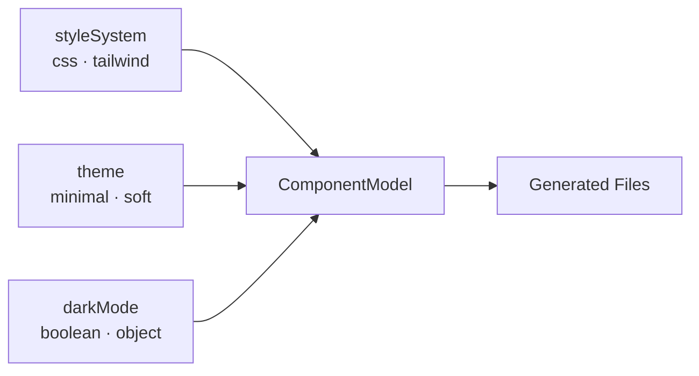
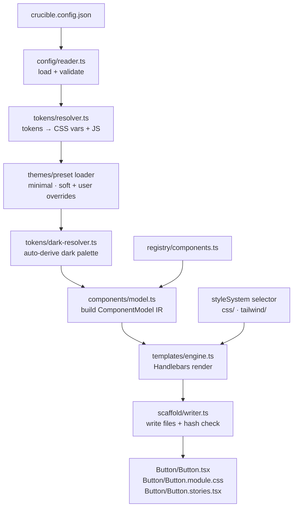
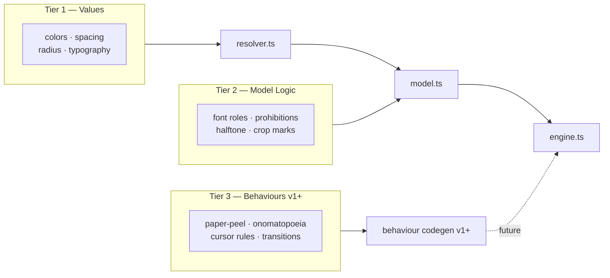
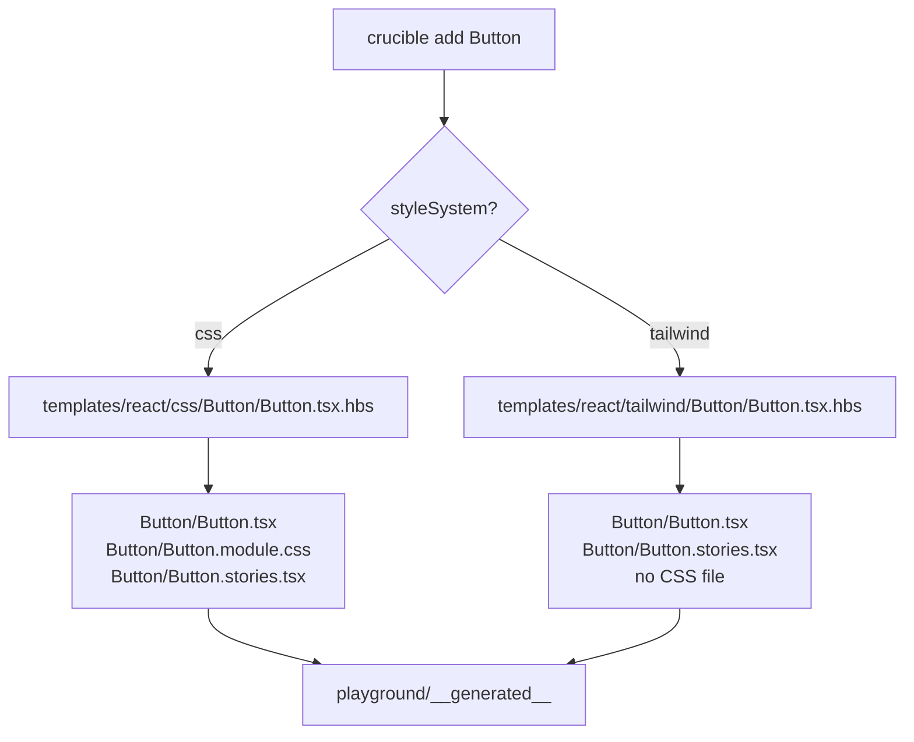
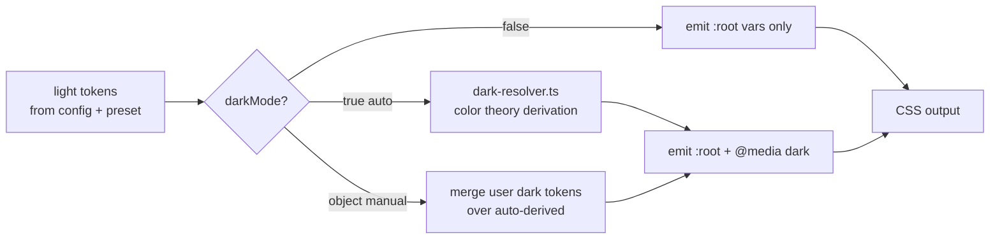
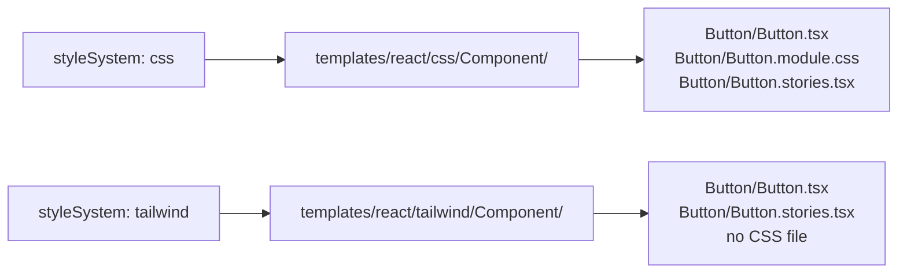
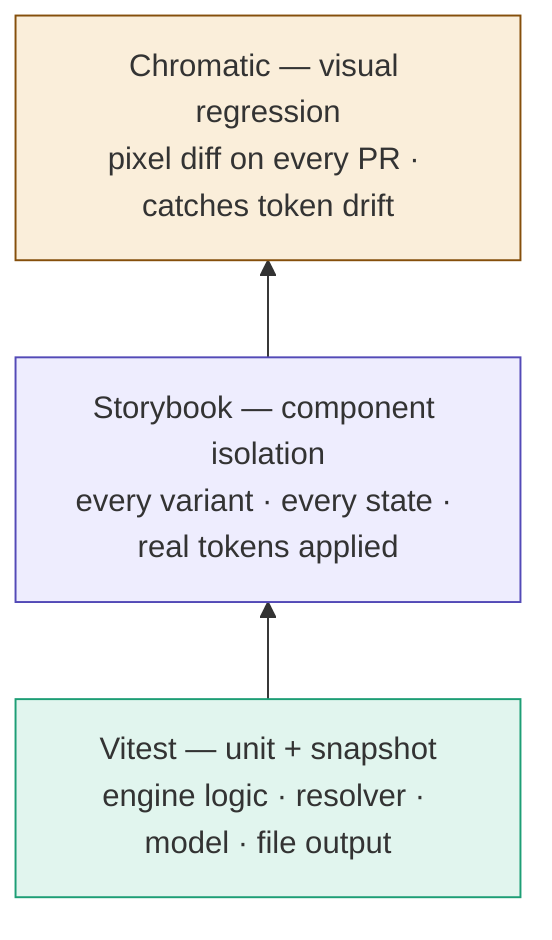

# ⚗ Crucible — Design System Engine

## v0.1 Complete Architecture & Work Guide

> **Generated once. Yours forever.**
>
> A code-generation engine that scaffolds native, fully-editable React components directly into your
> project — driven by a JSON config file. No wrappers, no black-box libraries. You own every file
> generated.

_Solo Project · Open Source · React + TypeScript · March 2026_

---

## Table of Contents

1. [What Is Crucible](#1-what-is-crucible)
2. [Core Philosophy](#2-core-philosophy)
3. [Full Architecture](#3-full-architecture)
4. [Config Schema — Complete v0.1](#4-config-schema--complete-v01)
5. [Design Languages — Minimal & Soft](#5-design-languages--minimal--soft)
6. [Dark Mode System](#6-dark-mode-system)
7. [Style System — CSS vs Tailwind](#7-style-system--css-vs-tailwind)
8. [Engine Source Code](#8-engine-source-code)
9. [Handlebars Templates](#9-handlebars-templates)
10. [Component Accessibility Specs](#10-component-accessibility-specs)
11. [Testing Stack](#11-testing-stack)
12. [Build Order — Week by Week](#12-build-order--week-by-week)
13. [Repo Setup — Complete Commands](#13-repo-setup--complete-commands)
14. [Commands Cheatsheet](#14-commands-cheatsheet)

---

## 1. What Is Crucible

Crucible is a CLI tool that reads your design intentions from a JSON config file and writes
idiomatic, production-ready React component code with accessibility, responsiveness, and design
tokens already baked in.

**The key difference from every other design system:** Crucible generates source code files you keep
in your own project. You read, edit, and extend every line. There is no runtime dependency on
Crucible after generation.

```
npx crucible add Button --framework react
```

This command reads `crucible.config.json`, resolves your design tokens, picks the right template for
Button, and writes `Button/Button.tsx` + `Button/Button.module.css` (or a Tailwind TSX file) into your components
folder. You own these files from that point forward.

---

## 2. Core Philosophy

### The "No Wrapper" Principle

Most design systems install as npm packages — you import their components and are locked into their
API forever. Crucible is different. It generates source code. Once generated, Crucible has zero
footprint in your runtime.

### Three Design Dimensions

Every generation is the product of three independent choices that compose cleanly:



These dimensions are orthogonal. `tailwind + soft + darkMode: true` is just as valid as
`css + minimal + darkMode: false`. The model layer handles the combination — templates stay dumb.

---

## 3. Full Architecture

### 3.1 The Pipeline



### 3.2 The Three-Tier Token System



> **v0.1 scope:** Tier 1 only. Tier 3 is VOID_PROTOCOL territory — designed into the architecture
> but not built yet.

### 3.3 Folder Structure

```
crucible/
  src/
    cli/
      index.ts              ← commander entry, wires all layers
      init.ts               ← interactive crucible init command
      tailwind.ts           ← automatic tailwind v4 setup integration
    config/
      reader.ts             ← load + parse crucible.config.json
      validator.ts          ← ajv schema validation
      schema.json           ← JSON schema definition
    tokens/
      resolver.ts           ← tokens → CSS vars + JS object
      dark-resolver.ts      ← derive dark palette from light tokens
    themes/
      minimal.ts            ← built-in minimal preset
      soft.ts               ← built-in soft preset
      index.ts              ← exports PRESETS map
    components/
      model.ts              ← build ComponentModel (IR layer)
    templates/
      engine.ts             ← Handlebars compile + render
    scaffold/
      writer.ts             ← write files + store generation hash
    registry/
      components.ts         ← component → file output map
    __tests__/
      resolver.test.ts
      model.test.ts
      dark-resolver.test.ts
      snapshots/
        button.test.ts

  templates/
    react/
      css/                  ← CSS module templates
        Button/
          Button.tsx.hbs
          Button.module.css.hbs
          Button.stories.tsx.hbs
        Input/
          Input.tsx.hbs
          Input.module.css.hbs
          Input.stories.tsx.hbs
        Card/
          Card.tsx.hbs
          Card.module.css.hbs
          Card.stories.tsx.hbs
        Modal/
          Modal.tsx.hbs
          Modal.module.css.hbs
          Modal.stories.tsx.hbs
        Select/
          Select.tsx.hbs
          Select.module.css.hbs
          Select.stories.tsx.hbs
      tailwind/             ← Tailwind utility class templates
        Button/
          Button.tsx.hbs
          Button.stories.tsx.hbs
        Input/
          Input.tsx.hbs
          Input.stories.tsx.hbs
        Card/
          Card.tsx.hbs
          Card.stories.tsx.hbs
        Modal/
          Modal.tsx.hbs
          Modal.stories.tsx.hbs
        Select/
          Select.tsx.hbs
          Select.stories.tsx.hbs

  playground/
    react/
      package.json
      vite.config.ts
      .storybook/
        main.ts
        preview.ts
      src/
        __generated__/      ← crucible writes here in --dev mode

  bin/
    crucible.js             ← npm bin entry
  crucible.config.json      ← example config
  package.json
  tsconfig.json
  vitest.config.ts
  .crucible-hashes.json     ← generation hashes — do not delete
```

### 3.4 Template Selection Flow



### 3.5 Dark Mode Resolution



---

## 4. Config Schema — Complete v0.1

The config is the user's single source of truth. Three new keys in v0.1: `styleSystem`, `theme`, and
`darkMode`.

```json
{
  "$schema": "./node_modules/crucible/schema.json",
  "version": "1",
  "framework": "react",

  "theme": "minimal",
  "styleSystem": "css",

  "tokens": {
    "color": {
      "primary": "#6C63FF",
      "secondary": "#F3F2FF",
      "surface": "#FFFFFF",
      "background": "#F8F9FA",
      "border": "#E2E1F0",
      "text": "#1A1A2E",
      "textMuted": "#6B6B8A",
      "danger": "#E24B4A",
      "success": "#1D9E75"
    },
    "radius": {
      "sm": "4px",
      "md": "8px",
      "lg": "12px"
    },
    "spacing": { "unit": "4px" },
    "typography": {
      "fontFamily": "system-ui, sans-serif",
      "scaleBase": "16px"
    }
  },

  "darkMode": true,

  "features": {
    "hover": true,
    "focusRing": true,
    "motionSafe": true
  },

  "a11y": {
    "focusRingStyle": "outline",
    "focusRingColor": "var(--color-primary)",
    "focusRingWidth": "2px",
    "focusRingOffset": "3px",
    "reduceMotion": true
  }
}
```

### Config Key Reference

| Key                   | Type             | Values                                  | Description                        |
| --------------------- | ---------------- | --------------------------------------- | ---------------------------------- |
| `theme`               | string           | `"minimal"` · `"soft"`                  | Built-in design language preset    |
| `styleSystem`         | string           | `"css"` · `"tailwind"`                  | Output style format                |
| `darkMode`            | boolean · object | `true` · `false` · `{strategy, tokens}` | Dark mode generation               |
| `tokens`              | object           | —                                       | User overrides, merged over preset |
| `features.hover`      | boolean          | —                                       | Emit hover state styles            |
| `features.focusRing`  | boolean          | —                                       | Emit focus-visible ring            |
| `features.motionSafe` | boolean          | —                                       | Emit prefers-reduced-motion        |
| `a11y.reduceMotion`   | boolean          | —                                       | Guard all transitions              |

### darkMode object form

```json
{
  "darkMode": {
    "strategy": "manual",
    "tokens": {
      "surface": "#0f0f1a",
      "background": "#07080c",
      "text": "#f1f5f9"
    }
  }
}
```

Use `strategy: "auto"` (or just `true`) for colour-theory derivation. Use `strategy: "manual"` to
override specific dark tokens while keeping the rest auto-derived.

### Token → CSS variable mapping

| Config key                     | Resolved CSS variable |
| ------------------------------ | --------------------- |
| `tokens.color.primary`         | `--color-primary`     |
| `tokens.color.textMuted`       | `--color-text-muted`  |
| `tokens.radius.md`             | `--radius-md`         |
| `tokens.spacing.unit`          | `--spacing-unit`      |
| `tokens.typography.fontFamily` | `--font-family`       |

> **Rule:** Every component references `var(--...)` only. No hard-coded values anywhere in generated
> output. This applies to Tailwind output too — arbitrary value syntax `bg-[var(--color-primary)]`
> bridges Tailwind utilities with your token system.

---

## 5. Design Languages — Minimal & Soft

Built-in themes live in `src/themes/`. The resolver loads the preset first, then deep-merges user
config on top. User values always win.

### 5.1 Minimal

Clean, neutral, works anywhere. Subtle radius, cool-toned palette, low visual weight. Good default
for developer tools, dashboards, and internal products.

```typescript
// src/themes/minimal.ts
export const minimalTokens = {
  color: {
    primary: '#6C63FF',
    secondary: '#F3F2FF',
    surface: '#FFFFFF',
    background: '#F8F9FA',
    border: '#E2E1F0',
    text: '#1A1A2E',
    textMuted: '#6B6B8A',
    danger: '#E24B4A',
    success: '#1D9E75',
  },
  radius: { sm: '4px', md: '8px', lg: '12px' },
  spacing: { unit: '4px' },
  typography: {
    fontFamily: 'system-ui, sans-serif',
    scaleBase: '16px',
  },
};
```

### 5.2 Soft

Warm, friendly, consumer-product feel. Notably rounder corners, warmer purple primary, slightly
elevated surface colour. Good for SaaS products, marketplaces, and consumer apps.

```typescript
// src/themes/soft.ts
export const softTokens = {
  color: {
    primary: '#7C3AED',
    secondary: '#EDE9FE',
    surface: '#FDFCFF',
    background: '#F5F3FF',
    border: '#DDD6FE',
    text: '#1E1B2E',
    textMuted: '#6D6490',
    danger: '#DC2626',
    success: '#059669',
  },
  radius: { sm: '6px', md: '12px', lg: '20px' },
  spacing: { unit: '4px' },
  typography: {
    fontFamily: "'Inter', system-ui, sans-serif",
    scaleBase: '16px',
  },
};
```

### 5.3 Theme Preset Loader

```typescript
// src/themes/index.ts
import { minimalTokens } from './minimal';
import { softTokens } from './soft';

export const PRESETS: Record<string, typeof minimalTokens> = {
  minimal: minimalTokens,
  soft: softTokens,
};

export function loadPreset(theme: string) {
  return PRESETS[theme] ?? PRESETS.minimal;
}
```

The resolver merges preset → user tokens:

```typescript
// src/tokens/resolver.ts
const preset = loadPreset(config.theme);
const merged = deepMerge(preset, config.tokens ?? {});
// resolve merged tokens as before
```

---

## 6. Dark Mode System

### 6.1 How Auto-Derivation Works

When `darkMode: true`, Crucible derives a dark palette from your light tokens using perceptual
colour transformations in OKLCH colour space. This produces results that feel intentional rather
than mechanical — the hue stays correct, only lightness and chroma shift.

The derivation rules:

| Token role   | Transformation                                |
| ------------ | --------------------------------------------- |
| `background` | Near-black, fixed per theme                   |
| `surface`    | Dark elevated surface, fixed per theme        |
| `border`     | Primary hue at 15% opacity                    |
| `text`       | Flip to near-white `#f1f5f9`                  |
| `textMuted`  | Flip to mid-gray `#94a3b8`                    |
| `primary`    | Boost lightness +15%, chroma +5% for contrast |
| `danger`     | Boost lightness +10%                          |
| `success`    | Boost lightness +10%                          |

### 6.2 Dark Resolver Source

```typescript
// src/tokens/dark-resolver.ts
import Color from 'colorjs.io';

export interface DarkModeConfig {
  strategy: 'auto' | 'manual';
  tokens?: Record<string, string>;
}

export function normalizeDarkMode(raw: boolean | DarkModeConfig): DarkModeConfig | null {
  if (raw === false || raw === undefined) return null;
  if (raw === true) return { strategy: 'auto' };
  return raw;
}

export function deriveDarkTokens(
  light: Record<string, string>,
  config: DarkModeConfig,
  theme: string,
): Record<string, string> {
  const base =
    theme === 'soft'
      ? { surface: '#1a1525', background: '#100e1a' }
      : { surface: '#1a1a2e', background: '#0f0f1a' };

  const auto: Record<string, string> = {
    primary: shiftColor(light.primary, { l: +15, c: +5 }),
    secondary: shiftColor(light.primary, { l: -40, c: -20 }),
    surface: base.surface,
    background: base.background,
    border: hexWithAlpha(light.primary, 0.15),
    text: '#f1f5f9',
    textMuted: '#94a3b8',
    danger: shiftColor(light.danger, { l: +10 }),
    success: shiftColor(light.success, { l: +10 }),
  };

  if (config.strategy === 'manual' && config.tokens) {
    return { ...auto, ...config.tokens };
  }

  return auto;
}

function shiftColor(hex: string, shift: { l?: number; c?: number }): string {
  try {
    const color = new Color(hex).to('oklch');
    if (shift.l) color.l = clamp(color.l + shift.l / 100, 0, 1);
    if (shift.c) color.c = Math.max(0, color.c + shift.c / 100);
    return color.to('srgb').toString({ format: 'hex' });
  } catch {
    return hex;
  }
}

function hexWithAlpha(hex: string, alpha: number): string {
  try {
    const color = new Color(hex);
    color.alpha = alpha;
    return color.to('srgb').toString({ format: 'hex' });
  } catch {
    return hex;
  }
}

function clamp(n: number, min: number, max: number): number {
  return Math.min(max, Math.max(min, n));
}
```

### 6.3 CSS Output — Dark Mode

The resolver emits two blocks when dark mode is enabled:

```css
/* Light tokens — always emitted */
:root {
  --color-primary: #6c63ff;
  --color-surface: #ffffff;
  --color-text: #1a1a2e;
  --color-text-muted: #6b6b8a;
  --radius-md: 8px;
  --spacing-unit: 4px;
  --font-family: system-ui, sans-serif;
}

/* Dark tokens — emitted when darkMode is enabled */
@media (prefers-color-scheme: dark) {
  :root {
    --color-primary: #8b85ff;
    --color-surface: #1a1a2e;
    --color-background: #0f0f1a;
    --color-text: #f1f5f9;
    --color-text-muted: #94a3b8;
    --color-border: rgba(108, 99, 255, 0.15);
  }
}
```

Components reference only `var(--...)` — they automatically respond to the media query with zero
changes to their own code.

---

## 7. Style System — CSS vs Tailwind

### 7.1 How Template Selection Works



The engine resolves the template directory from `model.styleSystem`:

```typescript
// src/templates/engine.ts
const tplDir = path.join(
  process.cwd(),
  'templates',
  model.framework,
  model.styleSystem, // 'css' or 'tailwind'
);
```

### 7.2 CSS Module Output

Standard CSS modules. Tokens injected as `:root` vars. All values reference `var(--...)`.

```tsx
// Generated: Button.tsx (css mode)
import React from 'react';
import styles from './Button.module.css';

export const Button = React.forwardRef<HTMLButtonElement, ButtonProps>(
  ({ variant = 'primary', size = 'md', ...props }, ref) => {
    const cls = [styles.btn, styles[`btn--${variant}`], styles[`btn--${size}`]]
      .filter(Boolean)
      .join(' ');

    return <button ref={ref} className={cls} {...props} />;
  },
);
```

### 7.3 Tailwind Utility Output

> **Tailwind v4 Setup Integration:**
> When generating components with `styleSystem: 'tailwind'`, the CLI automatically checks your project for a valid Tailwind setup. If missing, it will prompt to install **Tailwind CSS v4** automatically and inject `@import "tailwindcss";` into your global CSS file.

No CSS module generated. Token values bridge into Tailwind via arbitrary value syntax. The `:root`
vars are still emitted — just into the project's global CSS rather than a component CSS module.

```tsx
// Generated: Button.tsx (tailwind mode)
import React from 'react';

const variantClasses = {
  primary:
    'bg-[var(--color-primary)] text-white border border-[var(--color-primary)] hover:brightness-110',
  secondary:
    'bg-[var(--color-secondary)] text-[var(--color-primary)] border border-[var(--color-border)]',
  ghost:
    'bg-transparent text-[var(--color-text)] border border-[var(--color-border)] hover:bg-[var(--color-secondary)]',
  danger:
    'bg-[var(--color-danger)] text-white border border-[var(--color-danger)] hover:brightness-110',
};

const sizeClasses = {
  sm: 'px-3 py-1.5 text-sm',
  md: 'px-5 py-2.5 text-base',
  lg: 'px-7 py-3.5 text-lg',
};

export const Button = React.forwardRef<HTMLButtonElement, ButtonProps>(
  ({ variant = 'primary', size = 'md', loading, disabled, children, className, ...props }, ref) => {
    const cls = [
      'inline-flex items-center justify-center font-medium rounded-[var(--radius-md)]',
      'transition-colors duration-150',
      'focus-visible:outline focus-visible:outline-2',
      'focus-visible:outline-[var(--color-primary)]',
      'focus-visible:outline-offset-[3px]',
      'disabled:opacity-45 disabled:cursor-not-allowed',
      variantClasses[variant],
      sizeClasses[size],
      loading && 'cursor-wait',
      className,
    ]
      .filter(Boolean)
      .join(' ');

    return (
      <button
        ref={ref}
        className={cls}
        disabled={disabled || loading}
        aria-disabled={disabled || loading}
        aria-busy={loading}
        {...props}
      >
        {loading && (
          <span
            className="w-4 h-4 border-2 border-current border-t-transparent rounded-full animate-spin"
            aria-hidden="true"
          />
        )}
        {children}
      </button>
    );
  },
);

Button.displayName = 'Button';
```

> **Token bridging:** `bg-[var(--color-primary)]` uses Tailwind's arbitrary value syntax to
> reference your CSS custom properties. This means your tokens still control the visual output —
> Tailwind becomes the layout and spacing system, not the colour system.

---

## 8. Engine Source Code

Write files in this order. Each builds on the previous one.

### 8.1 src/config/reader.ts

```typescript
import fs from 'fs-extra';
import path from 'path';

export interface DarkModeConfig {
  strategy: 'auto' | 'manual';
  tokens?: Record<string, string>;
}

export interface CrucibleConfig {
  version: string;
  framework: string;
  theme: string;
  styleSystem: 'css' | 'tailwind';
  tokens?: {
    color?: Record<string, string>;
    radius?: Record<string, string>;
    spacing?: { unit: string };
    typography?: { fontFamily: string; scaleBase: string };
  };
  darkMode?: boolean | DarkModeConfig;
  features: {
    hover: boolean;
    focusRing: boolean;
    motionSafe: boolean;
  };
  a11y: {
    focusRingStyle: string;
    focusRingColor: string;
    focusRingWidth: string;
    focusRingOffset: string;
    reduceMotion: boolean;
  };
  flags?: {
    outputDir?: string;
  };
}

export async function readConfig(configPath: string): Promise<CrucibleConfig> {
  const resolved = path.resolve(process.cwd(), configPath);
  if (!(await fs.pathExists(resolved))) {
    throw new Error(`Config not found: ${resolved}\nRun: crucible init`);
  }
  const raw = await fs.readJson(resolved);
  return {
    styleSystem: 'css', // default
    theme: 'minimal', // default
    ...raw,
  };
}
```

### 8.2 src/themes/minimal.ts

```typescript
export const minimalTokens = {
  color: {
    primary: '#6C63FF',
    secondary: '#F3F2FF',
    surface: '#FFFFFF',
    background: '#F8F9FA',
    border: '#E2E1F0',
    text: '#1A1A2E',
    textMuted: '#6B6B8A',
    danger: '#E24B4A',
    success: '#1D9E75',
  },
  radius: { sm: '4px', md: '8px', lg: '12px' },
  spacing: { unit: '4px' },
  typography: { fontFamily: 'system-ui, sans-serif', scaleBase: '16px' },
};
```

### 8.3 src/themes/soft.ts

```typescript
export const softTokens = {
  color: {
    primary: '#7C3AED',
    secondary: '#EDE9FE',
    surface: '#FDFCFF',
    background: '#F5F3FF',
    border: '#DDD6FE',
    text: '#1E1B2E',
    textMuted: '#6D6490',
    danger: '#DC2626',
    success: '#059669',
  },
  radius: { sm: '6px', md: '12px', lg: '20px' },
  spacing: { unit: '4px' },
  typography: { fontFamily: "'Inter', system-ui, sans-serif", scaleBase: '16px' },
};
```

### 8.4 src/themes/index.ts

```typescript
import { minimalTokens } from './minimal';
import { softTokens } from './soft';

export const PRESETS = {
  minimal: minimalTokens,
  soft: softTokens,
} as const;

export type ThemeName = keyof typeof PRESETS;

export function loadPreset(theme: string): typeof minimalTokens {
  return (PRESETS as Record<string, typeof minimalTokens>)[theme] ?? PRESETS.minimal;
}
```

### 8.5 src/tokens/dark-resolver.ts

```typescript
import Color from 'colorjs.io';
import { DarkModeConfig } from '../config/reader';

export function normalizeDarkMode(
  raw: boolean | DarkModeConfig | undefined,
): DarkModeConfig | null {
  if (!raw) return null;
  if (raw === true) return { strategy: 'auto' };
  return raw as DarkModeConfig;
}

export function deriveDarkTokens(
  light: Record<string, string>,
  config: DarkModeConfig,
  theme: string,
): Record<string, string> {
  const base =
    theme === 'soft'
      ? { surface: '#1a1525', background: '#100e1a' }
      : { surface: '#1a1a2e', background: '#0f0f1a' };

  const auto: Record<string, string> = {
    primary: shiftColor(light.primary, { l: +15, c: +5 }),
    secondary: shiftColor(light.primary, { l: -40, c: -20 }),
    surface: base.surface,
    background: base.background,
    border: withAlpha(light.primary, 0.15),
    text: '#f1f5f9',
    textMuted: '#94a3b8',
    danger: shiftColor(light.danger, { l: +10 }),
    success: shiftColor(light.success, { l: +10 }),
  };

  return config.strategy === 'manual' && config.tokens ? { ...auto, ...config.tokens } : auto;
}

function shiftColor(hex: string, shift: { l?: number; c?: number }): string {
  try {
    const c = new Color(hex).to('oklch');
    if (shift.l) c.l = Math.min(1, Math.max(0, c.l + shift.l / 100));
    if (shift.c) c.c = Math.max(0, c.c + shift.c / 100);
    return c.to('srgb').toString({ format: 'hex' });
  } catch {
    return hex;
  }
}

function withAlpha(hex: string, alpha: number): string {
  try {
    const c = new Color(hex);
    c.alpha = alpha;
    return c.to('srgb').toString({ format: 'hex' });
  } catch {
    return hex;
  }
}
```

### 8.6 src/tokens/resolver.ts

```typescript
import { CrucibleConfig } from '../config/reader';
import { loadPreset } from '../themes';
import { normalizeDarkMode, deriveDarkTokens } from './dark-resolver';

export interface ResolvedTokens {
  cssVars: Record<string, string>;
  darkCssVars: Record<string, string> | null;
  js: Record<string, string>;
}

export function resolveTokens(config: CrucibleConfig): ResolvedTokens {
  const preset = loadPreset(config.theme);
  const merged = deepMerge(preset, config.tokens ?? {}) as typeof preset;

  const cssVars: Record<string, string> = {};
  const js: Record<string, string> = {};

  for (const [key, value] of Object.entries(merged.color)) {
    cssVars[`--color-${kebab(key)}`] = value;
    js[`color${pascal(key)}`] = value;
  }
  for (const [key, value] of Object.entries(merged.radius)) {
    cssVars[`--radius-${key}`] = value;
    js[`radius${pascal(key)}`] = value;
  }
  cssVars['--spacing-unit'] = merged.spacing.unit;
  cssVars['--font-family'] = merged.typography.fontFamily;
  cssVars['--font-size-base'] = merged.typography.scaleBase;

  const darkConfig = normalizeDarkMode(config.darkMode);
  let darkCssVars: Record<string, string> | null = null;

  if (darkConfig) {
    const darkColors = deriveDarkTokens(merged.color, darkConfig, config.theme);
    darkCssVars = {};
    for (const [key, value] of Object.entries(darkColors)) {
      darkCssVars[`--color-${kebab(key)}`] = value;
    }
  }

  return { cssVars, darkCssVars, js };
}

function deepMerge(base: any, override: any): any {
  const result = { ...base };
  for (const key of Object.keys(override ?? {})) {
    if (typeof override[key] === 'object' && !Array.isArray(override[key])) {
      result[key] = deepMerge(base[key] ?? {}, override[key]);
    } else {
      result[key] = override[key];
    }
  }
  return result;
}

function kebab(str: string): string {
  return str.replace(/([A-Z])/g, (m) => `-${m.toLowerCase()}`);
}

function pascal(str: string): string {
  return str[0].toUpperCase() + str.slice(1);
}
```

### 8.7 src/components/model.ts

```typescript
import { CrucibleConfig } from '../config/reader';
import { ResolvedTokens } from '../tokens/resolver';

export interface ComponentModel {
  name: string;
  framework: string;
  styleSystem: 'css' | 'tailwind';
  variants: string[];
  sizes: string[];
  states: string[];
  tokens: ResolvedTokens;
  a11y: {
    focusRing: boolean;
    focusRingColor: string;
    focusRingWidth: string;
    focusRingOffset: string;
    reduceMotion: boolean;
    role?: string;
    focusTrap?: boolean;
    keyboardNav?: boolean;
  };
  features: {
    hover: boolean;
  };
}

const COMPONENT_DEFAULTS: Record<string, Pick<ComponentModel, 'variants' | 'sizes' | 'states'>> = {
  Button: {
    variants: ['primary', 'secondary', 'ghost', 'danger'],
    sizes: ['sm', 'md', 'lg'],
    states: ['disabled', 'loading'],
  },
  Input: {
    variants: ['default', 'error'],
    sizes: ['sm', 'md', 'lg'],
    states: ['disabled', 'error'],
  },
  Card: {
    variants: ['default', 'hoverable', 'clickable'],
    sizes: ['sm', 'md', 'lg'],
    states: [],
  },
  Modal: {
    variants: ['default', 'confirm'],
    sizes: ['sm', 'md', 'lg'],
    states: ['open', 'closed'],
  },
  Select: {
    variants: ['default', 'error'],
    sizes: ['sm', 'md', 'lg'],
    states: ['disabled', 'error', 'open'],
  },
};

export function buildComponentModel(
  name: string,
  tokens: ResolvedTokens,
  config: CrucibleConfig,
): ComponentModel {
  const defaults = COMPONENT_DEFAULTS[name];
  if (!defaults) throw new Error(`Unknown component: ${name}. Run: crucible list`);

  return {
    name,
    framework: config.framework ?? 'react',
    styleSystem: config.styleSystem ?? 'css',
    ...defaults,
    tokens,
    a11y: {
      focusRing: config.features.focusRing ?? true,
      focusRingColor: config.a11y.focusRingColor ?? 'var(--color-primary)',
      focusRingWidth: config.a11y.focusRingWidth ?? '2px',
      focusRingOffset: config.a11y.focusRingOffset ?? '3px',
      reduceMotion: config.a11y.reduceMotion ?? true,
      role: name === 'Modal' ? 'dialog' : undefined,
      focusTrap: name === 'Modal' ? true : undefined,
      keyboardNav: name === 'Select' ? true : undefined,
    },
    features: {
      hover: config.features.hover ?? true,
    },
  };
}
```

### 8.8 src/registry/components.ts

```typescript
export interface ComponentDef {
  frameworks: string[];
  styleSystems: string[];
  files: {
    css: string[];
    tailwind: string[];
  };
}

export const registry: Record<string, ComponentDef> = {
  Button: {
    frameworks: ['react'],
    styleSystems: ['css', 'tailwind'],
    files: {
      css: ['Button.tsx', 'Button.module.css', 'Button.stories.tsx'],
      tailwind: ['Button.tsx', 'Button.stories.tsx'],
    },
  },
  Input: {
    frameworks: ['react'],
    styleSystems: ['css', 'tailwind'],
    files: {
      css: ['Input.tsx', 'Input.module.css', 'Input.stories.tsx'],
      tailwind: ['Input.tsx', 'Input.stories.tsx'],
    },
  },
  Card: {
    frameworks: ['react'],
    styleSystems: ['css', 'tailwind'],
    files: {
      css: ['Card.tsx', 'Card.module.css', 'Card.stories.tsx'],
      tailwind: ['Card.tsx', 'Card.stories.tsx'],
    },
  },
  Modal: {
    frameworks: ['react'],
    styleSystems: ['css', 'tailwind'],
    files: {
      css: ['Modal.tsx', 'Modal.module.css', 'Modal.stories.tsx'],
      tailwind: ['Modal.tsx', 'Modal.stories.tsx'],
    },
  },
  Select: {
    frameworks: ['react'],
    styleSystems: ['css', 'tailwind'],
    files: {
      css: ['Select.tsx', 'Select.module.css', 'Select.stories.tsx'],
      tailwind: ['Select.tsx', 'Select.stories.tsx'],
    },
  },
};
```

### 8.9 src/templates/engine.ts

```typescript
import Handlebars from 'handlebars';
import fs from 'fs-extra';
import path from 'path';
import { ComponentModel } from '../components/model';

Handlebars.registerHelper('eq', (a, b) => a === b);
Handlebars.registerHelper('includes', (arr, v) => arr?.includes(v));
Handlebars.registerHelper('capitalize', (s: string) => s[0].toUpperCase() + s.slice(1));
Handlebars.registerHelper('kebab', (s: string) =>
  s.replace(/([A-Z])/g, (m) => `-${m.toLowerCase()}`).toLowerCase(),
);

export async function renderComponent(model: ComponentModel): Promise<Record<string, string>> {
  const tplDir = path.join(
    __dirname,
    '../../templates',
    model.framework,
    model.styleSystem,
    model.name,
  );
  const result: Record<string, string> = {};

  const targets = [];
  targets.push({ tpl: `${model.name}.tsx.hbs`, out: `${model.name}.tsx` });

  if (model.styleSystem === 'css') {
    targets.push({ tpl: `${model.name}.module.css.hbs`, out: `${model.name}.module.css` });
  }

  if (model.generateStories) {
    targets.push({ tpl: `${model.name}.stories.tsx.hbs`, out: `${model.name}.stories.tsx` });
  }

  for (const { tpl, out } of targets) {
    const tplPath = path.join(tplDir, tpl);
    if (!(await fs.pathExists(tplPath))) continue;
    const source = await fs.readFile(tplPath, 'utf-8');
    const compiled = Handlebars.compile(source);
    result[out] = compiled(model);
  }

  return result;
}
```

### 8.10 src/scaffold/writer.ts

```typescript
import fs from 'fs-extra';
import path from 'path';
import crypto from 'crypto';
import chalk from 'chalk';

const HASH_FILE = '.crucible-hashes.json';

function hash(s: string) {
  return crypto.createHash('sha256').update(s).digest('hex').slice(0, 12);
}

async function loadHashes(): Promise<Record<string, string>> {
  try {
    return await fs.readJson(HASH_FILE);
  } catch {
    return {};
  }
}

export async function writeFiles(
  files: Record<string, string>,
  outputDir: string,
  componentName: string,
  opts: { force?: boolean } = {},
): Promise<void> {
  const componentDir = path.join(outputDir, componentName);
  await fs.ensureDir(componentDir);
  const hashes = await loadHashes();

  for (const [filename, content] of Object.entries(files)) {
    const outPath = path.join(componentDir, filename);
    const hashKey = `${componentName}/${filename}`;

    const newHash = hash(content);

    if ((await fs.pathExists(outPath)) && !opts.force) {
      const current = await fs.readFile(outPath, 'utf-8');
      const currentHash = hash(current);
      if (hashes[hashKey] && currentHash !== hashes[hashKey]) {
        console.log(chalk.yellow(`⚠  ${hashKey} has been modified. Use --force to overwrite.`));
        continue;
      }
    }

    await fs.writeFile(outPath, content, 'utf-8');
    hashes[hashKey] = newHash;
    console.log(chalk.green(`✓  ${hashKey}`));
  }

  await fs.writeJson(HASH_FILE, hashes, { spaces: 2 });
}
```

### 8.11 src/cli/index.ts

```typescript
import { Command } from 'commander';
import path from 'path';
import chalk from 'chalk';
import { readConfig } from '../config/reader';
import { resolveTokens } from '../tokens/resolver';
import { buildComponentModel } from '../components/model';
import { renderComponent } from '../templates/engine';
import { writeFiles } from '../scaffold/writer';
import { registry } from '../registry/components';

const program = new Command();

program
  .name('crucible')
  .description('Design system engine — generates owned React components')
  .version('0.1.0');

program
  .command('add <component>')
  .description('Scaffold a component into your project')
  .option('--framework <fw>', 'Target framework', 'react')
  .option('--dev', 'Output to playground/__generated__')
  .option('--force', 'Overwrite even if edited')
  .option('--config <path>', 'Path to config file', 'crucible.config.json')
  .action(async (componentName: string, opts) => {
    if (!registry[componentName]) {
      console.error(chalk.red(`✗ Unknown component: ${componentName}`));
      console.log(`Available: ${Object.keys(registry).join(', ')}`);
      process.exit(1);
    }

    const config = await readConfig(opts.config);
    const tokens = resolveTokens(config);
    const model = buildComponentModel(componentName, tokens, config);
    const files = await renderComponent(model);

    const outDir = opts.dev
      ? path.join(process.cwd(), 'playground/react/src/__generated__')
      : path.join(process.cwd(), config.flags?.outputDir ?? 'src/components');

    await writeFiles(files, outDir, { force: opts.force });
    console.log(
      chalk.cyan(`\n⚗  ${componentName} [${config.styleSystem}/${config.theme}] → ${outDir}`),
    );
  });

program
  .command('list')
  .description('Show all available components')
  .action(() => {
    console.log(chalk.cyan('Available components:'));
    for (const [name, def] of Object.entries(registry)) {
      console.log(`  ${name}  [${def.frameworks.join(', ')}]  [${def.styleSystems.join(', ')}]`);
    }
  });

program.parse();
```

---

## 9. Handlebars Templates

Templates receive the fully resolved `ComponentModel` — never raw config. All logic lives in
`model.ts`.

> **Rule:** If you find yourself writing complex `{{#if}}` chains in a template, that logic belongs
> in the model — not the template.

### 9.1 CSS Mode — Button.tsx.hbs

```handlebars
import React from 'react';
import styles from './Button.module.css';

export type ButtonVariant = {{#each variants}}'{{this}}'{{#unless @last}} | {{/unless}}{{/each}};
export type ButtonSize    = {{#each sizes}}'{{this}}'{{#unless @last}} | {{/unless}}{{/each}};

export interface ButtonProps extends React.ButtonHTMLAttributes<HTMLButtonElement> {
  variant?:  ButtonVariant;
  size?:     ButtonSize;
  loading?:  boolean;
  children:  React.ReactNode;
}

export const Button = React.forwardRef<HTMLButtonElement, ButtonProps>(
  ({ variant = 'primary', size = 'md', loading = false, disabled, children, className, ...props }, ref) => {
    const cls = [
      styles.btn,
      styles[`btn--${variant}`],
      styles[`btn--${size}`],
      loading  && styles['btn--loading'],
      disabled && styles['btn--disabled'],
      className,
    ].filter(Boolean).join(' ');

    return (
      <button
        ref={ref}
        className={cls}
        disabled={disabled || loading}
        aria-disabled={disabled || loading}
        aria-busy={loading}
        {...props}
      >
        {loading && <span className={styles.spinner} aria-hidden="true" />}
        {children}
      </button>
    );
  }
);

Button.displayName = 'Button';
```

### 9.2 CSS Mode — Button.module.css.hbs

```handlebars
/* Generated by Crucible — edit freely, re-generate with --force */

:root {
{{#each tokens.cssVars}}  {{@key}}: {{this}};
{{/each}}}

{{#if tokens.darkCssVars}}
@media (prefers-color-scheme: dark) {
  :root {
{{#each tokens.darkCssVars}}    {{@key}}: {{this}};
{{/each}}  }
}
{{/if}}

.btn {
  display:         inline-flex;
  align-items:     center;
  justify-content: center;
  gap:             calc(var(--spacing-unit) * 2);
  font-family:     var(--font-family);
  font-weight:     500;
  border:          1.5px solid transparent;
  cursor:          pointer;
  border-radius:   var(--radius-md);
  transition:      background 0.15s ease, color 0.15s ease, border-color 0.15s ease;
}

{{#if a11y.focusRing}}
.btn:focus-visible {
  outline:        {{a11y.focusRingWidth}} solid {{a11y.focusRingColor}};
  outline-offset: {{a11y.focusRingOffset}};
}
{{/if}}

{{#if a11y.reduceMotion}}
@media (prefers-reduced-motion: reduce) {
  .btn { transition: none; }
}
{{/if}}

/* Sizes */
.btn--sm { padding: 6px 12px;  font-size: 13px; }
.btn--md { padding: 10px 20px; font-size: 15px; }
.btn--lg { padding: 14px 28px; font-size: 17px; }

/* Variants */
.btn--primary   { background: var(--color-primary);   color: var(--color-surface);  border-color: var(--color-primary); }
.btn--secondary { background: var(--color-secondary); color: var(--color-primary);  border-color: var(--color-border); }
.btn--ghost     { background: transparent;            color: var(--color-text);     border-color: var(--color-border); }
.btn--danger    { background: var(--color-danger);    color: var(--color-surface);  border-color: var(--color-danger); }

{{#if features.hover}}
.btn--primary:not(:disabled):hover   { filter: brightness(1.1); }
.btn--secondary:not(:disabled):hover { background: var(--color-primary); color: var(--color-surface); }
.btn--ghost:not(:disabled):hover     { background: var(--color-secondary); }
.btn--danger:not(:disabled):hover    { filter: brightness(1.1); }
{{/if}}

/* States */
.btn--disabled, .btn:disabled { opacity: 0.45; cursor: not-allowed; }
.btn--loading  { cursor: wait; }

.spinner {
  width: 1em; height: 1em;
  border: 2px solid currentColor;
  border-top-color: transparent;
  border-radius: 50%;
  animation: spin 0.6s linear infinite;
}
@keyframes spin { to { transform: rotate(360deg); } }
```

### 9.3 Tailwind Mode — Button.tsx.hbs

```handlebars
import React from 'react';

const variantClasses: Record<string, string> = {
{{#each variants}}  {{this}}: '{{lookup ../tailwindVariants this}}',
{{/each}}};

const sizeClasses: Record<string, string> = {
  sm: 'px-3 py-1.5 text-sm',
  md: 'px-5 py-2.5 text-base',
  lg: 'px-7 py-3.5 text-lg',
};

export type ButtonVariant = {{#each variants}}'{{this}}'{{#unless @last}} | {{/unless}}{{/each}};
export type ButtonSize    = {{#each sizes}}'{{this}}'{{#unless @last}} | {{/unless}}{{/each}};

export interface ButtonProps extends React.ButtonHTMLAttributes<HTMLButtonElement> {
  variant?:  ButtonVariant;
  size?:     ButtonSize;
  loading?:  boolean;
  children:  React.ReactNode;
}

export const Button = React.forwardRef<HTMLButtonElement, ButtonProps>(
  ({ variant = 'primary', size = 'md', loading = false, disabled, children, className, ...props }, ref) => {
    const cls = [
      'inline-flex items-center justify-center font-medium transition-colors',
      'rounded-[var(--radius-md)]',
      {{#if a11y.focusRing}}'focus-visible:outline focus-visible:outline-[{{a11y.focusRingWidth}}]',
      'focus-visible:outline-[{{a11y.focusRingColor}}] focus-visible:outline-offset-[{{a11y.focusRingOffset}}]',{{/if}}
      'disabled:opacity-45 disabled:cursor-not-allowed',
      variantClasses[variant],
      sizeClasses[size],
      loading && 'cursor-wait',
      className,
    ].filter(Boolean).join(' ');

    return (
      <button
        ref={ref}
        className={cls}
        disabled={disabled || loading}
        aria-disabled={disabled || loading}
        aria-busy={loading}
        {...props}
      >
        {loading && (
          <span
            className="w-4 h-4 border-2 border-current border-t-transparent rounded-full animate-spin"
            aria-hidden="true"
          />
        )}
        {children}
      </button>
    );
  }
);

Button.displayName = 'Button';
```

### 9.4 Shared — Button.stories.tsx.hbs

```handlebars
import type { Meta, StoryObj } from '@storybook/react';
import { Button } from './Button';

const meta: Meta<typeof Button> = {
  title: 'Crucible/{{name}}',
  component: Button,
  parameters: { layout: 'centered' },
  argTypes: {
    variant:  { control: 'select', options: [{{#each variants}}'{{this}}'{{#unless @last}}, {{/unless}}{{/each}}] },
    size:     { control: 'select', options: [{{#each sizes}}'{{this}}'{{#unless @last}}, {{/unless}}{{/each}}] },
    loading:  { control: 'boolean' },
    disabled: { control: 'boolean' },
  },
};
export default meta;
type Story = StoryObj<typeof Button>;

{{#each variants}}
export const {{capitalize this}}: Story = {
  args: { variant: '{{this}}', children: '{{capitalize this}} button' },
};
{{/each}}

export const Loading: Story = {
  args: { variant: 'primary', loading: true, children: 'Loading...' },
};

export const Disabled: Story = {
  args: { variant: 'primary', disabled: true, children: 'Disabled' },
};
```

> The same `.hbs` pattern repeats for Input, Card, Modal, and Select. The model provides the correct
> variants, sizes, and states for each — templates stay structurally identical.

---

## 10. Component Accessibility Specs

These are non-negotiable. They determine what goes into each TSX template regardless of style
system.

### 10.1 Button

| Requirement     | Implementation          | Reason                                |
| --------------- | ----------------------- | ------------------------------------- |
| Element         | native `<button>`       | Never `<div onClick>`                 |
| `aria-disabled` | mirrors `disabled` prop | Keeps element in tab order for AT     |
| `aria-busy`     | true when `loading`     | Screen readers announce loading state |
| Focus ring      | `focus-visible` only    | Not `focus` — avoids mouse-click ring |
| Keyboard        | Enter + Space activate  | Native button handles this            |

### 10.2 Input

| Requirement | Implementation                             | Reason                                     |
| ----------- | ------------------------------------------ | ------------------------------------------ |
| Label       | `<label htmlFor={id}>`                     | Always linked — never placeholder-as-label |
| Error       | `aria-invalid="true"` + `aria-describedby` | Error span needs `role="alert"`            |
| Required    | `aria-required="true"` + visual `*`        | Both visual and programmatic signal        |
| Hint text   | `aria-describedby` on hint span            | Read after label and value by AT           |
| Password    | `type="password"` + show/hide toggle       | Toggle needs `aria-label` for its state    |

### 10.3 Card

| Requirement       | Implementation                              | Reason                                   |
| ----------------- | ------------------------------------------- | ---------------------------------------- |
| Default           | `role="article"`                            | Semantic landmark for screen readers     |
| Clickable variant | `role="button"` or `<a>`                    | Never bare `div` with onClick            |
| `aria-label`      | Required if no heading inside               | Cards with images only need a label      |
| Keyboard          | `tabIndex={0}` + Enter handler if clickable | Must be keyboard-reachable               |
| Hover             | CSS only, no JS                             | Works without JS, respects reduce-motion |

### 10.4 Modal — highest complexity

> **CAUTION:** Modal is the most accessibility-critical component. Missing focus trap or Escape
> handler = WCAG 2.4.3 failure. Use `focus-trap-react` — do not roll your own.

| Requirement         | Implementation                   | Reason                                 |
| ------------------- | -------------------------------- | -------------------------------------- |
| `role="dialog"`     | On the modal container           | Required ARIA role                     |
| `aria-modal="true"` | On the modal container           | Tells AT to ignore background          |
| `aria-labelledby`   | Points to modal heading id       | Screen reader announces title on open  |
| Focus trap          | `focus-trap-react` package       | Tab cycles only within modal when open |
| Initial focus       | First focusable element on open  | Or close button if no form inside      |
| Escape key          | Calls `onClose`                  | Universal modal dismiss expectation    |
| Return focus        | Back to trigger element on close | WCAG 2.4.3 — focus must return         |
| Scroll lock         | `overflow: hidden` on `<body>`   | Prevents background scrolling          |
| Backdrop click      | Calls `onClose`                  | Optional but expected UX               |

### 10.5 Select — custom combobox

> **IMPORTANT:** Do not use native `<select>` — it cannot be styled consistently. Implement the ARIA
> combobox pattern.

| Requirement             | Implementation                      | Reason                             |
| ----------------------- | ----------------------------------- | ---------------------------------- |
| Trigger                 | `role="combobox"` + `aria-expanded` | Announces open/closed to AT        |
| Listbox                 | `role="listbox"` on dropdown        | Groups options semantically        |
| Options                 | `role="option"` + `aria-selected`   | Each item in the list              |
| `aria-activedescendant` | ID of highlighted option            | AT announces focused item          |
| Arrow Down/Up           | Navigate options                    | Standard combobox keyboard pattern |
| Enter                   | Select highlighted + close          | Confirms selection                 |
| Escape                  | Close without selecting             | Cancel                             |
| Home/End                | Jump to first/last option           | Full keyboard nav requirement      |
| Type-ahead              | Jump to option by typed char        | Important for long lists           |

---

## 11. Testing Stack

### 11.1 The Testing Pyramid



Each layer catches a different class of failure. They are not redundant.

### 11.2 vitest.config.ts

```typescript
import { defineConfig } from 'vitest/config';

export default defineConfig({
  test: {
    globals: true,
    environment: 'node',
    include: ['src/__tests__/**/*.test.ts'],
    coverage: {
      provider: 'v8',
      reporter: ['text', 'html'],
      include: ['src/**/*.ts'],
      exclude: ['src/__tests__/**'],
    },
  },
});
```

### 11.3 Resolver Unit Tests

```typescript
// src/__tests__/resolver.test.ts
import { describe, it, expect } from 'vitest';
import { resolveTokens } from '../../tokens/resolver';

const mockConfig = {
  theme: 'minimal',
  styleSystem: 'css',
  features: { hover: true, focusRing: true, motionSafe: true },
  a11y: {
    focusRingColor: 'var(--color-primary)',
    focusRingWidth: '2px',
    focusRingOffset: '3px',
    reduceMotion: true,
  },
} as any;

describe('resolveTokens', () => {
  it('loads minimal preset colors', () => {
    const { cssVars } = resolveTokens(mockConfig);
    expect(cssVars['--color-primary']).toBe('#6C63FF');
  });

  it('user color overrides preset', () => {
    const { cssVars } = resolveTokens({
      ...mockConfig,
      tokens: { color: { primary: '#FF0000' } },
    });
    expect(cssVars['--color-primary']).toBe('#FF0000');
  });

  it('derives dark tokens when darkMode: true', () => {
    const { darkCssVars } = resolveTokens({ ...mockConfig, darkMode: true });
    expect(darkCssVars).not.toBeNull();
    expect(darkCssVars!['--color-text']).toBe('#f1f5f9');
  });

  it('returns null darkCssVars when darkMode: false', () => {
    const { darkCssVars } = resolveTokens({ ...mockConfig, darkMode: false });
    expect(darkCssVars).toBeNull();
  });

  it('kebab-cases camelCase keys', () => {
    const { cssVars } = resolveTokens(mockConfig);
    expect(cssVars['--color-text-muted']).toBeDefined();
  });
});
```

### 11.4 Model Unit Tests

```typescript
// src/__tests__/model.test.ts
import { describe, it, expect } from 'vitest';
import { buildComponentModel } from '../../components/model';

const mockTokens = { cssVars: {}, darkCssVars: null, js: {} };
const mockConfig = {
  framework: 'react',
  styleSystem: 'css',
  theme: 'minimal',
  features: { hover: true, focusRing: true, motionSafe: true },
  a11y: {
    focusRingColor: 'var(--color-primary)',
    focusRingWidth: '2px',
    focusRingOffset: '3px',
    reduceMotion: true,
  },
} as any;

describe('buildComponentModel', () => {
  it('carries styleSystem into model', () => {
    const model = buildComponentModel('Button', mockTokens, mockConfig);
    expect(model.styleSystem).toBe('css');
  });

  it('sets correct variants for Button', () => {
    const model = buildComponentModel('Button', mockTokens, mockConfig);
    expect(model.variants).toContain('primary');
    expect(model.variants).toContain('danger');
  });

  it('sets focusTrap for Modal only', () => {
    const modal = buildComponentModel('Modal', mockTokens, mockConfig);
    const button = buildComponentModel('Button', mockTokens, mockConfig);
    expect(modal.a11y.focusTrap).toBe(true);
    expect(button.a11y.focusTrap).toBeUndefined();
  });

  it('sets keyboardNav for Select only', () => {
    const select = buildComponentModel('Select', mockTokens, mockConfig);
    expect(select.a11y.keyboardNav).toBe(true);
  });

  it('throws for unknown component', () => {
    expect(() => buildComponentModel('Tooltip', mockTokens, mockConfig)).toThrow();
  });
});
```

### 11.5 Dark Resolver Unit Tests

```typescript
// src/__tests__/dark-resolver.test.ts
import { describe, it, expect } from 'vitest';
import { deriveDarkTokens, normalizeDarkMode } from '../../tokens/dark-resolver';

const lightColors = {
  primary: '#6C63FF',
  secondary: '#F3F2FF',
  surface: '#FFFFFF',
  background: '#F8F9FA',
  border: '#E2E1F0',
  text: '#1A1A2E',
  textMuted: '#6B6B8A',
  danger: '#E24B4A',
  success: '#1D9E75',
};

describe('normalizeDarkMode', () => {
  it('true → auto strategy', () => {
    expect(normalizeDarkMode(true)).toEqual({ strategy: 'auto' });
  });
  it('false → null', () => {
    expect(normalizeDarkMode(false)).toBeNull();
  });
  it('object passes through', () => {
    const config = { strategy: 'manual' as const, tokens: { text: '#fff' } };
    expect(normalizeDarkMode(config)).toEqual(config);
  });
});

describe('deriveDarkTokens', () => {
  it('auto: flips text to light', () => {
    const dark = deriveDarkTokens(lightColors, { strategy: 'auto' }, 'minimal');
    expect(dark.text).toBe('#f1f5f9');
    expect(dark.textMuted).toBe('#94a3b8');
  });

  it('manual: user overrides auto values', () => {
    const dark = deriveDarkTokens(
      lightColors,
      { strategy: 'manual', tokens: { text: '#ffffff' } },
      'minimal',
    );
    expect(dark.text).toBe('#ffffff');
    expect(dark.textMuted).toBe('#94a3b8'); // still auto
  });
});
```

### 11.6 Snapshot Tests

```typescript
// src/__tests__/snapshots/button.test.ts
import { describe, it, expect } from 'vitest';
import { buildComponentModel } from '../../components/model';
import { resolveTokens } from '../../tokens/resolver';
import { renderComponent } from '../../templates/engine';

const mockConfig = {
  framework: 'react',
  styleSystem: 'css',
  theme: 'minimal',
  darkMode: true,
  features: { hover: true, focusRing: true, motionSafe: true },
  a11y: {
    focusRingColor: 'var(--color-primary)',
    focusRingWidth: '2px',
    focusRingOffset: '3px',
    reduceMotion: true,
  },
} as any;

describe('Button snapshots', () => {
  it('css mode snapshot', async () => {
    const tokens = resolveTokens(mockConfig);
    const model = buildComponentModel('Button', tokens, mockConfig);
    const files = await renderComponent(model);
    expect(files['Button.tsx']).toMatchSnapshot();
    expect(files['Button.module.css']).toMatchSnapshot();
  });

  it('tailwind mode snapshot', async () => {
    const config = { ...mockConfig, styleSystem: 'tailwind' };
    const tokens = resolveTokens(config);
    const model = buildComponentModel('Button', tokens, config);
    const files = await renderComponent(model);
    expect(files['Button.tsx']).toMatchSnapshot();
    expect(files['Button.module.css']).toBeUndefined(); // no CSS file in tailwind mode
  });
});
```

### 11.7 Storybook Setup

```typescript
// playground/react/.storybook/main.ts
import type { StorybookConfig } from '@storybook/react-vite';

const config: StorybookConfig = {
  stories: ['../src/__generated__/**/*.stories.tsx'],
  addons: ['@storybook/addon-essentials', '@storybook/addon-a11y', '@storybook/addon-interactions'],
  framework: { name: '@storybook/react-vite', options: {} },
};

export default config;
```

### 11.8 Chromatic CI

```yaml
# .github/workflows/chromatic.yml
name: Chromatic
on: [push]
jobs:
  chromatic:
    runs-on: ubuntu-latest
    steps:
      - uses: actions/checkout@v4
        with: { fetch-depth: 0 }
      - run: npm ci
      - run: npm run build
      - run: npm run chromatic
        env:
          CHROMATIC_PROJECT_TOKEN: ${{ secrets.CHROMATIC_PROJECT_TOKEN }}
```

---

## 12. Build Order — Week by Week

```mermaid
gantt
    title Crucible v0.1 Build Schedule
    dateFormat  D
    axisFormat  Day %d

    section Week 1
    Button pipeline end-to-end   :active, d1, 1, 2d
    Tests + Storybook             :d3, 3, 1d
    Input component               :d4, 4, 2d
    Card component                :d6, 6, 2d

    section Week 2
    Modal component               :d8, 8, 2d
    Select component              :d10, 10, 3d
    Polish + ship                 :d13, 13, 2d
```



### Week 1 — Button, Input, Card

#### Day 1–2: Make the full pipeline work with Button

The entire pipeline must work end-to-end before you write a second component. One component, one
framework, one style system.

1. Write `src/config/reader.ts`
2. Write `src/themes/minimal.ts` + `soft.ts` + `index.ts`
3. Write `src/tokens/dark-resolver.ts`
4. Write `src/tokens/resolver.ts` — with preset loader + dark mode
5. Write `src/components/model.ts` — Button only, `styleSystem` field added
6. Write `src/registry/components.ts`
7. Write `templates/react/css/Button.tsx.hbs`
8. Write `templates/react/css/Button.module.css.hbs` — with `{{#if tokens.darkCssVars}}` block
9. Write `src/templates/engine.ts` — styleSystem-aware path resolution
10. Write `src/scaffold/writer.ts`
11. Write `src/cli/index.ts`
12. **Run:** `npm run build && node dist/cli/index.js add Button --dev`
13. Verify `Button.tsx` + `Button.module.css` appear in `playground/react/src/__generated__/`
14. Verify dark mode block present in `Button.module.css`

#### Day 3: Tests + Storybook

1. Write `resolver.test.ts` — includes dark mode tests
2. Write `dark-resolver.test.ts`
3. Write `model.test.ts`
4. Write `button.test.ts` snapshot — CSS mode baseline
5. Add Tailwind mode snapshot test
6. Run Storybook — all 4 variants render
7. **Open a11y panel — zero violations required**

#### Day 4–5: Input

1. Add Input to model + registry
2. Write `templates/react/css/Input.tsx.hbs` — label linked, error with `role="alert"`
3. Write `templates/react/css/Input.module.css.hbs`
4. Write `templates/react/tailwind/Input.tsx.hbs`
5. Write story templates for both
6. Run: `crucible add Input --dev` in both CSS and Tailwind mode
7. Check a11y panel on every story

#### Day 6–7: Card

1. Add Card to model + registry
2. Write CSS + Tailwind templates
3. Clickable variant must use `role="button"` + `tabIndex={0}`
4. Hover guard must check `features.hover` in model
5. Run + verify in Storybook

### Week 2 — Modal, Select, Polish

#### Day 8–9: Modal

> Install first: `npm install focus-trap-react`

1. Add Modal to model + registry
2. Write Modal templates — `FocusTrap` wrapper, `role="dialog"`, `aria-modal`, `aria-labelledby`
3. Escape key handler in template
4. Scroll lock on body mount/unmount
5. Verify: Tab trapped inside modal
6. Verify: Focus returns to trigger after close
7. Verify: Escape closes the modal

#### Day 10–12: Select

> Budget 3 days. The ARIA combobox pattern is the most complex keyboard interaction in v0.1.

1. Add Select to model + registry
2. Write templates — `role="combobox"`, listbox, option roles
3. Arrow key nav (Up/Down, Home, End)
4. Type-ahead (jump to option on key press)
5. Enter (select + close) + Escape (close without selecting)
6. `aria-activedescendant` set to highlighted option id
7. Test every key in every state exhaustively

#### Day 13–14: Polish and ship

1. Full Vitest suite — all pass
2. Storybook — a11y panel clean on every story, zero violations
3. Update snapshots for any intentional template changes
4. Push to GitHub — Chromatic runs
5. Accept Chromatic baselines for all stories
6. Write `README.md`
7. Tag `v0.1.0`

> **Definition of done:** All 5 components generate in both CSS and Tailwind mode. All Storybook
> stories render. The a11y panel is clean on every story. Chromatic has accepted baselines. Not
> before.

---

## 13. Repo Setup — Complete Commands

### 13.1 Init

```bash
mkdir crucible && cd crucible
git init
npm init -y

# During development of the engine:
node dist/cli/index.js init

# Once installed as a package:
npx crucible init
```

*Note: The `init` command is an interactive prompt that lets you choose your style system and component destination, automatically generating a well-typed `crucible.config.json`.*

### 13.2 The Eject Command

If you want to customize the built-in themes beyond simple overrides, use:

```bash
npx crucible eject
```

This "ejects" the currently selected preset's tokens (like colors, spacing, and radius) into your local `crucible.config.json`. This is the recommended path for users who want to diverge significantly from the default design languages while keeping the automated scaffolding.

### 13.3 Folder structure

```bash
mkdir -p src/{cli,config,tokens,themes,components,templates/{react/{css,tailwind}},scaffold,registry,__tests__/snapshots}
mkdir -p templates/react/css/{Button,Input,Card,Modal,Select}
mkdir -p templates/react/tailwind/{Button,Input,Card,Modal,Select}
mkdir -p playground/react
mkdir -p bin
```

### 13.3 Engine dependencies

```bash
npm install commander handlebars ajv fs-extra chalk colorjs.io
npm install --save-dev typescript tsx vitest @vitest/coverage-v8
npm install --save-dev @types/node @types/fs-extra
npm install --save-dev prettier eslint concurrently
```

### 13.4 Playground dependencies

```bash
cd playground/react
npm init -y
npm install react react-dom
npm install --save-dev vite @vitejs/plugin-react typescript
npm install --save-dev @storybook/react-vite @storybook/addon-essentials
npm install --save-dev @storybook/addon-a11y @storybook/addon-interactions
npm install focus-trap-react
cd ../..
```

### 13.5 tsconfig.json

```json
{
  "compilerOptions": {
    "target": "ES2020",
    "module": "CommonJS",
    "moduleResolution": "node",
    "outDir": "./dist",
    "rootDir": "./src",
    "strict": true,
    "esModuleInterop": true,
    "resolveJsonModule": true,
    "declaration": true
  },
  "include": ["src/**/*"],
  "exclude": ["node_modules", "playground"]
}
```

### 13.6 Root package.json

```json
{
  "scripts": {
    "build": "tsc",
    "build:watch": "tsc --watch",
    "dev": "concurrently \"npm run build:watch\" \"npm run playground\"",
    "playground": "npm run dev --workspace=playground/react",
    "storybook": "npm run storybook --workspace=playground/react",
    "generate:dev": "node dist/cli/index.js add Button --dev",
    "test": "vitest",
    "test:coverage": "vitest --coverage",
    "chromatic": "chromatic --project-token=$CHROMATIC_PROJECT_TOKEN"
  },
  "workspaces": ["playground/react"],
  "bin": { "crucible": "./bin/crucible.js" }
}
```

### 13.7 bin/crucible.js

```js
#!/usr/bin/env node
require('../dist/cli/index.js');
```

---

## 14. Commands Cheatsheet

### Daily commands

| Command                                       | What it does                                           |
| --------------------------------------------- | ------------------------------------------------------ |
| `npm run build`                               | Compile TypeScript to `dist/`                          |
| `npm run build:watch`                         | Watch mode — recompiles on save                        |
| `npm run dev`                                 | `build:watch` + Vite playground simultaneously         |
| `node dist/cli/index.js init`                 | Scaffold config interactively                          |
| `node dist/cli/index.js eject`                | Eject built-in theme to config for editing             |
| `node dist/cli/index.js add`                  | Interactive multiselect to pick components             |
| `node dist/cli/index.js add Button --dev`     | Generate Button (css mode) into playground             |
| `node dist/cli/index.js add Button --dev`     | Change `styleSystem` in config to switch to Tailwind   |
| `node dist/cli/index.js add Button -y`        | Accept all prompts (like Tailwind setup/dependencies)  |
| `node dist/cli/index.js add Button --force`   | Overwrite even if file was edited                      |
| `node dist/cli/index.js list`                 | Show all available components                          |
| `npm run test`                                | Run Vitest suite                                       |
| `npm run test:coverage`                       | Tests with coverage report                             |
| `vitest --update-snapshots`                   | Commit new snapshot baselines                          |
| `npm run storybook`                           | Start Storybook dev server                             |
| `npm run chromatic`                           | Push stories to Chromatic (needs env token)            |

### Key files

| File                                  | Purpose                                                   |
| ------------------------------------- | --------------------------------------------------------- |
| `crucible.config.json`                | User-facing config — theme, styleSystem, darkMode, tokens |
| `src/config/reader.ts`                | Loads + parses config, applies defaults                   |
| `src/themes/minimal.ts`               | Built-in minimal preset token object                      |
| `src/themes/soft.ts`                  | Built-in soft preset token object                         |
| `src/themes/index.ts`                 | Preset loader + PRESETS map                               |
| `src/tokens/resolver.ts`              | Preset merge + token → CSS var conversion                 |
| `src/tokens/dark-resolver.ts`         | Derives dark palette from light tokens                    |
| `src/components/model.ts`             | IR — normalized ComponentModel                            |
| `src/registry/components.ts`          | Component → file output map                               |
| `src/templates/engine.ts`             | Handlebars renderer, styleSystem-aware                    |
| `src/scaffold/writer.ts`              | File writer with hash protection                          |
| `src/cli/index.ts`                    | CLI entry — wires all layers                              |
| `templates/react/css/*.hbs`           | CSS module templates                                      |
| `templates/react/tailwind/*.hbs`      | Tailwind utility templates                                |
| `playground/react/src/__generated__/` | Dev output — watched by Vite                              |
| `.crucible-hashes.json`               | Generation hashes — do not delete                         |

### What changes per config setting

| Config                                            | What it changes                                         |
| ------------------------------------------------- | ------------------------------------------------------- |
| `theme: "soft"`                                   | Loads soft preset — warmer palette, rounder radius      |
| `theme: "minimal"`                                | Loads minimal preset — neutral, subtle                  |
| `styleSystem: "tailwind"`                         | Selects `tailwind/` templates, no CSS module emitted    |
| `styleSystem: "css"`                              | Selects `css/` templates, CSS module emitted            |
| `darkMode: true`                                  | Adds `@media (prefers-color-scheme: dark)` block to CSS |
| `darkMode: false`                                 | Light tokens only                                       |
| `darkMode: { strategy: "manual", tokens: {...} }` | Auto-derived + user overrides                           |
| `tokens.color.primary: "#FF0000"`                 | Overrides preset primary — all components update        |

---

_Crucible v0.1 — Design System Engine — March 2026_
